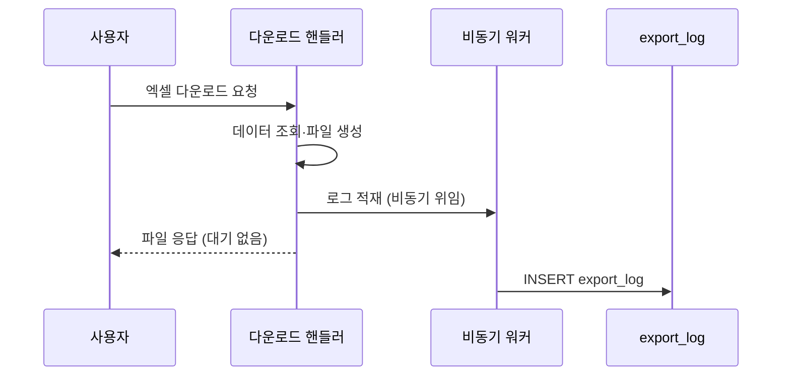

운영 데이터를 화면에서 보는 것과 파일로 **내려받는 것**은 위험도가 다르다. 다운로드된 데이터는 사내 시스템 밖으로 나가고, 통제를 벗어난다. 그래서 "누가, 언제, 무엇을, 얼마나" 내려받았는지는 추적돼야 한다. 변경 이력(audit trail)이 "데이터가 어떻게 바뀌었나"를 본다면, 이건 **데이터 반출(export) 감사**다.

## 무엇을 남길 것인가

추출 감사 로그는 "사후에 추적 가능"이 목표다. 최소한 다음을 남긴다.

- **요청자**: 누가 받았나 (사용자 식별자)
- **요청 경로/기능**: 어느 화면·어느 메뉴에서 받았나
- **파일명**: 무엇을 받았나
- **행 개수**: 얼마나 받았나 (가장 중요한 민감도 지표)
- **크기**: 바이트 수
- **시각**: 언제
- (선택) 검색 조건: 어떤 필터로 추출했나

```sql
CREATE TABLE export_log (
  id          BIGINT AUTO_INCREMENT PRIMARY KEY,
  user_id     BIGINT       NOT NULL,
  menu_path   VARCHAR(255) NOT NULL,   -- 어느 화면
  file_name   VARCHAR(255) NOT NULL,
  row_count   INT          NOT NULL,   -- 몇 건
  byte_size   BIGINT       NOT NULL,
  search_cond TEXT,                    -- 추출 조건(직렬화)
  created_at  DATETIME     NOT NULL
);
```

행 개수는 단순한 메타데이터가 아니다. "평소 100건 받던 사람이 어느 날 50만 건을 받았다"는 이상 징후를 잡는 핵심 신호다.

## 응답을 늦추지 않는다 — 비동기 기록

다운로드는 이미 무거운 작업이다. 큰 결과를 조회하고 파일로 만들어 내려보낸다. 여기에 감사 로그 INSERT까지 같은 요청 스레드에서 동기로 끼우면, 사용자는 로그 기록 시간만큼 더 기다린다. 게다가 로그 INSERT가 실패하면 다운로드 자체가 실패하는 건 본말전도다.

원칙: **감사 로깅은 본 작업의 곁가지다. 본 작업을 막거나 늦춰선 안 된다.** 그래서 비동기로 분리한다.



스프링이라면 `@Async`로 간단히 분리할 수 있다.

```java
@Service
public class ExportAuditService {

    @Async                       // 별도 스레드 — 호출 즉시 반환
    public void record(ExportLog log) {
        try {
            exportLogMapper.insert(log);
        } catch (Exception e) {
            // 감사 실패가 본 작업을 깨지 않도록 삼키고 별도 모니터링
            log.warn("export audit failed", e);
        }
    }
}
```

```java
// 다운로드 핸들러
public void downloadUsers(HttpServletResponse res, UserSearch cond) {
    List<UserDto> rows = userMapper.findBySearch(cond);
    byte[] file = excelWriter.write(rows);

    // 응답을 먼저 확정하고, 로깅은 비동기로 위임
    writeResponse(res, file, "users.xlsx");
    auditService.record(ExportLog.builder()
            .userId(currentUserId())
            .menuPath("/admin/users")
            .fileName("users.xlsx")
            .rowCount(rows.size())
            .byteSize(file.length)
            .searchCond(cond.toString())
            .createdAt(LocalDateTime.now())
            .build());
}
```

## 보관과 조회

감사 로그는 쌓이기만 하고 거의 안 읽힌다. 그래서 두 가지를 설계해둔다.

- **보관 기간**: 무한히 쌓으면 테이블이 비대해진다. 규정상 필요한 기간(예: N개월)을 정하고, 그 이후는 별도 보관 테이블로 옮기거나 아카이브한다.
- **조회 인덱스**: 추적은 보통 "특정 사용자가 무엇을 받았나" 또는 "특정 기간 누가 받았나"로 한다. `(user_id, created_at)`, `(created_at)` 인덱스를 미리 둔다.

## 운영 함정

**함정 1 — 감사 로그 실패가 본 작업을 깬다.** 동기로 묶고 예외를 안 삼키면, 로그 테이블 장애가 다운로드 전체를 멈춘다. 감사는 곁가지다 — 비동기 + 예외 격리.

**함정 2 — 행 개수를 안 남긴다.** 경로·파일명만 남기면 "대량 반출" 이상 징후를 못 잡는다. 행 개수와 크기는 감사의 핵심 신호이므로 반드시 남긴다.

## 핵심 요약

- 데이터 반출은 화면 조회보다 위험하다 — 요청자·경로·파일명·행수·크기·시각을 남겨라.
- 감사 로깅은 본 작업의 곁가지다. 비동기 + 예외 격리로 응답을 늦추지도, 깨지도 않게.
- 행 개수는 대량 반출 탐지의 핵심 지표. 보관 기간과 조회 인덱스를 함께 설계한다.

> **면접 한 줄**: "다운로드 감사 로그가 다운로드를 느리게 하지 않나요?" → "`@Async`로 본 작업과 분리하고 예외를 격리해, 로그 적재 지연이나 실패가 다운로드 응답에 영향을 주지 않게 합니다. 행 개수·크기는 대량 반출 탐지용으로 반드시 남깁니다."
