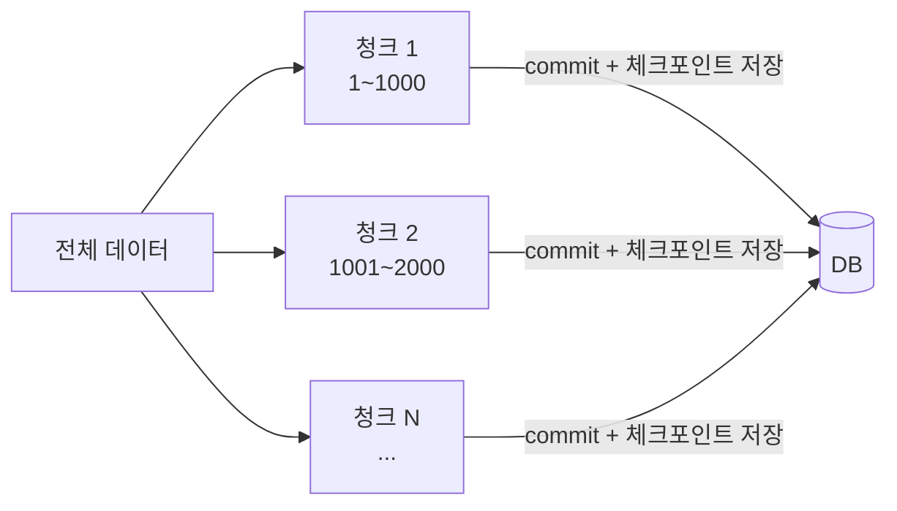

대량 데이터를 한 번에 처리하다 보면 유혹이 생긴다. 전부 한 트랜잭션에 담고 마지막에 한 번 커밋하면 깔끔하지 않은가. 실제로 돌려 보면 OOM이 나거나, 락 때문에 다른 작업이 멈추거나, 99% 지점에서 실패해 전부 날아간다. 대량 처리의 첫 원칙은 **거대 트랜잭션을 쪼개는 것**이다.

## 한 트랜잭션이 거대해질 때 치르는 비용

세 가지 비용이 동시에 커진다.

**메모리.** 영속성 컨텍스트나 결과 누적 컬렉션이 처리한 만큼 부풀어 힙을 잠식한다. 50만 건을 메모리에 들고 있으면 GC가 따라오지 못하고 OOM으로 죽는다.

**락과 undo log.** 트랜잭션이 길어질수록 잡은 락을 오래 쥐고, 롤백을 대비한 undo log가 계속 쌓인다. MVCC 환경에서는 이 오래된 트랜잭션 때문에 **이전 버전을 지우지 못해**(purge 지연) 다른 쿼리까지 느려진다. 긴 트랜잭션 하나가 전체 DB 성능을 끌어내린다.

**롤백 비용.** 49만 9천 건째에서 실패하면 앞의 49만 8천 건이 전부 롤백된다. 작업도 날아가고, 롤백 자체에 또 시간이 든다.

## 청크 단위로 끊어 커밋한다

해법은 일정 건수(청크)마다 커밋하는 것이다.



```java
public void processAll(List<Long> ids) {
    int chunkSize = 1000;
    for (int i = 0; i < ids.size(); i += chunkSize) {
        List<Long> chunk = ids.subList(i, Math.min(i + chunkSize, ids.size()));
        processChunk(chunk);   // 청크마다 독립 트랜잭션
        checkpointStore.save(i + chunk.size());  // 어디까지 처리했는지 기록
    }
}

@Transactional
public void processChunk(List<Long> chunk) {
    List<Item> items = itemRepository.findByIdIn(chunk);
    for (Item item : items) {
        item.process();
    }
    itemRepository.saveAll(items);
}   // 메서드 종료 시 청크 단위로 커밋
```

핵심은 **`processChunk`에만 `@Transactional`을 붙이는 것**이다. 청크 하나가 독립 트랜잭션으로 커밋되니, 메모리는 청크 크기만큼만 쓰고, 락도 짧게 잡았다 푼다.

## 체크포인트로 재시작한다

청크로 끊으면 새로운 문제가 생긴다. 30만 건째에서 죽으면 이미 커밋된 29만 건은 살아 있는데, **다시 돌리면 그 29만 건을 또 처리**한다. 그래서 "어디까지 처리했는가"를 기록하는 체크포인트가 필요하다.

재시작 시 체크포인트 이후부터 시작하면 중복 처리를 피한다. 단, 재처리가 불가피한 구간이 있을 수 있으므로 각 처리는 **멱등**하게 설계하는 것이 안전하다. 예컨대 "상태를 PROCESSED로 변경"은 두 번 해도 결과가 같지만, "카운트를 +1"은 두 번 하면 망가진다.

## 운영 함정

**커서/페이징의 오프셋 함정.** 청크를 `LIMIT ... OFFSET`으로 끊으면 처리하면서 데이터가 바뀔 때 행을 건너뛰거나 중복 처리한다. 변하지 않는 정렬 키(주로 PK) 기준의 **keyset 방식**(`WHERE id > :lastId ORDER BY id LIMIT n`)이 안전하고, 뒤로 갈수록 느려지지도 않는다.

**청크 크기는 트레이드오프다.** 너무 작으면 커밋 왕복 오버헤드가 커지고, 너무 크면 메모리·락 비용이 다시 올라간다. 보통 수백~수천 건에서 측정하며 조정한다.

## 핵심 요약

- 거대 단일 트랜잭션은 메모리·락·롤백 비용을 동시에 키우고, 긴 트랜잭션은 MVCC purge를 막아 DB 전체를 느리게 한다.
- 청크 단위로 끊어 커밋하면 자원 사용이 일정해진다. 트랜잭션 경계는 청크 처리 메서드에만 둔다.
- 체크포인트로 재시작 지점을 기록하되, 재처리에 대비해 각 처리는 멱등하게 설계한다.
