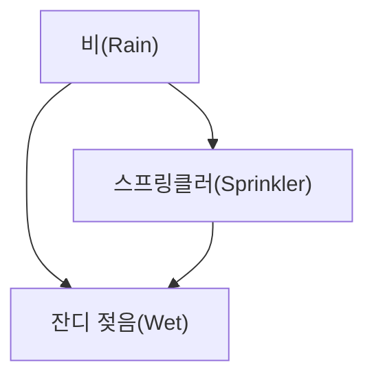
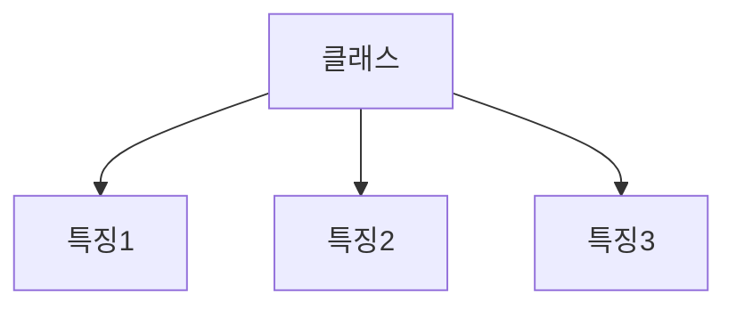

## 변수들 사이의 인과/의존을 그래프로

[나이브 베이즈](/posts/ml-suffix-trie-tree-naive-bayes/)는 "모든 특징이 독립"이라고 가정했죠. 하지만 현실의 변수들은 서로 영향을 줍니다. **베이지안 네트워크**는 이 **조건부 의존 관계를 그래프로 표현**하는 확률 모델입니다.

## 구조: 방향성 비순환 그래프(DAG)

- **노드**: 확률 변수(예: 비, 스프링클러, 잔디 젖음)
- **간선(방향)**: 직접적인 확률적 의존(보통 인과) 관계
- **비순환(Acyclic)**: 사이클이 없어야 함

각 노드는 **부모가 주어졌을 때의 조건부 확률표(CPT)** 를 가집니다. 위 예라면 `P(Wet | Rain, Sprinkler)` 같은 표죠.

## 핵심 아이디어: 결합확률의 분해

베이지안 네트워크의 힘은, 전체 결합확률을 **각 노드의 (부모 조건부) 확률의 곱**으로 분해할 수 있다는 데 있습니다.

$$ P(R, S, W) = P(R) \cdot P(S \mid R) \cdot P(W \mid R, S) $$

모든 변수 조합을 다 저장하면 표가 기하급수적으로 커지지만, 이렇게 **국소적인 의존성**만 표현하면 훨씬 적은 파라미터로 모델링할 수 있습니다.

## 추론(Inference)

베이지안 네트워크로 할 수 있는 대표적인 일은, **일부 변수를 관측했을 때 다른 변수의 확률을 갱신**하는 것입니다.

> "잔디가 젖어 있다(W=참)"를 관측 → "비가 왔을 확률 `P(Rain | Wet)`"을 역으로 추론.

이를 통해 진단(증상 → 질병 확률), 스팸 필터, 추천, 센서 융합 등에 활용합니다. 정확한 추론은 비용이 클 수 있어, 실전에선 **근사 추론(샘플링 등)** 을 쓰기도 합니다.

## 나이브 베이즈와의 관계

사실 [나이브 베이즈](/posts/ml-suffix-trie-tree-naive-bayes/)는 베이지안 네트워크의 **아주 단순한 특수 형태**입니다. "클래스" 노드 하나가 모든 특징 노드의 부모이고, 특징들끼리는 간선이 없는(독립) 구조죠. 베이지안 네트워크는 이 가정을 풀어 **변수 간 의존을 명시적으로** 표현한 일반화입니다.

## 정리

- 베이지안 네트워크 = 변수 간 **조건부 의존을 DAG로** 표현한 확률 모델.
- 각 노드는 **부모 조건부 확률(CPT)**, 결합확률은 이들의 **곱으로 분해**.
- 관측을 바탕으로 다른 변수 확률을 **추론**(진단·필터링 등).
- 나이브 베이즈는 그 특수·단순화 버전.
