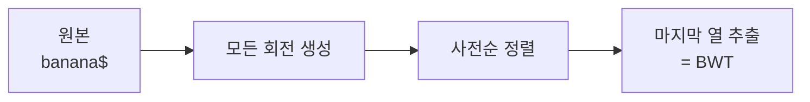

## 압축이 잘 되게 문자열을 "재배열"한다

BWT(Burrows-Wheeler Transform)는 그 자체로 압축은 아니지만, **압축이 잘 되도록 문자열을 가역적으로 재배열**하는 변환입니다. `bzip2` 같은 압축기와 DNA 서열 검색(FM-index)의 핵심이죠. 신기한 점은 **원래 문자열로 되돌릴 수 있다(가역)** 는 것입니다.

## 변환 과정

문자열 끝에 종료 문자 `$`(다른 모든 문자보다 작다고 약속)를 붙이고 시작합니다. 예: `"banana$"`.

1. 문자열의 **모든 회전(rotation)** 을 만든다.
2. 회전들을 **사전순으로 정렬**한다.
3. 정렬된 행렬의 **마지막 열(Last column)** 이 BWT 결과다.



`"banana$"`의 회전을 정렬하면 마지막 열은 `annb$aa`가 됩니다.

```text
정렬된 회전들 (마지막 열 ↓)
$banana   →  a
a$banan   →  n
ana$ban   →  n
anana$b   →  b
banana$   →  $
na$bana   →  a
nana$ba   →  a
결과 BWT: annb$aa
```

## 왜 압축에 유리한가

BWT 결과를 보면 **같은 문자가 뭉쳐 나오는 경향**이 생깁니다(위에서 `a`, `n`이 모임). 비슷한 맥락의 문자가 인접해지기 때문이죠. 이렇게 뭉친 데이터는 **MTF(Move-To-Front) + 런길이 인코딩(RLE) + 엔트로피 코딩**으로 훨씬 잘 압축됩니다. 즉 BWT는 "압축 전처리"인 셈입니다.

## 가역성: 되돌리기

BWT의 백미는 **마지막 열만으로 원본을 복원**할 수 있다는 점입니다. 마지막 열을 정렬하면 첫 열이 되고, 이 두 열의 대응 관계(LF-mapping)를 따라가면 원래 문자열이 재구성됩니다. 종료 문자 `$`가 시작점을 잡아주는 역할을 합니다.

## 어디에 쓰나

- **데이터 압축**: `bzip2`의 핵심 단계.
- **생물정보학**: BWT 기반 **FM-index**로 거대한 DNA 서열에서 패턴을 적은 메모리로 빠르게 검색(BWA, Bowtie 같은 정렬 도구).
- [접미사 배열/트리](/posts/ml-suffix-trie-tree-naive-bayes/)와 깊은 관련이 있습니다(정렬된 회전 ≈ 접미사 정렬).

## 정리

- BWT = 모든 회전을 정렬해 **마지막 열**을 취하는 **가역적 재배열**.
- 같은 문자를 뭉치게 해 **후속 압축(MTF+RLE+엔트로피)** 효율을 높인다.
- **마지막 열만으로 원본 복원**(LF-mapping) 가능.
- bzip2 압축과 DNA 검색(FM-index)의 토대.
