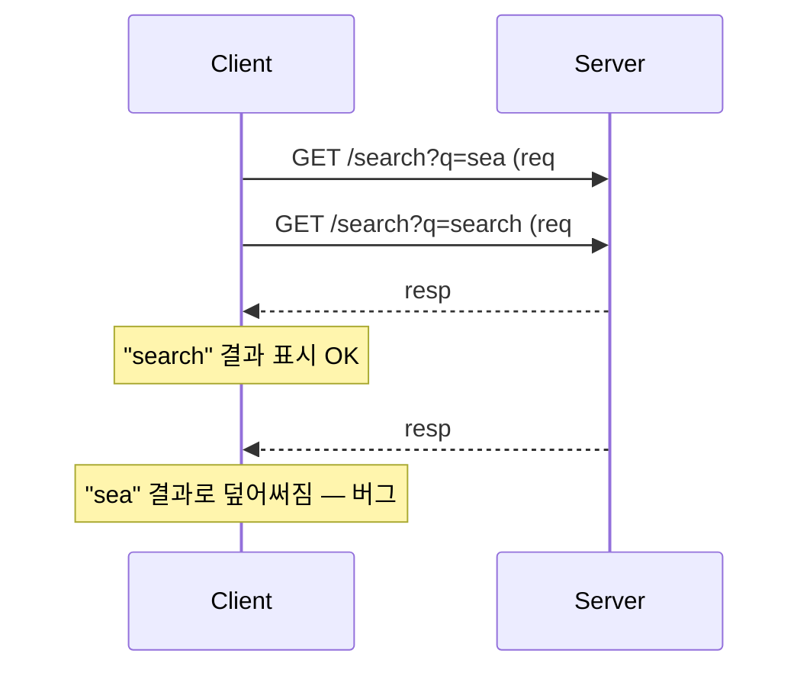

검색창에 글자를 칠 때마다 결과가 즉시 갱신되는 UX는 편리하다. 그런데 "search"를 입력하면 s, se, sea, sear, searc, search 여섯 번의 검색 요청이 순식간에 날아간다. 한 사용자가 그렇다. 동시 접속자가 늘면 이건 그대로 DB를 두드리는 트래픽 폭증이 된다. 실시간 검색의 본질적 비용을 이해하고 양쪽에서 줄여야 한다.

## 핵심 개념 — 디바운스와 스로틀의 차이

부하 완화의 1차 방어선은 클라이언트의 **디바운스(debounce)**다. 입력이 멈추고 일정 시간(예: 300ms)이 지난 뒤에만 요청을 보낸다. 타이핑이 이어지는 동안에는 타이머가 계속 리셋되므로 "search"를 빠르게 치면 마지막 한 번만 나간다.

**스로틀(throttle)**은 다르다. 디바운스가 "조용해질 때까지 기다린다"면, 스로틀은 "최소 간격마다 한 번씩 허용한다". 자동완성 검색에는 디바운스가 맞다. 사용자가 입력을 멈춘 시점의 완성된 단어가 가장 의미 있기 때문이다.

하지만 클라이언트만 믿으면 안 된다. 클라이언트 코드는 우회 가능하고, 봇은 디바운스를 무시한다. 그래서 서버에도 방어선이 필요하다.

## 코드 예시 — 서버측 캐싱과 짧은 키워드 차단

서버에서 가장 효과적인 건 **결과 캐싱**이다. 동일 키워드 검색은 짧은 TTL 캐시로 흡수한다. 인기 검색어는 수많은 사용자가 같은 쿼리를 던지므로 적중률이 높다.

```java
@Service
public class SearchService {

    private final SearchRepository repo;
    private final Cache<String, List<Product>> cache; // Caffeine, TTL 30s

    public List<Product> search(String keyword) {
        String key = normalize(keyword);

        // 너무 짧은 키워드는 전체 스캔에 가까워 비싸다 — 막는다
        if (key.length() < 2) {
            return List.of();
        }
        return cache.get(key, k -> repo.searchByKeyword(k, 20));
    }

    private String normalize(String raw) {
        return raw == null ? "" : raw.trim().toLowerCase();
    }
}
```

`normalize`로 "Apple", " apple ", "APPLE"을 같은 캐시 키로 모으면 적중률이 더 올라간다. 1글자 키워드 차단도 중요하다. LIKE `%a%` 같은 검색은 인덱스를 못 타고 풀스캔에 가까워 가장 비싼 요청이 된다.

## 이전 요청 취소 — 결과 순서가 뒤집히는 문제

디바운스를 통과해도 연속 요청은 발생한다. "sea"와 "search" 요청이 거의 동시에 나갔는데 "sea"의 응답이 더 늦게 도착하면, 화면에는 "search"를 친 사용자에게 "sea"의 결과가 덮어씌워진다. 이를 **out-of-order response** 문제라 한다.



클라이언트는 새 요청을 보낼 때 직전 요청을 취소(abort)하거나, 응답에 요청 시퀀스/키워드를 함께 실어 현재 입력값과 일치할 때만 화면에 반영해야 한다.

## 운영 함정

캐시 TTL을 길게 잡으면 신상품이나 가격 변경이 검색 결과에 늦게 반영된다. 자동완성처럼 실시간성이 중요하면 TTL은 수십 초 수준으로 짧게 둔다. 또한 검색어를 캐시 키로 쓸 때 정규화를 빠뜨리면 대소문자·공백만 다른 사실상 동일 쿼리가 캐시를 못 타 적중률이 폭락한다.

## 핵심 요약

- 디바운스는 입력이 멈춘 뒤 한 번 보낸다(자동완성에 적합). 스로틀은 최소 간격마다 허용한다.
- 클라이언트 디바운스는 1차 방어선일 뿐, 서버는 캐싱·짧은 키워드 차단으로 방어한다.
- 연속 요청의 응답 순서가 뒤집힐 수 있으니 이전 요청 취소 또는 키워드 일치 검증으로 막는다.
