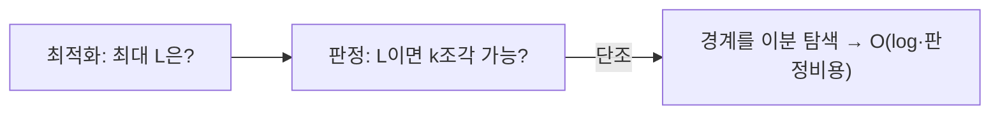

## 매 단계 절반을 버린다는 것

100만 개 중에서 하나를 찾는데 **20번** 만에 끝난다면 믿어지나요? 정렬된 데이터에서 **이진 탐색**은 매번 후보를 절반으로 줄여 $O(\log n)$에 답을 찾습니다. $2^{20} \approx 100$만이니, 100만 개도 20번, 10억 개도 30번입니다. "반씩 버린다"는 단순한 아이디어가 왜 이렇게 강력한지, 그리고 이게 "값 찾기"를 넘어 **"답 자체를 이분하는"** 사고법으로 확장되는 과정을 봅니다.

## lo·mid·hi — 후보 구간을 반씩 좁힌다

핵심은 세 포인터입니다. `lo`와 `hi`로 후보 구간을 잡고, 중간값 `mid`와 타겟을 비교해 **절반을 통째로 버립니다**. 아래에서 타겟(초록)을 향해 구간이 좁혀지는 걸 보세요.

<div class="bsearch7-narrow" markdown="0">
<style>
.bsearch7-narrow{margin:1.4rem 0;overflow-x:auto}
.bsearch7-narrow svg{width:100%;max-width:660px;height:auto;display:block;margin:0 auto;font-family:inherit}
.bsearch7-narrow .sub{fill:currentColor;font-size:10px;opacity:.65}
.bsearch7-narrow .cell{fill:none;stroke:currentColor;stroke-width:1.3;opacity:.45}
.bsearch7-narrow .num{fill:currentColor;font-size:12px;font-weight:600}
.bsearch7-narrow .target{fill:#2f9e44;opacity:.25}
.bsearch7-narrow .win{fill:#1971c2;opacity:.14;animation:bsearch7win 7s ease-in-out infinite}
.bsearch7-narrow .mid{fill:#e8590c;opacity:0;animation:bsearch7mid 7s ease-in-out infinite}
@keyframes bsearch7win{0%{x:40px;width:560px}25%{x:40px;width:560px}30%{x:320px;width:280px}55%{x:320px;width:280px}60%{x:320px;width:140px}85%,100%{x:460px;width:70px}}
@keyframes bsearch7mid{0%,8%{opacity:0}12%{opacity:.7;x:300px}30%{opacity:0}38%{opacity:.7;x:440px}55%{opacity:0}62%{opacity:.7;x:510px}85%,100%{opacity:0}}
</style>
<svg viewBox="0 0 640 140" role="img" aria-label="정렬된 배열에서 lo mid hi 포인터로 후보 구간을 반씩 버리며 타겟을 찾아가는 이진 탐색 애니메이션">
  <text class="sub" x="40" y="24">정렬된 배열에서 mid(주황)와 타겟 비교 → 절반을 버림</text>
  <rect class="win" x="40" y="40" width="560" height="48" rx="6"/>
  <rect class="mid" x="300" y="40" width="70" height="48" rx="6"/>
  <rect class="target" x="460" y="40" width="70" height="48" rx="6"/>
  <g>
    <rect class="cell" x="40"  y="40" width="70" height="48"/><text class="num" x="75"  y="70" text-anchor="middle">1</text>
    <rect class="cell" x="110" y="40" width="70" height="48"/><text class="num" x="145" y="70" text-anchor="middle">3</text>
    <rect class="cell" x="180" y="40" width="70" height="48"/><text class="num" x="215" y="70" text-anchor="middle">5</text>
    <rect class="cell" x="250" y="40" width="70" height="48"/><text class="num" x="285" y="70" text-anchor="middle">8</text>
    <rect class="cell" x="320" y="40" width="70" height="48"/><text class="num" x="355" y="70" text-anchor="middle">11</text>
    <rect class="cell" x="390" y="40" width="70" height="48"/><text class="num" x="425" y="70" text-anchor="middle">14</text>
    <rect class="cell" x="460" y="40" width="70" height="48"/><text class="num" x="495" y="70" text-anchor="middle">17</text>
    <rect class="cell" x="530" y="40" width="70" height="48"/><text class="num" x="565" y="70" text-anchor="middle">21</text>
  </g>
  <text class="sub" x="320" y="116" text-anchor="middle">타겟 17 → 매 단계 후보가 8→4→2→1로 반토막</text>
</svg>
</div>

```python
def binary_search(a, target):
    lo, hi = 0, len(a) - 1
    while lo <= hi:                 # 닫힌 구간 [lo, hi]
        mid = lo + (hi - lo) // 2   # 오버플로 방지(중요)
        if a[mid] == target: return mid
        elif a[mid] < target: lo = mid + 1
        else: hi = mid - 1
    return -1
```

`(lo + hi) / 2`가 아니라 `lo + (hi - lo) / 2`로 쓰는 건 **정수 오버플로 방지** — 2006년 자바 표준 라이브러리에서도 발견된 유명한 버그입니다.

## lower_bound / upper_bound — "있냐"가 아니라 "어디부터냐"

실무에서 더 자주 쓰는 건 "정확히 같은 값"이 아니라 **경계**입니다.

- **lower_bound**: `target` **이상**이 처음 나오는 위치.
- **upper_bound**: `target` **초과**가 처음 나오는 위치.

이 둘의 차이가 곧 **그 값의 개수**이고, 정렬된 로그·시계열에서 "특정 시각 이후 첫 이벤트"를 찾는 **DB 인덱스 범위 스캔**의 본질이기도 합니다. 핵심은 **반열린 구간 `[lo, hi)`** 로 통일해 off-by-one을 없애는 것:

```python
def lower_bound(a, x):
    lo, hi = 0, len(a)             # 반열린 [lo, hi)
    while lo < hi:
        mid = lo + (hi - lo) // 2
        if a[mid] < x: lo = mid + 1
        else: hi = mid
    return lo                       # x 이상이 처음 나오는 인덱스
```

> 이진 탐색이 어려운 게 아니라 **경계 조건**이 어렵습니다. 닫힌 `[lo,hi]`냐 반열린 `[lo,hi)`냐, `lo<=hi`냐 `lo<hi`냐, `mid+1`이냐 `mid`냐 — **하나의 규약을 정해 끝까지 지키는 것**이 무한 루프와 off-by-one을 막는 유일한 길입니다.

## 매개변수 탐색 — "답을 이분하라"

여기서 도약이 일어납니다. 이진 탐색은 사실 **정렬된 배열**이 아니라, **단조(monotone) 판정 함수**만 있으면 됩니다. 즉 어떤 값 `x`에 대해 "`x`면 가능?"이라는 답이 `...불가, 불가, 가능, 가능...`처럼 **한 번만 바뀐다면**, 그 경계를 이진 탐색으로 찾을 수 있습니다. 이를 **매개변수 탐색(parametric search)**, 흔히 "이분 답"이라 부릅니다.

<div class="bsearch7-param" markdown="0">
<style>
.bsearch7-param{margin:1.4rem 0;overflow-x:auto}
.bsearch7-param svg{width:100%;max-width:660px;height:auto;display:block;margin:0 auto;font-family:inherit}
.bsearch7-param .sub{fill:currentColor;font-size:10px;opacity:.7}
.bsearch7-param .no{fill:#e03131;opacity:.78}
.bsearch7-param .yes{fill:#2f9e44;opacity:.78}
.bsearch7-param .lbl{fill:#fff;font-size:11px;font-weight:700}
.bsearch7-param .probe{fill:#1971c2;opacity:0;animation:bsearch7pr 6s ease-in-out infinite}
@keyframes bsearch7pr{0%,6%{opacity:0;transform:translateX(0)}12%,28%{opacity:.85;transform:translateX(330px)}34%,52%{opacity:.85;transform:translateX(165px)}58%,76%{opacity:.85;transform:translateX(248px)}82%,94%{opacity:.85;transform:translateX(220px)}100%{opacity:0}}
</style>
<svg viewBox="0 0 640 130" role="img" aria-label="판정 함수가 불가능에서 가능으로 한 번 바뀌는 경계를 이분 탐색으로 좁혀가는 매개변수 탐색 애니메이션">
  <text class="sub" x="20" y="20">판정함수 f(x): 작을수록 불가능(빨강) → 어떤 경계부터 가능(초록)</text>
  <g transform="translate(20,36)">
    <rect class="no"  x="0"   width="80" height="44" rx="4"/><text class="lbl" x="40"  y="29" text-anchor="middle">불가</text>
    <rect class="no"  x="83"  width="80" height="44" rx="4"/><text class="lbl" x="123" y="29" text-anchor="middle">불가</text>
    <rect class="no"  x="166" width="80" height="44" rx="4"/><text class="lbl" x="206" y="29" text-anchor="middle">불가</text>
    <rect class="yes" x="249" width="80" height="44" rx="4"/><text class="lbl" x="289" y="29" text-anchor="middle">가능</text>
    <rect class="yes" x="332" width="80" height="44" rx="4"/><text class="lbl" x="372" y="29" text-anchor="middle">가능</text>
    <rect class="yes" x="415" width="80" height="44" rx="4"/><text class="lbl" x="455" y="29" text-anchor="middle">가능</text>
    <rect class="probe" x="-6" y="-6" width="92" height="56" rx="6" fill="none" stroke="#1971c2" stroke-width="3"/>
  </g>
  <text class="sub" x="320" y="118" text-anchor="middle">경계(불가↔가능)를 이분으로 좁힘 → 정렬된 배열이 없어도 O(log) 탐색</text>
</svg>
</div>

전형적 예: "케이블 `n`개를 길이 `L`로 자를 때 `k`조각 이상 나오나?"는 `L`이 커질수록 조각 수가 단조 감소합니다. 그러니 "조각 ≥ k를 만족하는 **최대 `L`**"을 이분 탐색으로 찾으면 됩니다. 문제를 **최적화(최대/최소)** 에서 **판정(가능/불가능)** 으로 바꾸는 순간, 이진 탐색이 열립니다.



## 회전된 정렬 배열 — 변형의 대표

`[4,5,6,7,0,1,2]`처럼 한 번 회전된 배열에서도, "어느 쪽 절반이 정렬돼 있는가"를 판정하면 여전히 $O(\log n)$에 찾을 수 있습니다. 핵심은 **"버릴 절반을 확신할 수 있는 불변식"** 을 매 단계 유지하는 것 — 이진 탐색의 본질이 비교가 아니라 **"절반을 안전하게 버리는 판단"** 임을 보여줍니다.

## 프로덕션 함정

| 함정 | 증상 | 해법 |
|------|------|------|
| `(lo+hi)/2` 오버플로 | 큰 인덱스에서 음수 mid | `lo + (hi-lo)/2` |
| 경계 규약 혼용 | 무한 루프 / off-by-one | `[lo,hi)` + `lo<hi` 한 규약 고정 |
| 정렬 안 된 입력 | 틀린 결과를 "정상" 반환 | 전제(정렬) 보장 — [정렬]() 선행 |
| 부동소수 이분 | 종료 안 됨(정밀도) | 고정 반복 횟수(예: 100회)로 종료 |
| 판정함수 비단조 | 매개변수 탐색이 틀림 | 단조성 먼저 증명 |

## 면접/리뷰 단골 질문

- **Q. 이진 탐색의 전제?** → 정렬(또는 단조 판정 함수). 정렬 없이는 적용 불가.
- **Q. lower_bound와 upper_bound 차이?** → 이상 vs 초과의 첫 위치. 둘의 차 = 그 값의 개수.
- **Q. 매개변수 탐색이란?** → 최적화 문제를 단조 판정으로 바꿔, "가능/불가능 경계"를 이분 탐색. "최대 X" 류 문제의 단골.
- **Q. mid 계산을 왜 빼기로?** → `lo+hi`가 int 범위를 넘는 오버플로 방지.
- **Q. 무한 루프를 피하려면?** → 구간이 매 반복 반드시 줄어야 함. 규약(`mid` vs `mid±1`)을 경계 정의와 일치시킬 것.

## 정리

- 이진 탐색은 매 단계 **절반을 버려** $O(\log n)$ — 100만 개도 20번.
- 실무 핵심은 정확한 값 찾기보다 **lower/upper bound**(경계)이고, 어려움은 알고리즘이 아니라 **경계 규약**에 있다.
- 진짜 무기는 **매개변수 탐색** — 정렬 배열이 없어도, **단조 판정 함수**만 있으면 "답 자체를 이분"할 수 있다.

> 정렬([비교]()·[선형]())과 탐색으로 "순서"의 세계를 마쳤습니다. 다음 글 [재귀와 분할 정복]()에서, 퀵·머지·이진 탐색이 공유하던 "쪼개서 정복한다"는 사고를 정면으로 다룹니다.
</content>
