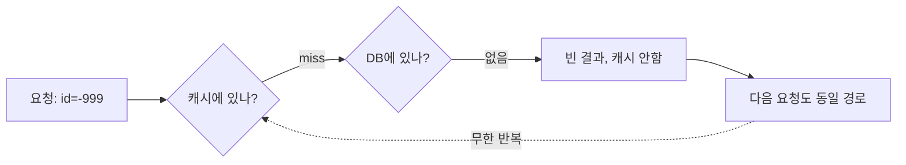

캐시는 보통 "한 번 읽은 데이터를 다시 안 읽게" 해주는 장치로 생각한다. 그런데 처음부터 **존재하지 않는 데이터**를 조회하면 어떻게 될까. 캐시에는 당연히 없고, DB를 봐도 없으니 캐시에 넣을 것도 없다. 그래서 매 요청이 캐시를 그대로 통과해 DB로 향한다. 이를 **캐시 관통(cache penetration)**이라 한다.

## 핵심 개념 — 관통은 왜 위험한가

일반적인 캐시 흐름은 이렇다. 요청이 오면 캐시를 보고, 있으면(hit) 반환, 없으면(miss) DB 조회 후 결과를 캐시에 채운다. 이 구조의 암묵적 전제는 "DB에 데이터가 존재한다"는 것이다.

존재하지 않는 키(예: 음수 ID, 무작위 큰 ID)를 조회하면 DB는 빈 결과를 반환하고, 코드는 "캐시할 게 없다"며 아무것도 안 채운다. 같은 키가 다시 오면 또 캐시 miss → DB 조회를 반복한다. 캐시가 전혀 방어막 역할을 못 한다.

이게 단순 비효율이 아니라 보안 문제가 되는 이유는, 공격자가 의도적으로 존재하지 않는 키를 무작위로 쏟아부으면 모든 요청이 DB로 직격해 **사실상 DB DDoS**가 되기 때문이다.



## 해결 1 — 빈 결과를 짧게 캐싱한다

가장 직접적인 해법은 "없다"는 사실 자체를 캐싱하는 것이다. DB 조회 결과가 비면, 그 키에 대해 빈 값(또는 sentinel)을 짧은 TTL로 캐시에 넣는다.

```java
public Product getProduct(Long id) {
    String key = "product:" + id;

    Object cached = cache.get(key);
    if (cached != null) {
        return cached == NULL_SENTINEL ? null : (Product) cached;
    }

    Product found = repo.findById(id);
    if (found == null) {
        // 없음을 짧게 캐싱 — 관통 차단
        cache.put(key, NULL_SENTINEL, Duration.ofSeconds(60));
        return null;
    }
    cache.put(key, found, Duration.ofMinutes(10));
    return found;
}
```

TTL을 짧게(수십 초~수 분) 잡는 이유는, 나중에 그 키로 진짜 데이터가 생길 수 있기 때문이다. null 캐시 TTL이 너무 길면 데이터가 생겼는데도 한참 "없음"으로 응답하는 일관성 문제가 생긴다.

`null`을 그냥 캐시에 넣으면 "캐시에 없음(miss)"과 구분이 안 되므로, `NULL_SENTINEL` 같은 명시적 표지값을 쓴다.

## 해결 2 — 블룸 필터로 사전 차단

null 캐싱은 이미 한 번씩은 DB를 거친다. 공격자가 **매번 다른** 무작위 키를 던지면 null 캐시도 매번 miss라 효과가 떨어진다. 이때는 **블룸 필터(Bloom filter)**가 강력하다.

블룸 필터는 "이 키가 존재할 가능성이 있는가"를 비트 배열과 여러 해시 함수로 압축 판정하는 확률적 자료구조다. 특성상 **거짓 양성(있다고 잘못 판정)은 있어도 거짓 음성(없는데 없다고 판정 누락)은 없다**. 즉 필터가 "없다"고 하면 확실히 없다. 실제 존재하는 모든 키를 필터에 등록해 두고, 요청이 오면 먼저 필터에 물어본 뒤 "없다"면 DB까지 가지 않고 즉시 반려한다.

## 운영 함정

null 캐싱의 TTL과 캐시 쓰기(write) 타이밍이 어긋나면 사고가 난다. 데이터를 새로 생성한 직후 해당 키의 null 캐시를 무효화하지 않으면, TTL이 만료될 때까지 신규 데이터가 "없음"으로 보인다. 데이터 생성 로직에서 관련 null 캐시 키를 명시적으로 삭제해야 한다.

블룸 필터는 등록만 되고 삭제는 어렵다(표준 블룸 필터는 원소 제거 불가). 키가 동적으로 사라지는 도메인이면 카운팅 블룸 필터를 쓰거나 주기적으로 필터를 재구축해야 한다.

## 핵심 요약

- 캐시 관통은 존재하지 않는 키 조회가 캐시를 그대로 뚫고 DB를 직격하는 현상이다.
- 1차 방어: 빈 결과를 짧은 TTL로 캐싱(NULL sentinel). 데이터 생성 시 무효화 필수.
- 무작위 키 공격엔 블룸 필터로 "확실히 없는" 키를 DB 이전에 차단한다.
