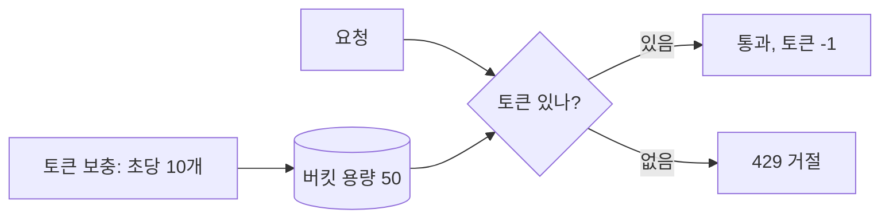

공개된 API는 반드시 누군가 남용한다. 잘못 짠 스크립트의 무한 재시도, 크롤러, 의도적 공격이 한 엔드포인트를 분당 수천 번 두드린다. 인증으로는 막을 수 없다. 정당한 사용자도 폭주할 수 있기 때문이다. 필요한 건 "단위 시간당 허용량"을 강제하는 **레이트리밋(rate limiting)**이다.

## 핵심 개념 — 알고리즘마다 허용 패턴이 다르다

**고정 윈도우(fixed window)**가 가장 단순하다. "분당 100회"라면 매 분 카운터를 0으로 리셋하고 100을 넘으면 거절한다. 구현은 쉽지만 **경계 폭발** 문제가 있다. 12:00:59에 100회, 12:01:00에 다시 100회를 보내면 1초 안에 200회가 통과한다. 윈도우 경계에서 한도의 두 배가 새는 것이다.

**슬라이딩 윈도우(sliding window)**는 이를 보정한다. 최근 1분이라는 "움직이는 창" 안의 요청 수를 본다. 정확히 하려면 각 요청 타임스탬프를 기록해야 하나, 보통 이전 윈도우 카운트를 비율로 가중 평균하는 근사법을 쓴다.

**토큰 버킷(token bucket)**은 가장 널리 쓰인다. 버킷에 토큰이 일정 속도로(예: 초당 10개) 채워지고 최대 용량까지만 쌓인다. 요청은 토큰 1개를 소비하며, 토큰이 없으면 거절된다. 이 방식의 강점은 **버스트 허용**이다. 한동안 요청이 없어 토큰이 가득 차 있으면, 순간적으로 버킷 용량만큼 몰아서 처리할 수 있다. 평균 속도는 제한하되 짧은 폭주는 흡수하는, 현실적인 트래픽에 잘 맞는 모델이다.



## 코드 예시 — 토큰 버킷

```java
public class TokenBucket {
    private final long capacity;      // 최대 토큰 (버스트 한도)
    private final double refillPerSec; // 초당 보충량
    private double tokens;
    private long lastRefillNanos;

    public TokenBucket(long capacity, double refillPerSec) {
        this.capacity = capacity;
        this.refillPerSec = refillPerSec;
        this.tokens = capacity;
        this.lastRefillNanos = System.nanoTime();
    }

    public synchronized boolean tryConsume() {
        refill();
        if (tokens >= 1) {
            tokens -= 1;
            return true;
        }
        return false;
    }

    private void refill() {
        long now = System.nanoTime();
        double elapsed = (now - lastRefillNanos) / 1_000_000_000.0;
        tokens = Math.min(capacity, tokens + elapsed * refillPerSec);
        lastRefillNanos = now;
    }
}
```

요청이 거절되면 HTTP `429 Too Many Requests`로 응답하고, `Retry-After` 헤더로 언제 재시도하면 되는지 알려주는 게 예의다.

## 분산 환경 — 카운터를 어디에 둘 것인가

위 버킷은 한 인스턴스 메모리에만 있다. 서버가 3대면 사용자당 한도가 사실상 3배가 된다. 각 인스턴스가 독립 카운터를 갖기 때문이다. 정확한 전역 제한이 필요하면 카운터를 **공유 저장소(Redis 등)**에 둔다.

Redis라면 사용자 키에 `INCR`로 카운트를 올리고 첫 증가 시 `EXPIRE`로 TTL을 건다. 단 INCR과 EXPIRE 사이에 인스턴스가 죽으면 TTL 없는 영구 키가 남으므로, 두 명령을 **Lua 스크립트로 원자 실행**해 read-modify-write 경쟁과 부분 실패를 함께 막는 게 정석이다.

## 운영 함정

리밋 키 설계가 중요하다. IP만으로 제한하면 회사/학교의 NAT 뒤 수백 명이 한 IP를 공유해 정상 사용자가 막힌다. 인증된 사용자는 사용자 ID로, 미인증은 IP로 키를 나누는 식의 다층 설계가 필요하다. 또 헬스체크·내부 호출까지 리밋에 걸리면 모니터링이 오작동하므로 화이트리스트로 제외한다.

## 핵심 요약

- 고정 윈도우는 경계에서 한도의 2배가 샌다. 슬라이딩 윈도우/토큰 버킷이 이를 보정한다.
- 토큰 버킷은 평균 속도를 제한하면서 짧은 버스트를 흡수해 현실 트래픽에 적합하다.
- 다중 인스턴스에선 메모리 카운터가 한도를 N배로 늘린다. Redis 등 공유 저장소에 원자 연산으로 카운트한다.
- 거절은 `429` + `Retry-After`. 리밋 키는 IP/사용자ID를 상황에 맞게 조합한다.
