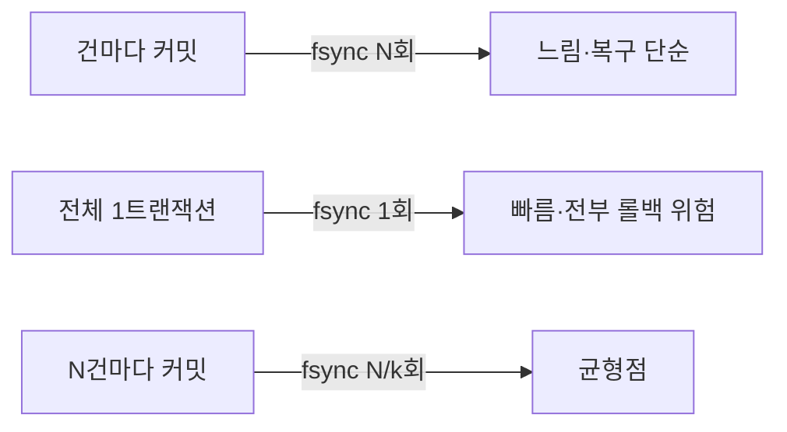

수만 건의 데이터를 한 번에 적재해야 하는 작업을 다룬 주가 있었다. 핵심은 "언제 커밋하느냐"였다. 커밋 시점을 잘못 고르면 처리량이 수십 배 느려지거나, 중간에 한 건 실패에 전체가 날아간다.

## 왜 커밋 간격이 처리량을 지배하는가

커밋은 단순한 메모리 플래그가 아니다. 대부분의 RDBMS에서 커밋은 **WAL(Write-Ahead Log) / redo 로그를 디스크에 동기화(fsync)** 한다는 약속이다. `innodb_flush_log_at_trx_commit=1`(MySQL 기본)이나 PostgreSQL의 `synchronous_commit=on`에서, 커밋마다 디스크 fsync가 한 번씩 발생한다.

fsync는 디스크 회전·플러시를 기다리므로 한 번에 수 ms가 든다. 건마다 커밋하면 10,000건 = 10,000번의 fsync다. 메모리 INSERT 자체보다 fsync 대기가 전체 시간을 지배한다. 반대로 전체를 한 트랜잭션으로 묶으면 fsync는 단 한 번이지만, 트랜잭션이 잡은 **언두 로그·락이 끝까지 유지**되고, 중간에 실패하면 전부 롤백된다.



결국 양극단 사이의 **커밋 간격(commit interval)** 을 찾는 문제가 된다.

## 코드: 청크 단위 커밋

```java
int BATCH = 1000;
List<Order> buffer = new ArrayList<>(BATCH);

for (Order o : source) {
    buffer.add(o);
    if (buffer.size() == BATCH) {
        flushInOwnTransaction(buffer); // 1000건 INSERT 후 커밋
        buffer.clear();
    }
}
if (!buffer.isEmpty()) flushInOwnTransaction(buffer);
```

```java
@Transactional(propagation = Propagation.REQUIRES_NEW)
public void flushInOwnTransaction(List<Order> chunk) {
    orderMapper.insertBatch(chunk); // foreach multi-row insert
    // 메서드 반환 시 커밋 → fsync 1회로 1000건 확정
}
```

`insertBatch`는 `INSERT INTO orders (...) VALUES (...),(...),(...)` 형태의 multi-row INSERT로, 네트워크 왕복(round-trip)까지 줄인다. JDBC라면 `rewriteBatchedStatements=true`를 켜야 `addBatch`가 실제 multi-row로 합쳐진다.

## 운영 함정

**1. 청크 실패의 부분 반영.** 청크마다 커밋하면 5번째 청크에서 실패해도 1~4청크는 이미 커밋되어 남는다. 재실행 시 중복 INSERT가 터진다. **멱등성**을 위해 자연키에 UNIQUE를 두고 `INSERT ... ON DUPLICATE KEY` / `ON CONFLICT DO NOTHING`을 쓰거나, 처리한 마지막 오프셋을 기록해 재개 지점을 잡아야 한다.

**2. 청크를 너무 크게.** 한 INSERT에 수만 row를 넣으면 `max_allowed_packet` 초과나 거대한 언두 로그로 오히려 느려진다. 1,000~5,000 사이에서 측정해 고르는 게 보통 안전하다.

## 핵심 요약

- 커밋은 fsync를 동반하므로, 건마다 커밋은 처리량을 죽인다.
- 전체 1트랜잭션은 빠르지만 락 유지·전부 롤백 위험이 크다.
- 해법은 N건 단위 청크 커밋. 멱등성(UNIQUE/upsert)과 재개 지점으로 부분 실패를 흡수한다.

> **면접 Q.** 배치 INSERT가 느린데 커밋 간격을 늘렸더니 빨라졌다. 왜?
> **A.** 커밋마다 redo/WAL의 디스크 fsync가 발생한다. 커밋을 1,000건당 한 번으로 묶으면 fsync 횟수가 1/1000로 줄어 디스크 대기 시간이 사라지기 때문이다.
