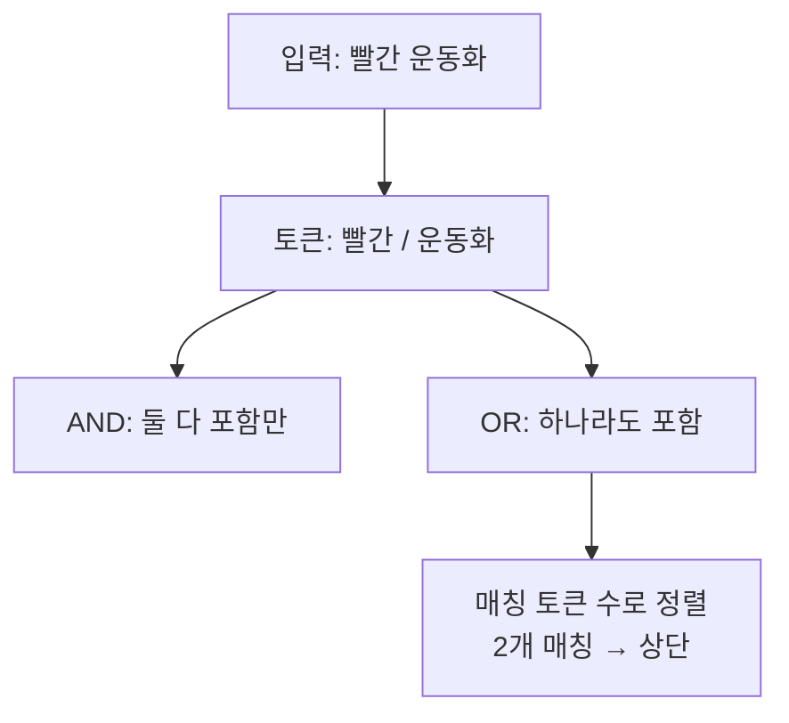

검색창에 여러 단어를 넣으면 어떻게 거를지 정해야 하는 주가 있었다. "빨간 운동화"를 입력했을 때 두 단어를 모두 가진 것만 보일지(AND), 하나라도 가진 걸 다 보일지(OR). 이건 단순한 취향이 아니라 **검색의 정밀도(precision)와 재현율(recall) 사이의 선택**이다.

## 토큰화와 불리언 결합

먼저 입력을 **토큰**으로 쪼갠다. 공백 분리가 가장 단순한 토큰화다. `"빨간 운동화"` → `["빨간", "운동화"]`.

- **AND(교집합)**: 모든 토큰을 포함해야 매칭. 결과가 적고 정밀하다. 결과 0건이 자주 난다(재현율 낮음).
- **OR(합집합)**: 토큰 중 하나라도 포함하면 매칭. 결과가 많고 누락이 적다. 대신 관련 없는 게 섞인다(정밀도 낮음).

실무 절충은 **OR로 넓게 긁되, 매칭된 토큰 수로 정렬**하는 것이다. 두 단어를 다 가진 행이 위로, 하나만 가진 행이 아래로 간다. AND의 정밀함과 OR의 재현율을 점수로 화해시킨다.



## 코드: OR + 누적 점수

각 토큰의 매칭 여부를 0/1로 합산해 점수를 만든다.

```sql
SELECT p.*,
  (CASE WHEN name LIKE CONCAT('%','빨간','%') THEN 1 ELSE 0 END
 + CASE WHEN name LIKE CONCAT('%','운동화','%') THEN 1 ELSE 0 END) AS score
FROM product p
WHERE name LIKE CONCAT('%','빨간','%')
   OR name LIKE CONCAT('%','운동화','%')
ORDER BY score DESC, p.id DESC;
```

`WHERE`는 OR로 후보를 넓게 잡고, `score`로 더 많은 토큰을 가진 행을 위로 올린다. 토큰을 동적으로 받으려면 빌더로 `CASE` 조각을 토큰 수만큼 생성하면 된다.

```java
List<String> tokens = Arrays.stream(input.trim().split("\\s+"))
        .filter(s -> !s.isBlank())
        .distinct()        // 중복 토큰 제거
        .limit(10)         // 토큰 폭발 방지
        .toList();
```

## 운영 함정

**1. 토큰 무제한 허용.** 사용자가 단어를 100개 붙여넣으면 `CASE`/`OR`가 100개 생성되어 쿼리 파싱과 실행이 폭발한다. 토큰 수에 상한(`limit`)을 두고, 너무 짧은 토큰(1글자)은 노이즈가 크니 제거하거나 별도 처리한다.

**2. LIKE의 한계.** `LIKE '%kw%'`는 인덱스를 못 타고, 형태소·동의어를 모른다. "운동화"와 "운동 화"를 다르게 본다. 규모가 커지면 SQL LIKE 대신 **풀텍스트 인덱스(MySQL FULLTEXT, PostgreSQL `tsvector`)** 나 전용 검색엔진으로 옮겨, 토큰화·랭킹(BM25 등)을 엔진에 위임하는 게 정석이다.

## 핵심 요약

- AND는 정밀하고 OR는 누락이 적다. 둘의 절충은 OR로 긁고 매칭 토큰 수로 정렬하는 것.
- 토큰 수 상한과 짧은 토큰 필터로 쿼리 폭발을 막는다.
- LIKE 기반은 임시방편. 규모가 커지면 풀텍스트/검색엔진으로 토큰화와 랭킹을 위임한다.
