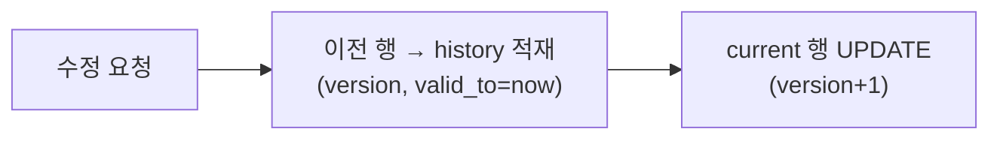

데이터의 수정 이력을 남겨야 하는 주가 있었다. "누가 언제 무엇을 어떻게 바꿨나"를 추적하고, 잘못 바꾼 값을 이전 상태로 되돌릴 수 있어야 했다. 핵심은 **현재 값만 들고 있는 테이블에 시간 축을 어떻게 더하느냐**다.

## 두 가지 모델: 스냅샷 vs 델타

이력을 남기는 방식은 크게 둘이다.

- **스냅샷(full row versioning)**: 수정할 때마다 그 시점의 전체 행을 이력 테이블에 통째로 복사한다. 조회가 단순(한 행이 한 시점의 완전한 상태)하지만 스토리지를 많이 쓴다.
- **델타(change log)**: 바뀐 컬럼만 `(필드, 이전값, 새값)`으로 기록한다. 저장은 작지만 특정 시점의 전체 상태를 복원하려면 변경분을 처음부터 누적 재생해야 한다.

대부분의 업무 시스템은 **스냅샷**을 택한다. 조회/되돌리기가 단순하고, 스토리지는 싸기 때문이다. 핵심 발상은 현재 테이블 옆에 **version 컬럼과 유효 기간을 가진 이력 테이블**을 두고, 현재 행을 이력의 "최신 버전"으로 보는 것이다(temporal table의 수동 구현).



## 코드: 스냅샷 적재

```sql
CREATE TABLE product (
    id BIGINT PRIMARY KEY,
    name VARCHAR(200),
    price INT,
    version INT NOT NULL DEFAULT 1
);

CREATE TABLE product_history (
    history_id BIGINT AUTO_INCREMENT PRIMARY KEY,
    id BIGINT NOT NULL,           -- 원본 PK
    name VARCHAR(200),
    price INT,
    version INT NOT NULL,
    changed_by VARCHAR(50),
    changed_at DATETIME NOT NULL,
    KEY idx_id_version (id, version)
);
```

```java
@Transactional
public void update(Long id, ProductUpdate cmd, String actor) {
    Product cur = mapper.findById(id);          // 현재 상태
    mapper.insertHistory(cur, actor);           // 변경 전 상태를 이력으로
    cur.apply(cmd);
    cur.bumpVersion();                          // version + 1
    mapper.update(cur);                         // 현재 테이블 갱신
}
```

시점 조회와 되돌리기는 이력에서 원하는 버전을 꺼내 쓴다.

```sql
-- 특정 버전 조회
SELECT * FROM product_history WHERE id = ? AND version = ?;
-- 되돌리기 = 그 버전을 새 버전으로 다시 적용 (이력은 보존)
```

## 운영 함정

**1. 트랜잭션 밖에서 이력 적재.** 현재 행 UPDATE와 이력 INSERT가 한 트랜잭션이 아니면, 중간 실패 시 이력만 남거나 현재만 바뀌어 **불일치**가 생긴다. 반드시 같은 트랜잭션으로 묶는다.

**2. 무한 적재로 인한 비대화.** 자주 수정되는 엔티티는 이력이 폭증한다. 보존 정책(예: 최근 N개 또는 M개월만 유지)과 오래된 이력의 아카이브/파티셔닝을 미리 설계해야 한다. 이력 테이블에는 조회용 인덱스(`id, version`)만 두고 쓰기 비용을 줄인다.

## 핵심 요약

- 이력은 스냅샷(전체 행 복사)과 델타(변경분) 중 택일. 업무 시스템은 보통 조회가 쉬운 스냅샷.
- 현재 UPDATE와 이력 INSERT는 한 트랜잭션으로 묶어 일관성을 보장한다.
- 보존 정책·파티셔닝으로 이력 비대화를 관리한다.
