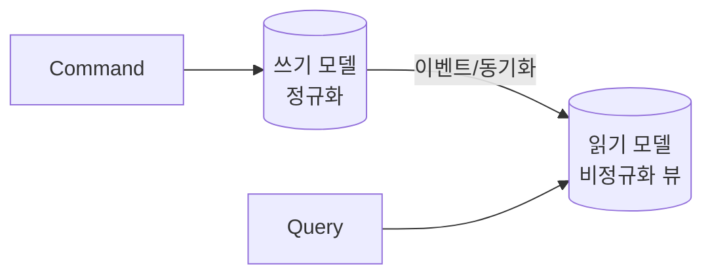

조회 화면의 요구와 갱신 로직의 요구가 정면으로 충돌한 주가 있었다. 화면은 여러 테이블을 합친 넓고 평평한 데이터를 빠르게 원하는데, 갱신은 무결성을 지키려 잘게 정규화된 모델을 원한다. 하나의 모델로 둘 다 만족시키려다 양쪽 다 어정쩡해졌다. 여기서 **CQRS(Command Query Responsibility Segregation)** 의 발상이 나온다.

## 왜 한 모델로는 둘 다 어려운가

쓰기(Command) 모델의 목표는 **불변식 보호**다. 정규화하고, 트랜잭션 경계를 좁히고, 도메인 규칙을 강제한다. 읽기(Query) 모델의 목표는 **빠른 조회**다. 화면이 필요로 하는 형태로 미리 합쳐두고, 비정규화하고, 인덱스를 조회에 최적화한다.

이 둘은 최적화 방향이 반대다. 정규화된 쓰기 모델로 조회하면 JOIN이 많아지고, 조회에 맞춰 비정규화하면 갱신 시 중복 갱신과 정합성 부담이 생긴다. CQRS는 "**하나의 모델로 둘 다 하지 말고, 책임을 갈라라**"고 답한다. 명령은 쓰기 모델로, 조회는 별도 읽기 모델로 처리한다.



주의: CQRS는 **반드시 DB를 둘로 나누는 게 아니다**. 가장 가벼운 형태는 같은 DB 안에서 명령 서비스와 조회 서비스(또는 조회 전용 뷰/매퍼)를 코드 레벨로 분리하는 것이다. 무거운 형태가 별도 읽기 저장소다.

## 코드: 책임 분리

```java
// 명령: 도메인 규칙·트랜잭션
@Transactional
public void placeOrder(PlaceOrderCommand cmd) {
    Order order = Order.create(cmd);   // 불변식 검증
    orderRepository.save(order);
}

// 조회: DTO 직행, 도메인 객체를 거치지 않음
public OrderSummaryView getSummary(Long id) {
    return orderQueryMapper.findSummaryView(id); // JOIN 결과를 평평한 뷰로
}
```

조회는 도메인 엔티티를 로드해 변환하지 않고, 화면용 뷰를 SQL로 직접 만든다. 무거운 형태에서는 명령 후 이벤트로 읽기 모델(검색용 뷰 테이블, 검색엔진 인덱스 등)을 갱신한다.

## 운영 함정

**1. 최종 일관성(eventual consistency)의 함정.** 읽기 모델을 별도 저장소로 비동기 갱신하면, 쓰기 직후 조회 시 옛 값이 보인다("내가 방금 바꿨는데 안 바뀜"). 사용자 본인의 변경은 동기 반영하거나, UI에서 낙관적 갱신으로 메우는 보정이 필요하다.

**2. 과한 적용.** CRUD가 단순한 도메인에 별도 읽기 저장소·이벤트 동기화를 도입하면 복잡도만 폭증한다. 대부분은 같은 DB 안에서 조회 전용 매퍼/뷰로 코드만 분리해도 충분하다. 분리의 비용은 동기화이므로, 이득(조회 성능·복잡한 화면)이 그 비용을 넘을 때만 무거운 쪽으로 간다.

## 핵심 요약

- 쓰기 모델은 불변식, 읽기 모델은 조회 성능을 목표로 한다. 방향이 반대라 한 모델로는 어렵다.
- CQRS는 책임 분리이지 DB 분리가 아니다. 가벼운 형태(조회 전용 매퍼)부터 시작한다.
- 별도 읽기 저장소를 쓰면 최종 일관성 지연을 UI/동기 반영으로 보정해야 한다.
