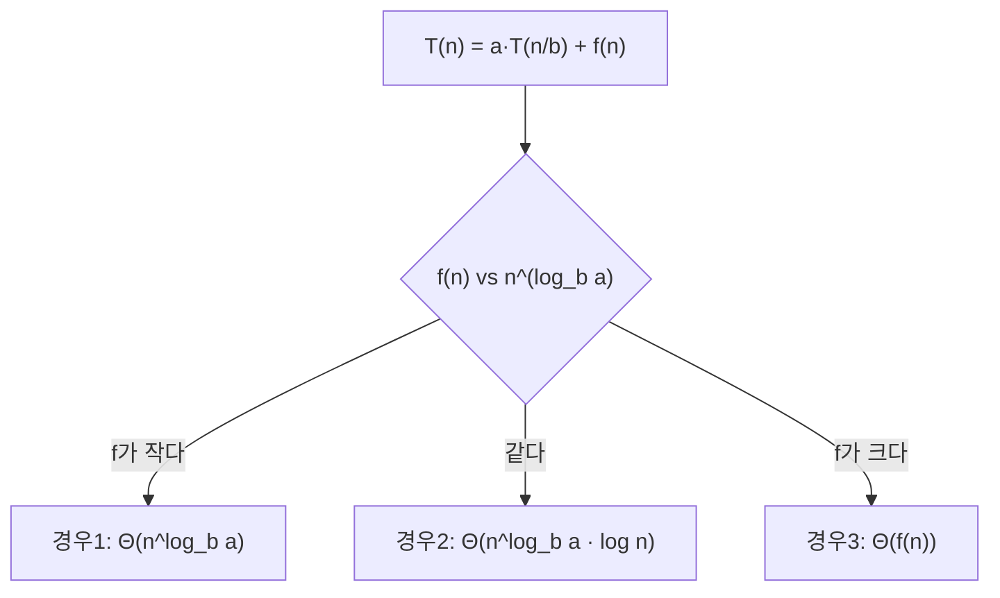

## 자기 자신을 믿는 함수

재귀(recursion)는 "**더 작은 같은 문제**를 풀 줄 안다고 믿고, 그 답으로 지금 문제를 푸는" 사고법입니다. `factorial(n)`을 풀 때 `factorial(n-1)`이 이미 정답을 준다고 믿으면, 남은 일은 `n`을 곱하는 것뿐입니다. 이 믿음이 성립하려면 두 가지가 필요합니다.

- **기저 조건(base case)**: 더 쪼갤 수 없는 가장 작은 문제의 답. 이게 없으면 무한히 내려갑니다.
- **재귀 단계(recursive step)**: 문제를 더 작은 같은 문제로 줄이는 규칙. 매번 기저에 **가까워져야** 합니다.

```python
def factorial(n):
    if n <= 1:          # 기저 조건
        return 1
    return n * factorial(n - 1)   # 재귀 단계 — 한 걸음 작아진다
```

기저로 수렴하지 않는 재귀는 반드시 터집니다. 재귀를 읽을 때 늘 "이게 **반드시** 기저에 도달하는가?"를 먼저 확인하는 습관이 무한 재귀를 막습니다.

## 콜스택 — 재귀가 실제로 사는 곳

재귀는 마법이 아니라 **콜스택(call stack)** 위의 물리적 동작입니다. 함수를 호출할 때마다 매개변수·지역변수·복귀 주소를 담은 **스택 프레임**이 쌓이고(push), `return`할 때 꼭대기부터 걷힙니다(pop). 아래는 `factorial(4)`가 바닥까지 쌓였다가, 기저에서 값을 들고 거꾸로 풀리며 곱이 완성되는 과정입니다.

<div class="rec8-stack" markdown="0">
<style>
.rec8-stack{margin:1.4rem 0;overflow-x:auto}
.rec8-stack svg{width:100%;max-width:640px;height:auto;display:block;margin:0 auto;font-family:inherit}
.rec8-stack .lbl{fill:currentColor;font-size:11.5px;font-weight:600}
.rec8-stack .sub{fill:currentColor;font-size:9.5px;opacity:.6}
.rec8-stack .frame{fill:#1971c2;opacity:0;stroke:#1971c2;stroke-width:1.4}
.rec8-stack .ret{fill:#2f9e44;opacity:0}
.rec8-stack .f1{animation:rec8push 9s ease-in-out infinite;animation-delay:0s}
.rec8-stack .f2{animation:rec8push 9s ease-in-out infinite;animation-delay:.6s}
.rec8-stack .f3{animation:rec8push 9s ease-in-out infinite;animation-delay:1.2s}
.rec8-stack .f4{animation:rec8push 9s ease-in-out infinite;animation-delay:1.8s}
@keyframes rec8push{0%{opacity:0;transform:translateY(-14px)}6%{opacity:.22;transform:translateY(0)}48%{opacity:.22}66%{opacity:0;transform:translateY(-14px)}100%{opacity:0}}
.rec8-stack .r4{animation:rec8ret 9s ease-in-out infinite;animation-delay:4.6s}
.rec8-stack .r3{animation:rec8ret 9s ease-in-out infinite;animation-delay:5.2s}
.rec8-stack .r2{animation:rec8ret 9s ease-in-out infinite;animation-delay:5.8s}
.rec8-stack .r1{animation:rec8ret 9s ease-in-out infinite;animation-delay:6.4s}
@keyframes rec8ret{0%{opacity:0}3%{opacity:1}28%{opacity:1}34%{opacity:0}100%{opacity:0}}
</style>
<svg viewBox="0 0 640 230" role="img" aria-label="factorial(4)가 콜스택에 프레임을 차례로 쌓았다가 기저 조건에 도달한 뒤 거꾸로 값을 반환하며 곱이 완성되는 애니메이션">
  <text class="sub" x="40" y="28">콜스택 (아래로 쌓임 → 위로 풀림)</text>
  <rect class="frame f1" x="40" y="40"  width="240" height="34" rx="5"/>
  <text class="lbl" x="52" y="62">factorial(4)</text>
  <rect class="frame f2" x="60" y="80"  width="240" height="34" rx="5"/>
  <text class="lbl" x="72" y="102">factorial(3)</text>
  <rect class="frame f3" x="80" y="120" width="240" height="34" rx="5"/>
  <text class="lbl" x="92" y="142">factorial(2)</text>
  <rect class="frame f4" x="100" y="160" width="240" height="34" rx="5"/>
  <text class="lbl" x="112" y="182">factorial(1) = 1  ← 기저</text>
  <text class="sub" x="380" y="56">반환하며 곱셈:</text>
  <rect class="ret r4" x="380" y="70"  width="220" height="26" rx="4"/>
  <text class="lbl" x="392" y="88" fill="#2f9e44">1 → factorial(1)=1</text>
  <rect class="ret r3" x="380" y="100" width="220" height="26" rx="4"/>
  <text class="lbl" x="392" y="118" fill="#2f9e44">2×1 → factorial(2)=2</text>
  <rect class="ret r2" x="380" y="130" width="220" height="26" rx="4"/>
  <text class="lbl" x="392" y="148" fill="#2f9e44">3×2 → factorial(3)=6</text>
  <rect class="ret r1" x="380" y="160" width="220" height="26" rx="4"/>
  <text class="lbl" x="392" y="178" fill="#2f9e44">4×6 → factorial(4)=24</text>
</svg>
</div>

여기서 두 가지가 따라옵니다. 첫째, 재귀 깊이만큼 **스택 메모리**를 먹습니다 — 깊이가 수만이면 **스택 오버플로**로 죽습니다. 둘째, 마지막 동작이 **순수한 자기 호출**(꼬리재귀, tail recursion)이면 컴파일러가 프레임을 재활용해 반복문으로 바꿀 수 있습니다. 다만 **JVM·CPython은 꼬리 호출 최적화를 하지 않으므로**, 깊은 재귀는 명시적 반복문이나 자체 스택으로 바꿔야 합니다.

## 분할정복 — 쪼개고, 풀고, 합친다

분할정복(divide and conquer)은 재귀를 **전략**으로 끌어올린 것입니다. 세 단계로 움직입니다.

1. **분할(divide)**: 문제를 같은 종류의 더 작은 부분으로 나눈다.
2. **정복(conquer)**: 부분을 재귀로 푼다(충분히 작으면 직접).
3. **결합(combine)**: 부분의 답을 합쳐 전체 답을 만든다.

[병합 정렬]()이 교과서적 예입니다. 배열을 절반씩 쪼개 바닥까지 내려갔다가, 정렬된 조각을 **병합하며 거꾸로 올라옵니다**. 아래는 그 "내려가며 쪼개고, 올라오며 합치는" 리듬입니다.

<div class="rec8-dc" markdown="0">
<style>
.rec8-dc{margin:1.4rem 0;overflow-x:auto}
.rec8-dc svg{width:100%;max-width:660px;height:auto;display:block;margin:0 auto;font-family:inherit}
.rec8-dc .lbl{fill:currentColor;font-size:10.5px;font-weight:600}
.rec8-dc .sub{fill:currentColor;font-size:9.5px;opacity:.6}
.rec8-dc .ln{stroke:currentColor;opacity:.25;stroke-width:1.2}
.rec8-dc .split{fill:none;stroke:#1971c2;stroke-width:1.6;opacity:0}
.rec8-dc .merge{fill:none;stroke:#2f9e44;stroke-width:1.6;opacity:0}
.rec8-dc .bt{fill:currentColor;font-size:10px}
.rec8-dc .d0{animation:rec8sp 8s ease-in-out infinite;animation-delay:.2s}
.rec8-dc .d1{animation:rec8sp 8s ease-in-out infinite;animation-delay:1s}
.rec8-dc .d2{animation:rec8sp 8s ease-in-out infinite;animation-delay:1.8s}
@keyframes rec8sp{0%{opacity:0}4%{opacity:.85}46%{opacity:.85}52%{opacity:.2}100%{opacity:.2}}
.rec8-dc .m2{animation:rec8mg 8s ease-in-out infinite;animation-delay:4s}
.rec8-dc .m1{animation:rec8mg 8s ease-in-out infinite;animation-delay:4.8s}
.rec8-dc .m0{animation:rec8mg 8s ease-in-out infinite;animation-delay:5.6s}
@keyframes rec8mg{0%{opacity:0}3%{opacity:.9}96%{opacity:.9}100%{opacity:.9}}
</style>
<svg viewBox="0 0 660 250" role="img" aria-label="병합 정렬이 배열을 절반씩 분할하며 내려갔다가 정렬된 조각을 병합하며 올라오는 분할정복 트리 애니메이션">
  <text class="sub" x="20" y="22" fill="#1971c2">▼ 분할(divide)</text>
  <text class="sub" x="560" y="22" fill="#2f9e44">병합(merge) ▲</text>
  <rect class="split d0" x="250" y="34" width="160" height="26" rx="4"/>
  <text class="bt" x="330" y="51" text-anchor="middle">[5 2 8 1]</text>
  <rect class="split d1" x="150" y="96" width="90" height="26" rx="4"/>
  <text class="bt" x="195" y="113" text-anchor="middle">[5 2]</text>
  <rect class="split d1" x="420" y="96" width="90" height="26" rx="4"/>
  <text class="bt" x="465" y="113" text-anchor="middle">[8 1]</text>
  <rect class="split d2" x="110" y="158" width="44" height="26" rx="4"/>
  <text class="bt" x="132" y="175" text-anchor="middle">[5]</text>
  <rect class="split d2" x="186" y="158" width="44" height="26" rx="4"/>
  <text class="bt" x="208" y="175" text-anchor="middle">[2]</text>
  <rect class="split d2" x="380" y="158" width="44" height="26" rx="4"/>
  <text class="bt" x="402" y="175" text-anchor="middle">[8]</text>
  <rect class="split d2" x="456" y="158" width="44" height="26" rx="4"/>
  <text class="bt" x="478" y="175" text-anchor="middle">[1]</text>
  <line class="ln" x1="330" y1="60" x2="195" y2="96"/>
  <line class="ln" x1="330" y1="60" x2="465" y2="96"/>
  <line class="ln" x1="195" y1="122" x2="132" y2="158"/>
  <line class="ln" x1="195" y1="122" x2="208" y2="158"/>
  <line class="ln" x1="465" y1="122" x2="402" y2="158"/>
  <line class="ln" x1="465" y1="122" x2="478" y2="158"/>
  <rect class="merge m2" x="150" y="200" width="90" height="26" rx="4"/>
  <text class="bt" x="195" y="217" text-anchor="middle">[2 5]</text>
  <rect class="merge m2" x="420" y="200" width="90" height="26" rx="4"/>
  <text class="bt" x="465" y="217" text-anchor="middle">[1 8]</text>
  <rect class="merge m0" x="250" y="200" width="160" height="26" rx="4" transform="translate(0,-138)"/>
  <text class="bt m0" x="330" y="79" text-anchor="middle" fill="#2f9e44" style="font-weight:700">[1 2 5 8]</text>
</svg>
</div>

분할정복이 강력한 이유는 **합치는 비용**이 쌀 때 전체가 극적으로 빨라지기 때문입니다. 정렬을 절반씩 나눠 각각 정렬한 뒤 병합하면, 비교 정렬은 $O(n^2)$에서 $O(n\log n)$으로 떨어집니다. 같은 아이디어가 [퀵정렬·이진 탐색]()·고속 푸리에 변환·행렬 곱(Strassen)까지 관통합니다.

## 마스터 정리 — 재귀의 비용을 즉답하는 공식

분할정복의 비용은 **점화식(recurrence)** 으로 표현됩니다.

$$T(n) = a\,T\!\left(\frac{n}{b}\right) + f(n)$$

- $a$: 부분 문제의 **개수**
- $b$: 한 단계에서 문제 크기가 줄어드는 **배수**
- $f(n)$: 분할·결합에 드는 **단계당 추가 비용**

마스터 정리는 $f(n)$과 $n^{\log_b a}$의 크기를 비교해 $T(n)$을 **세 경우**로 즉답합니다.

| 경우 | 조건 | 결론 | 직관 |
|------|------|------|------|
| 1 | $f(n) = O(n^{\log_b a - \epsilon})$ | $T(n)=\Theta(n^{\log_b a})$ | 잎(leaf)이 지배 |
| 2 | $f(n) = \Theta(n^{\log_b a})$ | $T(n)=\Theta(n^{\log_b a}\log n)$ | 층마다 균등 → $\log n$배 |
| 3 | $f(n) = \Omega(n^{\log_b a + \epsilon})$ | $T(n)=\Theta(f(n))$ | 뿌리(root)가 지배 |

병합 정렬은 $a=2,\,b=2,\,f(n)=\Theta(n)$이고 $n^{\log_2 2}=n$이라 **경우 2** → $\Theta(n\log n)$. 한눈에 나옵니다. 이진 탐색은 $a=1,\,b=2,\,f(n)=\Theta(1)$ → $\Theta(\log n)$.



## 카라츠바 — $a$를 줄여 차수를 낮추다

마스터 정리의 위력은 **$a$를 줄이면 지수가 내려간다**는 통찰을 줍니다. 두 $n$자리 수를 곱할 때, 초등학교 방식은 $\Theta(n^2)$입니다. 카라츠바(Karatsuba)는 수를 반으로 쪼개 곱셈 **4번이 필요해 보이는 것을 3번**으로 줄입니다($x=x_1 B + x_0$로 놓고 $x_1y_0+x_0y_1$을 한 번의 곱으로 추출).

$$T(n) = 3\,T\!\left(\frac{n}{2}\right) + \Theta(n) \;\Rightarrow\; \Theta\!\left(n^{\log_2 3}\right) \approx \Theta(n^{1.585})$$

곱셈 횟수 $a$를 4→3으로 줄인 것만으로 지수가 2→1.585로 떨어집니다. "결합 비용을 늘려서라도 부분 문제 수를 줄인다"는 분할정복 설계의 정수입니다.

## 프로덕션에서 마주치는 함정

| 함정 | 증상 | 해법 |
|------|------|------|
| 기저 누락·수렴 실패 | 무한 재귀 → `StackOverflowError` | 기저 조건과 "매번 작아지는가" 검증 |
| 깊은 재귀 | 입력 수만 깊이에서 스택 폭발(JVM 기본 ~512KB) | 반복문·명시적 스택으로 변환, 또는 스택 크기↑ |
| 중복 부분 문제 재계산 | 피보나치 재귀가 $O(2^n)$ | 메모이제이션 → [동적계획법]() |
| 꼬리재귀 믿음 | "꼬리재귀니 괜찮겠지" → JVM/CPython은 미최적화 | 언어 지원 확인, 안 되면 루프로 |
| 결합 비용 과소평가 | 분할은 빠른데 merge가 $O(n^2)$ | $f(n)$을 정확히 세고 마스터 정리 재적용 |

## 면접/리뷰 단골 질문

- **Q. 재귀와 반복의 차이?** → 재귀는 콜스택에 상태를 쌓아 표현력이 좋지만 스택 메모리·호출 비용이 든다. 반복은 메모리 상수지만 코드가 장황할 수 있다. 트리·분할정복은 재귀가 자연스럽다.
- **Q. 꼬리재귀가 뭐고 왜 중요?** → 마지막 동작이 순수 자기 호출이면 프레임 재활용으로 반복문화 가능. 단 JVM·CPython은 미지원이라 깊은 재귀는 직접 루프로 바꿔야 한다.
- **Q. 마스터 정리 세 경우?** → $f(n)$과 $n^{\log_b a}$ 비교. 잎 지배(1)·균등(2, $\log n$배)·뿌리 지배(3). 병합 정렬은 경우 2 → $\Theta(n\log n)$.
- **Q. 카라츠바가 $n^{1.585}$인 이유?** → 곱셈을 4→3번으로 줄여 $a=3,b=2$ → $n^{\log_2 3}$. 부분 문제 수가 지수를 결정.
- **Q. 분할정복이 항상 빠른가?** → 아니다. 결합 비용 $f(n)$이 크면(경우 3) 이득이 사라진다. 분할·결합이 싸야 이긴다.

## 정리

- 재귀는 **기저 조건 + 작아지는 재귀 단계**로 성립하며, 실제로는 **콜스택**에 프레임을 쌓았다 푸는 물리적 동작이다.
- 분할정복은 **분할→정복→결합**의 전략. 결합이 쌀 때 $O(n^2)$를 $O(n\log n)$으로 끌어내린다.
- **마스터 정리** $T(n)=aT(n/b)+f(n)$는 $f(n)$과 $n^{\log_b a}$ 비교로 비용을 즉답한다.
- 깊은 재귀의 스택 폭발과 중복 계산은 각각 **반복문화**와 [동적계획법]()으로 해결한다.

> 이전 글은 [복잡도와 분할상환]()이었습니다. 다음 글에서는 재귀가 가장 자연스럽게 살아 숨 쉬는 자료구조, [트리와 균형 트리]()로 들어갑니다.
</content>
</invoke>
