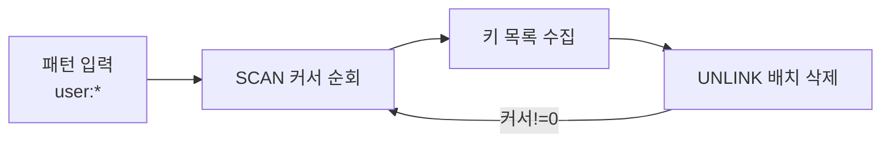

그 주엔 운영 중인 캐시 키를 조회하고 삭제하는 관리자 도구 페이지를 만들었다. 캐시는 평소엔 보이지 않게 잘 돌지만, 가끔 **스테일(stale) 데이터**가 끼어 잘못된 값을 계속 내려줄 때가 있다. 무효화 로직의 버그든, 외부에서 직접 데이터를 손댄 경우든, 운영자가 "이 키만 지금 비워줘"라고 해야 하는 순간이 온다. 그런 순간을 위한 도구다. 그런데 이 도구를 잘못 만들면 **도구 자체가 운영 장애의 원인**이 된다.

## KEYS는 운영 레디스에서 쓰면 안 된다

가장 먼저 떠오르는 건 `KEYS user:*` 같은 패턴 매칭이다. 동작은 한다. 개발 장비에선 멀쩡하다. 하지만 운영에서 이건 지뢰다.

레디스는 **싱글 스레드**로 명령을 처리한다. 한 번에 하나의 명령만 돌고, 그 명령이 끝나야 다음 명령이 처리된다. `KEYS`는 **전체 키스페이스를 한 번에 스캔하는 O(N) 명령**이다. 키가 수백만 개면 그 스캔이 끝날 때까지 — 수백 밀리초에서 수 초 — 레디스는 다른 모든 요청을 막아 둔다. 그 사이 들어온 정상 요청들은 전부 줄을 선다. **캐시 조회 한 번이 전체 응답을 멈춰 세운다.** 운영에서 `KEYS`로 장애를 낸 사례는 셀 수 없이 많다.

## SCAN — 커서로 잘라서 순회한다

대안은 `SCAN`이다. SCAN은 전체를 한 번에 보지 않고 **커서**를 써서 조금씩 끊어 본다. 한 번 호출에 일정 개수(`COUNT` 힌트)만 보고 다음 커서를 돌려준다. 커서가 0으로 돌아올 때까지 반복하면 전체를 순회한다.

```java
public List<String> scanKeys(String pattern) {
    List<String> result = new ArrayList<>();
    ScanOptions options = ScanOptions.scanOptions()
        .match(pattern)        // 예: "user:*"
        .count(200)            // 한 번에 훑을 대략적 개수(힌트)
        .build();

    try (Cursor<byte[]> cursor =
             redisConnection.scan(options)) {
        while (cursor.hasNext()) {
            result.add(new String(cursor.next()));
        }
    }
    return result;
}
```

각 호출이 짧으므로 다른 요청 사이에 끼어 처리된다. 레디스가 멈추지 않는다. 다만 트레이드오프가 있다. SCAN은 순회 도중 추가·삭제된 키에 대해 완벽한 스냅샷을 보장하지 않는다 — 진행 중 생긴 키는 보일 수도, 안 보일 수도 있다. 대신 순회 시작 전부터 끝까지 계속 존재한 키는 반드시 한 번 이상 반환한다. 캐시 점검 용도엔 이 정도 일관성으로 충분하다.

## 패턴 삭제의 주의

조회한 키를 삭제할 때도 마찬가지다. 큰 컬렉션(거대한 Hash·Set)을 `DEL`로 한 번에 지우면 그 삭제 자체가 블로킹된다. 레디스 4.0 이상은 `UNLINK`로 **삭제를 백그라운드 스레드에 넘겨** 메인 스레드를 막지 않는다. 패턴 삭제는 SCAN으로 키를 모은 뒤 배치로 `UNLINK` 하는 식으로 한다.



## 도구에 권한을 거는 이유

이 도구는 **운영 캐시를 직접 지울 수 있는 힘**을 준다. 잘못 쓰면 멀쩡한 캐시를 통째로 날려 일시적으로 DB에 부하가 몰리는 캐시 스탬피드(stampede)를 부른다. 그래서 도구 자체에 접근 권한을 건다. 누가, 언제, 어떤 패턴으로 무엇을 지웠는지 로그를 남긴다. `FLUSHALL` 같은 전체 삭제는 도구에서 아예 막거나 별도의 강한 확인 절차를 둔다. **위험한 명령일수록 도구가 막아준다.**

## 운영 함정

**패턴 매칭의 와일드카드를 과신하지 마라.** `user:*`를 지운다는 게 `user:profile:*`까지 다 지우는 의도였는지, 운영자는 종종 헷갈린다. 삭제 전에 매칭되는 키 개수와 샘플을 먼저 보여주고 확인을 받는 게 안전하다.

**SCAN의 COUNT는 정확한 개수가 아니다.** `COUNT 200`은 "대략 이 정도씩 보라"는 힌트일 뿐, 매 호출이 정확히 200개를 돌려주지 않는다. 적게 올 수도, 0개가 올 수도 있다(커서는 아직 0이 아님). 그러니 "한 번 호출했는데 비었으니 끝"이라고 판단하면 안 된다. **반드시 커서가 0이 될 때까지 반복**해야 한다.

## 핵심 요약

- 레디스는 싱글 스레드라 O(N) 명령 하나가 전체를 멈춘다. 운영에서 `KEYS` 금지.
- `SCAN`은 커서로 끊어 순회해 메인 스레드를 막지 않는다. 커서가 0일 때까지 반복한다.
- 큰 키 삭제는 `UNLINK`로 백그라운드에 넘긴다.
- 캐시를 직접 지우는 도구엔 권한·로그·확인 절차를 둔다.

> **면접 한 줄 Q&A**
> Q. 운영 레디스에서 KEYS가 위험한 이유는?
> A. 레디스는 싱글 스레드라 O(N)인 KEYS가 전체 키스페이스를 훑는 동안 다른 모든 요청을 블로킹한다. SCAN으로 커서를 써서 끊어 순회해야 한다.
