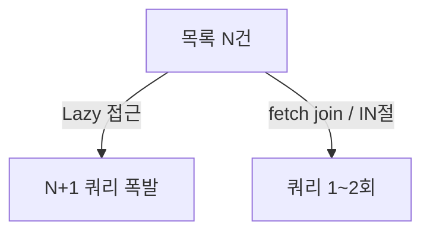

연관 데이터를 어떻게 불러올지 정해야 하는 주가 있었다. 주문 목록을 보여주면서 각 주문의 고객·상품도 함께 필요했다. 필요할 때 그때그때 불러올까(지연), 처음부터 한 번에 다 불러올까(즉시). 잘못 고르면 **N+1 쿼리**로 페이지가 기어가거나, 안 쓰는 데이터까지 끌어와 메모리를 낭비한다.

## 두 전략의 내부 동작

- **지연 로딩(Lazy)**: 연관 객체를 프록시로 두고, 실제 접근하는 순간 추가 쿼리를 날린다. 안 쓰면 안 불러오니 단건 조회엔 효율적이다. **함정은 목록**이다. 주문 100건을 돌며 각 주문의 고객을 접근하면 `1(목록) + 100(고객)` = **N+1 쿼리**가 터진다.
- **즉시 로딩(Eager)**: 처음부터 JOIN이나 추가 쿼리로 연관을 함께 가져온다. N+1은 없다. 대신 그 화면에서 안 쓰는 연관까지 항상 끌어오고, 컬렉션을 JOIN하면 결과 행이 곱연산으로 부풀어(카테시안 곱) 오히려 느려진다.

핵심은 "**지연/즉시는 전역 설정이 아니라 화면(쿼리)별 결정**"이라는 것이다. 같은 엔티티라도 목록 화면은 한 번에, 상세 화면은 그때그때가 맞을 수 있다.



## 코드: N+1을 IN 절로 접기

순수 SQL/MyBatis라면 목록을 먼저 받고, 거기서 모은 키로 연관을 **IN 절 한 번**에 가져와 메모리에서 합친다(배치 페치).

```java
List<Order> orders = orderMapper.findPage(page);          // 1쿼리
List<Long> customerIds = orders.stream()
        .map(Order::getCustomerId).distinct().toList();
Map<Long, Customer> customers = customerMapper
        .findByIds(customerIds).stream()                  // +1쿼리 (IN)
        .collect(toMap(Customer::getId, c -> c));
orders.forEach(o -> o.setCustomer(customers.get(o.getCustomerId())));
```

```sql
SELECT * FROM customer WHERE id IN (1, 7, 12, ...);  -- N+1 → 1+1
```

JPA라면 `JOIN FETCH`(단일 연관)나 `@BatchSize`(컬렉션을 IN 절로 묶기)로 같은 효과를 낸다.

## 운영 함정

**1. 컬렉션 fetch join + 페이징.** `JOIN FETCH`로 일대다 컬렉션을 가져오면서 동시에 페이징하면, DB는 곱연산된 행을 메모리로 다 읽은 뒤 잘라낸다(경고 로그 후 인메모리 페이징). 컬렉션은 `@BatchSize`/별도 IN 조회로 분리해야 한다.

**2. 트랜잭션 밖 지연 로딩.** 지연 프록시를 트랜잭션(영속성 컨텍스트)이 닫힌 뒤 뷰에서 접근하면 `LazyInitializationException`이 난다. 필요한 연관은 서비스 계층에서 미리 초기화해 내보낸다.

## 핵심 요약

- 지연은 단건에 효율적이나 목록에서 N+1을 유발한다. 즉시는 N+1은 없지만 과다 조회·카테시안 곱 위험.
- 전역 설정이 아니라 화면(쿼리)별로 고른다.
- N+1은 IN 절 배치 페치(또는 fetch join/`@BatchSize`)로 접고, 컬렉션 페이징은 fetch join과 분리한다.
