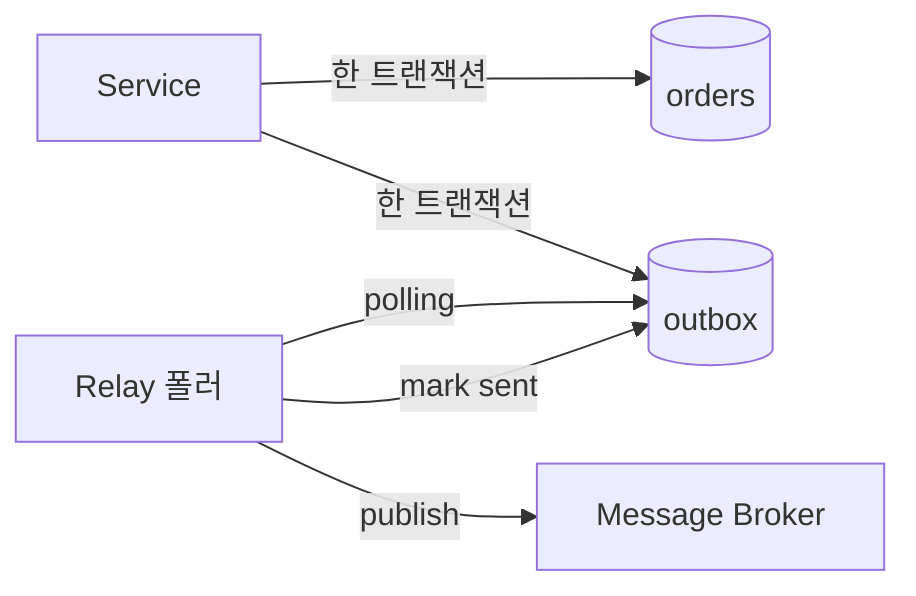

데이터를 저장한 뒤 다른 시스템에 알림이나 이벤트를 발행해야 하는 작업을 한 적이 있다. 핵심은 단순해 보이지만 실은 분산 시스템에서 가장 흔히 무너지는 지점이다 — **DB 저장과 외부 발행이라는 두 개의 쓰기를 어떻게 하나의 단위로 만드느냐**다.

## 이중 쓰기(dual-write)는 왜 깨지는가

전형적인 서비스 코드는 이렇게 생겼다.

```java
@Transactional
public void placeOrder(Order order) {
    orderRepository.save(order);      // (1) DB write
    messageBroker.publish(orderEvent); // (2) 외부 write
}
```

문제는 (1)과 (2)가 **서로 다른 자원**이라는 데 있다. DB 트랜잭션은 (1)만 보호한다. (2)는 그 트랜잭션 바깥의 네트워크 호출이다. 다음 두 경우가 반드시 발생한다.

- (1) 커밋 성공 → (2) 발행 직전 프로세스 다운: **저장됐지만 이벤트 없음** (유실)
- (2) 먼저 발행 → (1) 커밋 실패/롤백: **이벤트는 나갔는데 데이터 없음** (유령 이벤트)

2단계 커밋(XA)으로 두 자원을 묶을 수는 있지만, 메시지 브로커가 XA를 지원해야 하고 성능·운영 비용이 크다. 그래서 실무는 다른 길을 택한다.

## 트랜잭셔널 아웃박스

발상의 전환은 이렇다. **외부로 보낼 메시지를, 보내는 대신 같은 DB에 저장한다.** 그러면 "비즈니스 데이터 저장"과 "메시지 기록"이 *같은 트랜잭션 안의 두 INSERT*가 되어 원자적으로 커밋된다. 실제 발행은 별도의 릴레이(relay)가 아웃박스 테이블을 읽어 비동기로 수행한다.



```sql
CREATE TABLE outbox (
    id          BIGINT PRIMARY KEY AUTO_INCREMENT,
    aggregate   VARCHAR(64)  NOT NULL,
    event_type  VARCHAR(64)  NOT NULL,
    payload     JSON         NOT NULL,
    status      VARCHAR(16)  NOT NULL DEFAULT 'PENDING',
    created_at  DATETIME     NOT NULL DEFAULT CURRENT_TIMESTAMP
);
CREATE INDEX idx_outbox_status ON outbox (status, id);
```

```java
@Transactional
public void placeOrder(Order order) {
    orderRepository.save(order);
    outboxRepository.save(new OutboxEvent(
        "order", "ORDER_PLACED", toJson(order)));  // 같은 트랜잭션
}
```

릴레이는 주기적으로 `status='PENDING'` 행을 잠가(`FOR UPDATE SKIP LOCKED`) 발행하고 `SENT`로 바꾼다. 커밋된 행만 보이므로 유령 이벤트가 원천 차단되고, 다운돼도 PENDING이 남아 재시도된다.

## 운영 함정

**최소 1회 전달(at-least-once)이 기본이다.** 릴레이가 발행한 직후 `SENT` 마킹 전에 죽으면 같은 메시지가 다시 나간다. 따라서 소비자는 반드시 **멱등(idempotent)** 해야 한다 — 메시지에 고유 ID를 싣고 소비 측에서 중복 제거한다.

**아웃박스 테이블이 비대해진다.** `SENT` 행을 영원히 두면 인덱스가 부풀고 폴링이 느려진다. 보관 기간을 정해 배치로 삭제하거나 파티션을 돌린다.

## 핵심 요약

- 이중 쓰기는 두 자원을 한 트랜잭션으로 못 묶어 깨진다.
- 아웃박스는 "메시지 기록"을 비즈니스 저장과 **같은 로컬 트랜잭션**으로 끌어와 원자성을 확보한다.
- 전달 보장은 at-least-once이므로 소비자 멱등성이 짝을 이룬다.

> **면접 Q.** 아웃박스 패턴이 2단계 커밋보다 나은 이유는?
> **A.** 외부 자원을 분산 트랜잭션에 끌어들이지 않고 단일 DB의 로컬 트랜잭션만으로 정합을 보장하므로, 브로커 종류와 무관하게 단순하고 가용성·성능 비용이 낮다. 대신 정확히-1회가 아닌 최소-1회 의미론을 멱등 소비로 보완한다.
