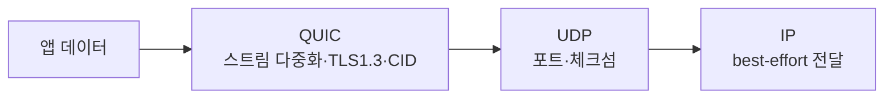

## 신뢰성이 항상 정답은 아니다

[TCP]()는 손실·순서·중복을 모두 막아 줍니다. 그런데 그 신뢰성이 **방해**가 되는 순간이 있습니다. 화상통화에서 0.3초 전 프레임을 재전송받아 봐야 의미가 없고, 게임에서 늦은 위치 패킷은 쓰레기입니다. "늦은 정확함보다 제때의 근사함"이 필요할 때, TCP의 재전송과 순서 보장은 오히려 지연을 만듭니다.

이 글은 두 가지를 봅니다. **UDP** — 아무것도 안 해주는 대신 빠르고 자유로운 전송. 그리고 **QUIC** — UDP 위에 TCP보다 나은 신뢰성을 다시 쌓아 올린, HTTP/3의 토대.

## UDP: 8바이트가 전부

UDP 헤더는 단 8바이트입니다. TCP의 20+바이트, 연결, 상태와 비교하면 거의 "포장 안 한 IP"입니다.

| 필드 | 크기 |
|------|------|
| 출발지 포트 / 목적지 포트 | 각 16비트 |
| 길이 | 16비트 |
| 체크섬 | 16비트 |

UDP가 해주는 것: **포트 다중화**(어느 프로세스로)와 **선택적 체크섬**. 그게 끝입니다. 핸드셰이크 없음, 순서 보장 없음, 재전송 없음, 혼잡 제어 없음. 그래서:

- **빠른 시작**: 연결 수립 RTT가 0. 첫 패킷부터 데이터.
- **자유**: 신뢰성·순서·혼잡 정책을 **애플리케이션이 원하는 대로** 다시 설계 가능.
- **대가**: 손실·순서·혼잡을 직접 책임져야 함.

그래서 UDP를 쓰는 곳은 명확합니다 — **DNS**([질의 1개=패킷 1개]()), 실시간 미디어(RTP/WebRTC), 게임, 그리고 그 위에 독자 신뢰성을 얹는 **QUIC**.

## TCP의 구조적 한계 두 가지

QUIC가 왜 나왔는지는 TCP의 두 한계에서 출발합니다.

**(1) 연결 수립이 느리다.** HTTPS 한 번에 TCP 3-way handshake(1 RTT) + TLS 핸드셰이크(TLS 1.3에서 1 RTT)가 **직렬**로 듭니다. 먼 서버일수록 이 왕복이 체감 지연을 지배합니다.

**(2) Head-of-Line(HOL) blocking.** TCP는 단일 바이트 스트림이라 **순서대로** 전달합니다. [HTTP/2]()가 한 TCP 연결에 여러 요청을 멀티플렉싱해도, 중간의 패킷 하나가 손실되면 그 뒤 **모든 스트림**이 재전송을 기다리며 멈춥니다. 애플리케이션 레벨에선 독립인데 전송 레벨에서 묶여버립니다.

## QUIC: UDP 위에 다시 세운 전송 계층

QUIC는 UDP 위에서 동작하는 사용자 공간 전송 프로토콜입니다(커널이 아니라 라이브러리로 구현 → 빠른 진화). 핵심 설계:

- **TLS 1.3 통합**: 암호화가 옵션이 아니라 프로토콜의 일부. 핸드셰이크와 키 교환이 합쳐짐.
- **독립 스트림**: 한 연결 안에 여러 스트림, 각각 **독립적으로** 순서·재전송 관리 → HOL blocking 제거.
- **Connection ID**: 연결을 IP/포트가 아니라 ID로 식별 → IP가 바뀌어도(와이파이↔LTE) 연결 유지.

### 핸드셰이크 RTT: 직렬 vs 통합

가장 큰 체감 차이입니다. TCP+TLS는 연결과 암호화를 따로 왕복하지만, QUIC는 하나로 합치고 재방문 시 **0-RTT**로 첫 패킷에 데이터를 실어 보냅니다.

<div class="quic-rtt" markdown="0">
<style>
.quic-rtt{margin:1.4rem 0;overflow-x:auto}
.quic-rtt svg{width:100%;max-width:720px;height:auto;display:block;margin:0 auto;font-family:inherit}
.quic-rtt .life{stroke:currentColor;stroke-width:1.5;opacity:.35}
.quic-rtt .lbl{fill:currentColor;font-size:11.5px;font-weight:600}
.quic-rtt .sub{fill:currentColor;font-size:9.5px;opacity:.6}
.quic-rtt .t-tcp{fill:#e03131}
.quic-rtt .t-quic{fill:#2f9e44}
.quic-rtt .m1{animation:quicm 5s ease-in-out infinite}
.quic-rtt .m2{animation:quicm 5s ease-in-out infinite .55s}
.quic-rtt .m3{animation:quicm 5s ease-in-out infinite 1.1s}
.quic-rtt .m4{animation:quicm 5s ease-in-out infinite 1.65s}
.quic-rtt .q1{animation:quicm 5s ease-in-out infinite}
@keyframes quicm{0%{opacity:0;transform:translateX(0)}5%{opacity:1}40%{opacity:1;transform:translateX(310px)}48%{opacity:0;transform:translateX(310px)}100%{opacity:0}}
</style>
<svg viewBox="0 0 720 230" role="img" aria-label="TCP와 TLS는 여러 번 왕복해야 데이터를 보내지만 QUIC는 한 번 또는 0번 왕복으로 데이터를 보내는 핸드셰이크 비교 애니메이션">
  <text class="lbl" x="80"  y="20" text-anchor="middle">TCP + TLS 1.3</text>
  <text class="sub" x="80"  y="36" text-anchor="middle">2 RTT 후 데이터</text>
  <line class="life" x1="40" y1="46" x2="40" y2="210"/>
  <line class="life" x1="350" y1="46" x2="350" y2="210"/>
  <text class="t-tcp m1" x="50" y="64">▶ SYN</text>
  <text class="t-tcp m2" x="50" y="104">◀ SYN-ACK / ACK</text>
  <text class="t-tcp m3" x="50" y="144">▶ TLS ClientHello</text>
  <text class="t-tcp m4" x="50" y="184">◀ ServerHello … 그제서야 데이터</text>

  <text class="lbl" x="470" y="20" text-anchor="middle">QUIC (재방문 0-RTT)</text>
  <text class="sub" x="470" y="36" text-anchor="middle">첫 패킷에 데이터 동봉</text>
  <line class="life" x1="410" y1="46" x2="410" y2="210"/>
  <line class="life" x1="700" y1="46" x2="700" y2="210"/>
  <text class="t-quic q1" x="420" y="64">▶ Initial + 0-RTT 데이터</text>
  <text class="sub" x="420" y="104">한 번의 왕복(또는 0)으로 끝</text>
</svg>
</div>

### HOL blocking: 한 스트림의 손실이 모두를 막나

TCP/HTTP-2는 한 패킷 손실이 전체를 멈추지만, QUIC는 스트림이 독립이라 **손실난 스트림만** 기다립니다. 아래에서 빨간 손실이 났을 때, 위(TCP)는 뒤 패킷이 함께 멈추고, 아래(QUIC)는 다른 스트림이 계속 흐릅니다.

<div class="quic-hol" markdown="0">
<style>
.quic-hol{margin:1.4rem 0;overflow-x:auto}
.quic-hol svg{width:100%;max-width:700px;height:auto;display:block;margin:0 auto;font-family:inherit}
.quic-hol .lbl{fill:currentColor;font-size:11.5px;font-weight:600}
.quic-hol .sub{fill:currentColor;font-size:9.5px;opacity:.6}
.quic-hol .lost{fill:#e03131}
.quic-hol .s1{fill:#1971c2}.quic-hol .s2{fill:#f08c00}.quic-hol .s3{fill:#2f9e44}
.quic-hol .tcpflow{animation:quicstuck 5s ease-in-out infinite}
.quic-hol .qa{animation:quicgo 5s linear infinite}
.quic-hol .qb{animation:quicgo 5s linear infinite}
.quic-hol .qlost{animation:quicstuck2 5s ease-in-out infinite}
@keyframes quicstuck{0%{transform:translateX(0);opacity:1}35%{transform:translateX(150px);opacity:1}40%,100%{transform:translateX(150px);opacity:.4}}
@keyframes quicgo{0%{transform:translateX(0);opacity:1}90%{transform:translateX(430px);opacity:1}100%{opacity:0;transform:translateX(430px)}}
@keyframes quicstuck2{0%{transform:translateX(0);opacity:1}35%{transform:translateX(150px);opacity:1}40%,100%{transform:translateX(150px);opacity:.4}}
</style>
<svg viewBox="0 0 700 180" role="img" aria-label="TCP는 한 패킷 손실로 뒤 패킷 전체가 멈추지만 QUIC는 독립 스트림이라 손실 안 난 스트림이 계속 흐르는 비교 애니메이션">
  <text class="lbl" x="6" y="20">TCP/HTTP-2 · 단일 스트림 — 하나 막히면 전부 멈춤</text>
  <line x1="6" y1="62" x2="694" y2="62" stroke="currentColor" stroke-opacity="0.12"/>
  <g class="tcpflow">
    <rect class="lost" x="20"  y="48" width="22" height="16" rx="2"/>
    <rect class="s1"   x="48"  y="48" width="22" height="16" rx="2"/>
    <rect class="s2"   x="76"  y="48" width="22" height="16" rx="2"/>
    <rect class="s3"   x="104" y="48" width="22" height="16" rx="2"/>
  </g>
  <text class="sub" x="200" y="60">빨강 손실 → 뒤 전부 대기 ✖</text>

  <text class="lbl" x="6" y="120">QUIC · 독립 스트림 — 손실난 것만 대기</text>
  <line x1="6" y1="150" x2="694" y2="150" stroke="currentColor" stroke-opacity="0.12"/>
  <rect class="qlost lost" x="20" y="136" width="22" height="16" rx="2"/>
  <rect class="qa s2" x="48"  y="136" width="22" height="16" rx="2"/>
  <rect class="qb s3" x="76"  y="136" width="22" height="16" rx="2"/>
  <text class="sub" x="540" y="148">다른 스트림 계속 ✔</text>
</svg>
</div>

이 두 가지(빠른 핸드셰이크 + HOL 제거)가 **HTTP/3 = HTTP over QUIC**의 정체입니다. HTTP/3는 새 문법이 아니라, HTTP/2의 의미를 QUIC 위로 옮긴 것입니다.

## Connection Migration: 연결이 IP에 묶이지 않는다

TCP 연결은 4-튜플(출발IP·포트, 목적IP·포트)로 식별돼, 와이파이에서 LTE로 바뀌어 IP가 변하면 연결이 끊깁니다. QUIC는 **Connection ID**로 연결을 식별하므로, 클라이언트 IP가 바뀌어도 같은 연결을 이어갑니다. 모바일에서 영상이 끊기지 않고 망을 갈아타는 경험이 여기서 나옵니다.



## 프로덕션 함정

- **UDP는 방화벽·NAT에서 막히기 쉽다**: 많은 사내망이 UDP/443을 차단합니다. 그래서 QUIC 클라이언트는 **TCP/TLS로 폴백**하는 경로를 반드시 둡니다. "QUIC가 안 켜진다"의 단골 원인.
- **0-RTT 데이터는 재전송 공격(replay)에 취약**: 0-RTT로 보낸 요청은 공격자가 가로채 재전송할 수 있어, **멱등(GET 등) 요청에만** 허용해야 합니다. 결제 같은 비멱등 요청에 0-RTT를 쓰면 안 됩니다.
- **CPU 비용**: QUIC는 사용자 공간 + 암호화 기본이라 커널 TCP보다 CPU를 더 씁니다. 대규모 서버는 오프로딩·튜닝이 필요합니다.
- **UDP 버퍼**: 고처리량 QUIC에선 `net.core.rmem_max`/`wmem_max`가 작으면 손실이 납니다.

## 디버깅

```bash
# QUIC는 UDP/443 — UDP 트래픽부터 확인
sudo tcpdump -n 'udp port 443'
ss -ua                                   # UDP 소켓 목록

# 브라우저: 응답 헤더의 alt-svc 가 h3 광고
curl -I --http3 https://example.com      # curl이 HTTP/3로 붙는지
# alt-svc: h3=":443"; ma=86400
```

브라우저 개발자도구의 Protocol 열에서 `h2`(HTTP/2) vs `h3`(HTTP/3)를 구분할 수 있습니다. `h3`로 떴다면 QUIC/UDP 경로가 살아 있는 것입니다.

## 면접/리뷰 단골 질문

- **Q. UDP는 왜 쓰나, 신뢰성도 없는데?** → 핸드셰이크 0·낮은 오버헤드·정책 자유. 실시간 미디어/게임/DNS처럼 "늦은 정확함보다 제때"가 중요하거나, QUIC처럼 위에 독자 신뢰성을 얹을 때.
- **Q. HTTP/2도 멀티플렉싱하는데 HTTP/3가 왜 필요한가?** → HTTP/2는 단일 TCP 위라 패킷 손실 시 **전송 레벨 HOL blocking**. QUIC는 스트림이 독립이라 손실난 스트림만 멈춘다.
- **Q. QUIC가 TCP보다 핸드셰이크가 빠른 이유는?** → TLS 1.3을 전송에 통합해 연결+암호화를 1 RTT로, 재방문은 0-RTT.
- **Q. 0-RTT의 위험은?** → replay 공격. 멱등 요청에만 허용.
- **Q. 모바일에서 망을 갈아타도 안 끊기는 이유는?** → Connection ID로 연결을 식별(4-튜플이 아니라) → connection migration.

## 정리

- **UDP** = 포트 다중화 + 체크섬, 그게 전부. 빠르고 자유로운 대신 신뢰성은 직접.
- **QUIC** = UDP 위에 TLS 1.3 통합 + 독립 스트림 + Connection ID로 다시 세운 전송. TCP의 느린 핸드셰이크와 HOL blocking을 정조준.
- **HTTP/3 = HTTP over QUIC.** 멀티플렉싱은 같지만 전송 레벨 HOL이 사라짐.
- 실무에선 **TCP 폴백·0-RTT replay·UDP 차단**을 반드시 고려한다.

> 이 시리즈의 전송 계층은 여기까지입니다. 다음은 응용 계층의 문 — 이름을 주소로 바꾸는 [DNS]()로 이어집니다. QUIC를 품은 [HTTP의 진화]()와 그 암호화 [TLS]()도 곧 다룹니다.
