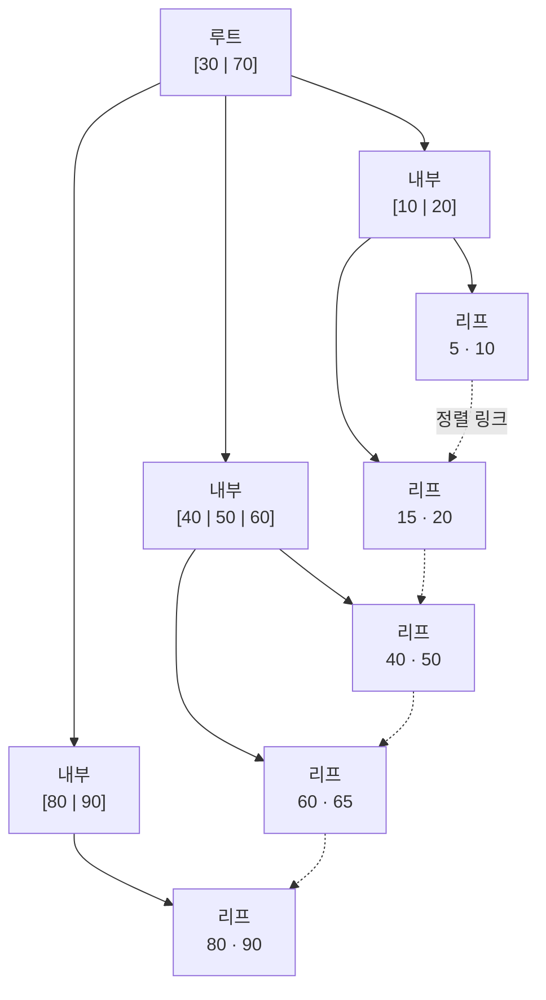

## 인덱스를 왜 거는 걸까?

처음 백엔드를 시작했을 때, 인덱스는 그냥 "검색 빠르게 해주는 마법" 정도로만 알고 있었습니다. 그런데 운영 중인 테이블에 데이터가 수백만 건 쌓이고 나서 특정 조회 API가 점점 느려지는 걸 보면서, "왜 느린지", "어떤 컬럼에 인덱스를 걸어야 하는지"를 제대로 이해할 필요가 생겼습니다. 🤔

PostgreSQL에서 `CREATE INDEX`를 그냥 치면 기본으로 만들어지는 게 바로 **B-tree 인덱스**입니다. 가장 많이 쓰는 만큼, 동작 원리를 알아두면 인덱스 설계가 훨씬 편해집니다.

## B-tree는 어떻게 생겼나

B-tree(Balanced Tree)는 이름 그대로 **균형 잡힌 트리**입니다. 루트 노드 → 내부 노드 → 리프 노드로 내려가는 구조인데, 어떤 값을 찾든 루트에서 리프까지의 깊이가 동일합니다. 데이터가 늘어나도 트리의 높이는 천천히(로그 스케일로) 증가하기 때문에, 탐색 비용이 `O(log n)`으로 유지됩니다.

리프 노드에는 정렬된 키 값과 실제 행을 가리키는 포인터(TID)가 들어 있고, 리프끼리는 양방향 링크로 연결돼 있습니다. 덕분에 범위 검색(`BETWEEN`, `<`, `>`)이나 정렬(`ORDER BY`)에도 강합니다.



루트에서 시작해 비교를 따라 내려가면, 어떤 값이든 같은 깊이의 리프에 도달합니다. 리프끼리 링크로 이어져 있어 범위 스캔도 자연스럽죠.

## 어떤 조건에서 B-tree가 쓰이나

B-tree 인덱스는 다음 연산자에서 사용됩니다.

- `=`, `<`, `<=`, `>`, `>=`
- `BETWEEN`, `IN`, `IS NULL`, `IS NOT NULL`
- `ORDER BY` (정렬 비용 절약)
- `LIKE 'prefix%'` 처럼 **앞부분이 고정된** 패턴 매칭

반대로 `LIKE '%suffix'`처럼 앞이 와일드카드인 경우엔 B-tree를 못 씁니다. 정렬된 트리에서 "끝이 이걸로 끝나는 값"을 찾는 건 불가능하니까요.

```sql
-- 단일 컬럼 인덱스
CREATE INDEX idx_users_email ON users (email);

-- 조회
SELECT * FROM users WHERE email = 'comdol@example.com';
```

## 복합 인덱스와 "왼쪽 접두사" 규칙

여러 컬럼을 묶어 인덱스를 만들 때는 **컬럼 순서**가 정말 중요합니다.

```sql
CREATE INDEX idx_orders_user_status ON orders (user_id, status);
```

이 인덱스는 `(user_id)`, `(user_id, status)`로 시작하는 조건엔 잘 동작하지만, `status` 단독 조건에는 쓰이지 않습니다. 전화번호부가 "성 → 이름" 순으로 정렬돼 있을 때, 이름만으로는 빠르게 못 찾는 것과 같은 이치입니다.

```sql
-- 인덱스 사용 O
SELECT * FROM orders WHERE user_id = 42 AND status = 'PAID';
SELECT * FROM orders WHERE user_id = 42;

-- 인덱스 사용 X (왼쪽 접두사인 user_id가 빠짐)
SELECT * FROM orders WHERE status = 'PAID';
```

## 진짜 쓰이는지 확인하기

인덱스를 걸었다고 끝이 아닙니다. 옵티마이저가 실제로 그 인덱스를 선택했는지 `EXPLAIN ANALYZE`로 꼭 확인해야 합니다.

```sql
EXPLAIN ANALYZE
SELECT * FROM users WHERE email = 'comdol@example.com';
```

출력에서 `Index Scan using idx_users_email`이 보이면 잘 타고 있는 것이고, `Seq Scan`이 나오면 인덱스를 안(못) 쓰고 전체를 훑고 있다는 뜻입니다. 데이터가 적거나 조건이 테이블 대부분을 반환할 때는 옵티마이저가 일부러 `Seq Scan`을 택하기도 합니다.

## 정리 & 주의점

- PostgreSQL의 기본 인덱스는 B-tree이고, 등호·부등호·범위·정렬·앞부분 LIKE에 강합니다.
- 복합 인덱스는 **왼쪽 접두사 규칙**을 따른다는 점을 항상 기억하세요.
- 인덱스는 공짜가 아닙니다. `INSERT`/`UPDATE`/`DELETE` 때마다 인덱스도 갱신되므로, 쓰기가 많은 테이블에 인덱스를 남발하면 오히려 느려집니다.
- 걸었으면 반드시 `EXPLAIN ANALYZE`로 실제 사용 여부를 검증하는 습관을 들이는 게 좋습니다.
