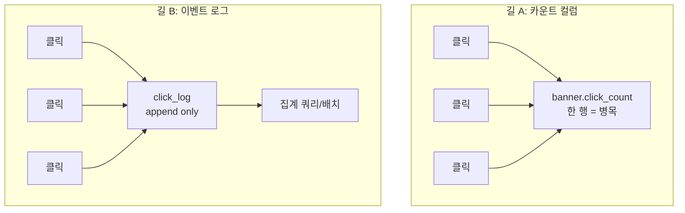

그 주엔 배너 클릭 수를 적재하고 집계해 화면에 표시하는 작업을 했다. "클릭 수를 보여주세요"라는 요구는 한 문장이지만, 그 뒤엔 설계 선택이 숨어 있다. **클릭을 어떻게 셀 것인가.** 단순히 숫자 하나를 1씩 올리면 될 것 같지만, 클릭은 짧은 시간에 몰리는 **고빈도 이벤트**라서 세는 방식에 따라 DB가 멀쩡하기도, 한 행에서 막히기도 한다.

## 길 A — 카운트 컬럼을 직접 올린다

가장 직관적인 방법. 배너 테이블에 `click_count` 컬럼을 두고 클릭마다 1 더한다.

```sql
UPDATE banner SET click_count = click_count + 1 WHERE id = 10;
```

조회는 더없이 싸다. `SELECT click_count`면 끝이다. 문제는 **쓰기**다. 인기 배너 하나에 클릭이 몰리면, 그 배너의 한 행을 향해 수많은 `UPDATE`가 동시에 쏟아진다. 행 단위 락이 걸리는 DB에서 같은 행을 갱신하는 트랜잭션들은 **줄을 서서** 락을 기다린다. 이게 바로 **핫로우(hot row) 경합**이다. 모든 클릭이 한 행이라는 병목을 통과해야 한다. 트래픽이 커질수록 락 대기가 길어지고, 클릭 기록이 응답을 느리게 만든다.



## 길 B — 이벤트를 로그로 쌓고 집계한다

다른 길은 클릭 하나하나를 **로그 행으로 INSERT**하고, 표시할 땐 그걸 집계하는 것이다.

```sql
CREATE TABLE click_log (
    id         BIGINT PRIMARY KEY AUTO_INCREMENT,
    banner_id  BIGINT NOT NULL,
    clicked_at DATETIME NOT NULL,
    INDEX idx_banner_time (banner_id, clicked_at)
);

-- 클릭마다 새 행 추가 (append) — 경합이 없다
INSERT INTO click_log (banner_id, clicked_at) VALUES (10, NOW());

-- 표시할 때 집계
SELECT banner_id, COUNT(*) AS clicks
FROM click_log
WHERE banner_id = 10
GROUP BY banner_id;
```

INSERT는 **항상 새 행을 추가**하므로 같은 행을 두고 다투지 않는다. 핫로우 경합이 사라진다. 쓰기는 병렬로 거침없이 들어간다. 대신 **읽기 비용**을 떠안는다. 매 표시마다 수백만 행을 `COUNT`하면 그게 또 느리다.

이 둘은 **쓰기 비용과 읽기 비용을 맞바꾸는 트레이드오프**다. A는 쓰기를 한 행에 집중시켜 읽기를 공짜로 만들고, B는 쓰기를 흩뿌려 경합을 없애는 대신 읽기를 비싸게 만든다.

## 실무에선 보통 섞는다

로그로 쌓되, 매번 전부 집계하지 않는다. **주기적으로 집계해 요약 테이블에 적재**한다(배치 또는 트리거). 화면은 요약 테이블의 값을 읽는다.

```sql
-- 주기적으로: 로그를 집계해 요약본 갱신
INSERT INTO banner_click_summary (banner_id, total_clicks)
SELECT banner_id, COUNT(*) FROM click_log GROUP BY banner_id
ON DUPLICATE KEY UPDATE total_clicks = VALUES(total_clicks);
```

이러면 쓰기는 경합 없는 append, 읽기는 요약본에서 싸게 — 양쪽의 좋은 점을 취한다. 대가는 **약간의 지연**이다. 화면의 클릭 수는 "마지막 집계 시점까지"의 값이라 실시간이 아니다. 클릭 수 통계엔 보통 이 정도 지연이 허용된다. 실시간이 꼭 필요하면 인메모리 카운터(레디스 `INCR`)로 받고 주기적으로 DB에 내려쓰는 방식을 더한다.

## 운영 함정

**로그 테이블은 무한히 자란다.** append-only는 경합엔 좋지만 테이블이 끝없이 커진다. 인덱스가 비대해지고 집계가 느려진다. 오래된 로그는 파티셔닝으로 잘라 버리거나, 일별 요약으로 압축한 뒤 원본을 보존 기간 지나면 정리해야 한다.

**클릭 한 번을 한 번으로 셀 수 있나.** 사용자가 빠르게 두 번 누르거나, 봇이 같은 링크를 반복 호출하면 클릭 수가 부풀려진다. "유효 클릭" 정의(같은 사용자·세션의 짧은 시간 내 중복 제거 등)를 먼저 정하지 않으면 숫자가 신뢰를 잃는다.

## 핵심 요약

- 클릭은 고빈도 이벤트라 세는 방식이 성능을 가른다.
- 카운트 컬럼 UPDATE는 읽기는 공짜지만 인기 항목에서 핫로우 경합이 난다.
- 이벤트 로그 append는 경합이 없지만 읽기(집계)가 비싸다.
- 실무는 로그 적재 + 주기적 집계 요약으로 양쪽을 절충하고, 약간의 지연을 받아들인다.

> **면접 한 줄 Q&A**
> Q. 인기 배너의 클릭 수를 click_count 컬럼으로 세면 무슨 문제가 있나?
> A. 같은 행을 향한 UPDATE가 몰려 행 락을 두고 줄을 서는 핫로우 경합이 난다. 이벤트 로그를 append하고 집계하면 경합은 사라지지만 읽기 비용을 진다.
