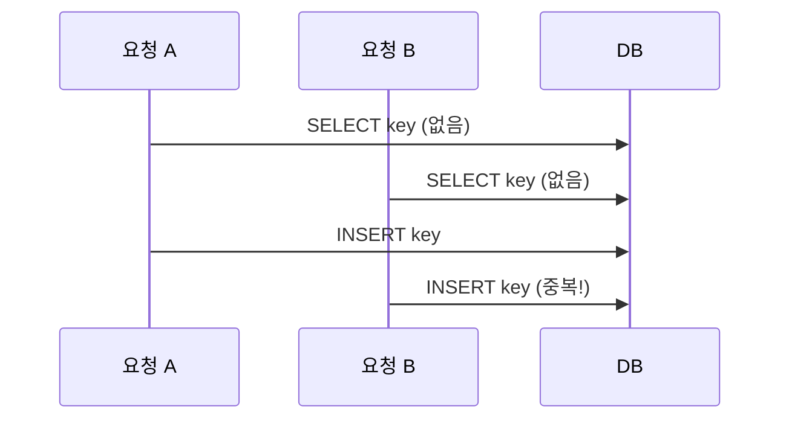

"있으면 수정, 없으면 추가"하는 저장 로직을 다룬 적이 있다. 너무 흔해서 별생각 없이 짜기 쉽지만, 동시 요청이 들어오는 순간 이 패턴은 **경쟁 상태(race condition)** 의 교과서적 사례가 된다.

## 선조회-분기의 함정

가장 직관적인 구현은 이렇다.

```java
// 위험한 패턴
Optional<Counter> found = repo.findByKey(key);
if (found.isPresent()) {
    repo.update(key, found.get().getValue() + 1);   // 있으면 수정
} else {
    repo.insert(new Counter(key, 1));                // 없으면 추가
}
```

문제는 **조회와 쓰기 사이의 시간 틈(경쟁 윈도)** 이다. 두 요청이 동시에 같은 `key`를 다룰 때:



둘 다 "없음"을 보고 둘 다 INSERT를 시도한다. 유니크 제약이 있으면 한쪽은 예외로 터지고, 없으면 **중복 행**이 생긴다. 애플리케이션 레벨의 if-else로는 이 틈을 막을 수 없다 — 검사와 행동이 원자적이지 않기 때문이다.

## 원자적 UPSERT

해법은 "검사 후 행동"을 **하나의 원자적 DB 문장**으로 합치는 것이다. 그러면 경쟁 윈도 자체가 사라진다. 전제는 **유니크 제약/인덱스**다. DB는 이 제약 위에서 충돌을 감지하고 분기를 원자적으로 수행한다.

MySQL:

```sql
INSERT INTO counter (k, value) VALUES (?, 1)
ON DUPLICATE KEY UPDATE value = value + 1;
```

PostgreSQL:

```sql
INSERT INTO counter (k, value) VALUES (?, 1)
ON CONFLICT (k) DO UPDATE SET value = counter.value + 1;
```

표준 SQL의 `MERGE`도 같은 의도다. 핵심은 **"이미 있으면"의 판정을 DB가 락과 함께 원자적으로** 한다는 것. 동시 요청이 와도 하나는 INSERT, 다른 하나는 UPDATE 경로로 갈라져 중복이 생기지 않는다.

```java
@Transactional
public void increment(String key) {
    counterMapper.upsertIncrement(key);  // 위 SQL 한 방
}
```

`value = value + 1`처럼 **현재 값 기준 증분**으로 쓴 것도 중요하다. `SET value = ?`로 앱이 계산한 값을 덮어쓰면 갱신 유실(lost update)이 다시 생긴다. 증분은 DB가 락 안에서 계산하므로 안전하다.

## 운영 함정

**유니크 제약 없는 UPSERT는 UPSERT가 아니다.** `ON DUPLICATE KEY`/`ON CONFLICT`는 *유니크 또는 PK 충돌*에만 발동한다. 제약이 없으면 충돌을 감지할 길이 없어 그냥 INSERT가 되고 중복이 쌓인다. 충돌 기준 컬럼에 반드시 유니크 인덱스를 건다.

**AUTO_INCREMENT가 비어도 증가한다.** MySQL의 `ON DUPLICATE KEY UPDATE`는 INSERT를 시도하다 충돌하면 UPDATE로 가지만, 그 과정에서 auto-increment 값을 소비해 PK에 **구멍(gap)** 이 생길 수 있다. PK 연속성에 의존하는 로직이 있으면 안 된다.

## 핵심 요약

- 선조회-분기는 조회와 쓰기 사이 경쟁 윈도 때문에 동시 요청에서 중복/예외를 낸다.
- `INSERT ... ON DUPLICATE/CONFLICT`(또는 `MERGE`)로 검사와 행동을 한 원자 문장에 합친다.
- 유니크 제약이 전제이며, 갱신은 `value = value + 1` 같은 증분으로 써야 갱신 유실을 막는다.
