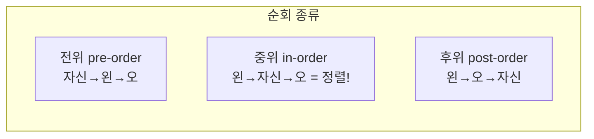

## 정렬된 채로 빠르게 넣고, 찾고, 지운다

[배열은 인덱스 접근이 O(1)]()이지만 중간 삽입이 O(n)이고, 정렬을 유지하려면 매번 자리를 밀어야 합니다. [해시 테이블]()은 조회가 평균 O(1)이지만 **순서**가 없습니다 — "100 이상 200 미만"이나 "다음으로 큰 값" 같은 **범위·순서 질의**를 못 합니다.

**이진 탐색 트리(BST)** 는 그 빈틈을 메웁니다. 정렬을 유지하면서 삽입·탐색·삭제를 모두 **트리 높이 $h$에 비례**($O(h)$)하게 처리합니다. 규칙은 단 하나입니다.

> 모든 노드에서, **왼쪽 서브트리의 모든 값 < 자신 < 오른쪽 서브트리의 모든 값**.

## 탐색은 매 단계 절반을 버린다

값을 찾을 때는 루트에서 시작해, 찾는 값이 작으면 왼쪽, 크면 오른쪽으로 내려갑니다. [이진 탐색]()과 똑같은 원리로 **매 비교마다 후보의 절반을 버립니다**. 삽입도 같습니다 — 내려갈 자리를 찾아 잎(leaf)에 매답니다.

<svg viewBox="0 0 600 220" role="img" aria-label="이진 탐색 트리에 값 40을 삽입할 때 루트 50에서 작으니 왼쪽 30으로 30보다 크니 오른쪽으로 내려가 빈 자리에 자리잡는 애니메이션">
  <text class="sub" x="20" y="22">삽입: 40  (작으면 왼쪽 ←, 크면 오른쪽 →)</text>
  <line class="edge" x1="300" y1="56" x2="190" y2="116"/>
  <line class="edge" x1="300" y1="56" x2="410" y2="116"/>
  <line class="edge" x1="190" y1="116" x2="120" y2="176"/>
  <line class="edge" x1="190" y1="116" x2="260" y2="176"/>
  <circle class="node" cx="300" cy="44" r="22"/>
  <text class="val" x="300" y="49" text-anchor="middle">50</text>
  <circle class="node" cx="190" cy="116" r="22"/>
  <text class="val" x="190" y="121" text-anchor="middle">30</text>
  <circle class="node" cx="410" cy="116" r="22"/>
  <text class="val" x="410" y="121" text-anchor="middle">70</text>
  <circle class="node" cx="120" cy="176" r="20"/>
  <text class="val" x="120" y="181" text-anchor="middle">20</text>
  <circle class="probe p1" cx="300" cy="44" r="22"/>
  <circle class="probe p2" cx="190" cy="116" r="22"/>
  <circle class="probe p3" cx="260" cy="176" r="20"/>
  <circle class="node newn" cx="260" cy="176" r="20" style="stroke:#2f9e44"/>
  <text class="val newn" x="260" y="181" text-anchor="middle" fill="#2f9e44">40</text>
</svg>

그리고 **중위 순회(in-order traversal)** — 왼쪽 → 자신 → 오른쪽 순으로 방문하면, 값이 **오름차순으로 정렬되어** 나옵니다. BST가 "정렬을 내장한 자료구조"인 이유입니다.

## 문제는 "쏠림" — $h$가 $n$이 되는 순간

$O(h)$가 좋은 건 $h$가 $\log n$일 때입니다. 그런데 **이미 정렬된 데이터**(1, 2, 3, 4, …)를 순서대로 넣으면 트리가 한쪽으로만 자라 **사실상 [연결 리스트]()** 가 됩니다. 그러면 $h = n$, 모든 연산이 **O(n)** 으로 퇴화합니다.

| 상태 | 높이 $h$ | 탐색/삽입/삭제 |
|------|---------|----------------|
| 균형 잡힌 BST | $\Theta(\log n)$ | $O(\log n)$ |
| 한쪽으로 쏠린 BST | $\Theta(n)$ | $O(n)$ — 망함 |

실무에서 입력은 종종 정렬돼 있거나(타임스탬프·자동증가 ID) 적대적입니다. 그래서 **스스로 균형을 잡는 트리**가 필요합니다.

## 회전 — 트리를 한 단계 굴려 키를 낮춘다

균형 트리의 핵심 도구는 **회전(rotation)** 입니다. 부모-자식 관계를 한 칸 돌려 **중위 순서(정렬)는 그대로 유지한 채** 높이만 줄입니다. 아래는 오른쪽으로 3단 쏠린 트리가 한 번의 회전으로 가운데를 위로 올려 균형을 회복하는 모습입니다.

<svg viewBox="0 0 620 220" role="img" aria-label="오른쪽으로 쏠려 높이 3이 된 트리를 왼쪽 회전으로 가운데 노드를 루트로 올려 높이 2의 균형 트리로 만드는 회전 애니메이션">
  <g class="before">
    <text class="sub" x="60" y="24">회전 전 — 높이 3 (쏠림)</text>
    <line class="edge" x1="90" y1="56" x2="150" y2="116"/>
    <line class="edge" x1="150" y1="116" x2="210" y2="176"/>
    <circle class="node" cx="90" cy="44" r="20"/><text class="val" x="90" y="49" text-anchor="middle">10</text>
    <circle class="node" cx="150" cy="116" r="20"/><text class="val" x="150" y="121" text-anchor="middle">20</text>
    <circle class="node" cx="210" cy="176" r="20"/><text class="val" x="210" y="181" text-anchor="middle">30</text>
    <text class="arrow" x="290" y="116" font-size="30">⟳</text>
    <text class="sub arrow" x="270" y="146">왼쪽 회전</text>
  </g>
  <g class="after">
    <text class="sub" x="420" y="24" fill="#2f9e44">회전 후 — 높이 2 (균형)</text>
    <line class="edge" x1="470" y1="56" x2="420" y2="120"/>
    <line class="edge" x1="470" y1="56" x2="520" y2="120"/>
    <circle class="node" cx="470" cy="44" r="20" style="stroke:#2f9e44"/><text class="val" x="470" y="49" text-anchor="middle">20</text>
    <circle class="node" cx="420" cy="120" r="20"/><text class="val" x="420" y="125" text-anchor="middle">10</text>
    <circle class="node" cx="520" cy="120" r="20"/><text class="val" x="520" y="125" text-anchor="middle">30</text>
  </g>
</svg>

회전은 **포인터 몇 개만 바꾸는 O(1)** 연산입니다. 이 값싼 도구로 어떻게 균형을 정의·복구하느냐에 따라 두 갈래의 명작이 나옵니다.

## AVL vs 레드블랙 — 엄격함과 느슨함의 트레이드오프

**AVL 트리**는 모든 노드에서 좌우 서브트리 높이 차(균형 인수)를 **−1, 0, +1**로 강제합니다. 삽입·삭제 후 깨지면 회전(LL·RR·LR·RL)으로 즉시 복구. 매우 엄격해 높이가 $1.44\log n$ 이하로 **아주 납작** → **조회가 빠릅니다**. 대신 수정 때 회전이 잦습니다.

**레드블랙 트리(RB)** 는 더 느슨합니다. 노드에 빨강/검정 색을 부여하고 다섯 규칙(루트는 검정, 빨강의 자식은 검정, 임의 노드에서 잎까지 **검정 노드 수가 동일**…)으로 "**가장 긴 경로 ≤ 2 × 가장 짧은 경로**"만 보장합니다. 높이는 $2\log n$까지 느슨하지만, **삽입·삭제당 회전이 최대 상수 번** → **수정이 빈번할 때 유리**.

| | AVL | 레드블랙 |
|---|---|---|
| 균형 엄격도 | 높음(높이차 ≤1) | 느슨(≤2배 경로) |
| 높이 | ~$1.44\log n$ | ~$2\log n$ |
| 조회 | 더 빠름 | 빠름 |
| 삽입/삭제 회전 | 많을 수 있음 | 상수 번 |
| 대표 사용처 | 읽기 위주 인덱스 | 범용 — 아래 참고 |

레드블랙 트리는 우리가 매일 쓰는 곳에 박혀 있습니다 — **Java `TreeMap`/`TreeSet`**, C++ `std::map`/`std::set`, **리눅스 커널의 CFS 스케줄러**(실행 큐), 그리고 [Java 8 `HashMap`이 한 버킷에 충돌이 8개 이상 쌓이면 연결 리스트를 레드블랙 트리로 바꿔]() 최악을 $O(n)$에서 $O(\log n)$으로 막는 것까지. 디스크 기반이라면 한 노드에 키를 많이 담아 높이를 더 낮춘 [B-트리]()가 DB 인덱스의 표준입니다.

## 프로덕션에서 마주치는 함정

| 함정 | 증상 | 해법 |
|------|------|------|
| 일반 BST에 정렬 입력 | 트리가 리스트로 퇴화, O(n) | 균형 트리(TreeMap) 또는 입력 셔플 |
| 순서 필요 없는데 트리 | 불필요한 $\log n$ 오버헤드 | 순서 불필요면 [해시 테이블]() |
| 재귀 순회 깊이 폭발 | 쏠린 트리에서 스택 오버플로 | [반복+명시적 스택]() |
| 디스크에 이진 트리 | 노드마다 랜덤 I/O 폭증 | 디스크는 B-트리/B+트리(팬아웃↑) |
| 삭제 구현 버그 | 두 자식 노드 삭제 시 트리 깨짐 | 중위 후속자(successor)로 대체 후 삭제 |

## 면접/리뷰 단골 질문

- **Q. BST가 최악 O(n)이 되는 경우?** → 정렬·역정렬 입력을 일반 BST에 넣으면 한쪽으로 쏠려 높이 $n$. 그래서 균형 트리가 필요.
- **Q. 회전이 정렬을 깨지 않는 이유?** → 회전은 부모-자식만 한 칸 돌리고 중위 순서를 보존한다. O(1).
- **Q. AVL vs 레드블랙 언제 무엇?** → 조회 위주면 더 납작한 AVL, 삽입·삭제가 잦으면 회전이 상수인 레드블랙. 범용 라이브러리는 대부분 RB.
- **Q. 해시 테이블 두고 왜 트리?** → 트리는 **순서·범위·다음 값** 질의가 가능(중위 순회=정렬). 해시는 순서가 없다.
- **Q. DB 인덱스는 왜 B-트리?** → 디스크는 블록 단위 I/O. 한 노드에 키를 많이 담아 팬아웃을 키우면 높이가 낮아져 디스크 접근 횟수가 준다.

## 정리

- **BST**는 "왼쪽<자신<오른쪽" 규칙으로 정렬을 유지하며 삽입·탐색·삭제를 $O(h)$에 처리하고, **중위 순회 = 정렬**이다.
- 쏠리면 $h=n$으로 퇴화 → **회전**(O(1), 정렬 보존)으로 균형을 잡는다.
- **AVL**(엄격·조회 유리) vs **레드블랙**(느슨·수정 유리). RB는 TreeMap·`std::map`·리눅스 CFS·Java HashMap 트리화의 기반.
- 순서가 필요 없으면 [해시 테이블](), 디스크면 [B-트리](). 자료구조 선택은 질의 패턴이 결정한다.

> 이전 글은 [재귀와 분할정복]()이었습니다. 다음 글부터는 노드가 한 줄·한 갈래가 아니라 그물처럼 얽힌 [그래프와 그 순회]()로 나아갑니다.
</content>
</invoke>
