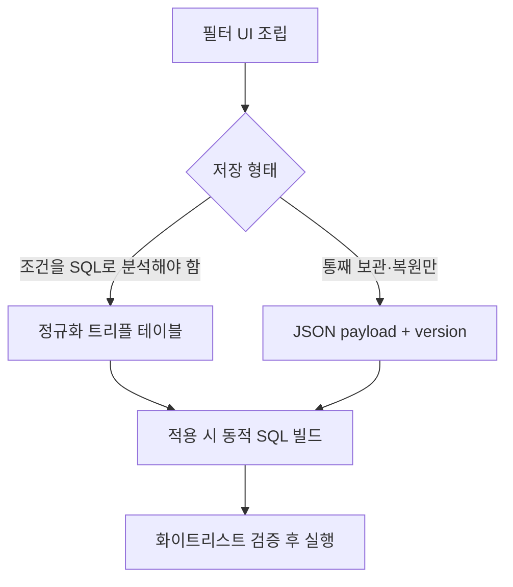

복합 검색 조건을 프리셋으로 저장하고 다시 열었을 때 그대로 복원하는 기능을 만든다고 하자. 한 번 쓰고 버리는 일회성 검색과 달리, 사용자가 정성껏 조립한 필터를 **서버에 보관**하고 **재적용**해야 한다. 핵심은 "검색을 어떻게 도는가"가 아니라 "검색 조건을 어떤 형태로 영속화하는가"다.

## 무엇을 저장하는가 — 표현의 선택

필터는 보통 `(필드, 연산자, 값)` 트리플의 묶음이다. `status = ACTIVE AND createdAt >= 2024-01-01 AND name LIKE '%kim%'` 같은 식이다. 이걸 저장하는 방법은 크게 둘이다.

**(A) 정규화된 관계형 표현.** 조건 하나를 한 행으로 푼다.

```sql
CREATE TABLE saved_filter (
  id        BIGINT PRIMARY KEY,
  user_id   BIGINT NOT NULL,
  name      VARCHAR(100) NOT NULL,
  logic     VARCHAR(8) DEFAULT 'AND'   -- AND / OR
);

CREATE TABLE saved_filter_condition (
  id         BIGINT PRIMARY KEY,
  filter_id  BIGINT NOT NULL,
  field      VARCHAR(64)  NOT NULL,   -- status, created_at, name ...
  operator   VARCHAR(16)  NOT NULL,   -- EQ, GTE, LIKE, IN ...
  value      VARCHAR(512) NOT NULL
);
```

조건을 SQL로 질의·집계할 수 있고("status 조건을 쓰는 필터가 몇 개냐"), 무결성 검증이 쉽다. 대신 중첩 그룹(`A AND (B OR C)`)을 표현하려면 트리 구조 컬럼(`parent_id`)이 필요해 금방 복잡해진다.

**(B) JSON 블롭.** 조건 트리를 통째로 직렬화해 한 컬럼에 박는다.

```sql
CREATE TABLE saved_filter (
  id        BIGINT PRIMARY KEY,
  user_id   BIGINT NOT NULL,
  name      VARCHAR(100) NOT NULL,
  payload   JSON NOT NULL,        -- {"logic":"AND","conditions":[...]}
  version   INT  NOT NULL DEFAULT 1
);
```

중첩·임의 구조를 자유롭게 담고 스키마가 단순하다. 대신 DB 안에서 조건을 질의하기 어렵고, 구조가 바뀌면 마이그레이션이 까다롭다.

판단 기준은 단순하다. **저장된 조건 자체를 SQL로 분석·검색할 일이 있으면 (A), 그저 통째로 보관했다 통째로 복원하면 되면 (B)다.** 대부분의 "내 필터 프리셋"은 후자에 가깝다.



## 버전과 마이그레이션

JSON 블롭의 가장 큰 함정은 **스키마 진화**다. 오늘 저장한 `{"field":"status","op":"EQ","value":"A"}`를, 내년에 `value`를 배열로 바꾸면 과거 데이터가 깨진다. 그래서 payload에 `version`을 같이 박는다. 읽을 때 버전을 보고 마이그레이션 함수를 통과시킨다.

```java
SavedFilterDto load(SavedFilter row) {
    JsonNode payload = mapper.readTree(row.getPayload());
    int v = row.getVersion();
    while (v < CURRENT_VERSION) {
        payload = MIGRATIONS.get(v).apply(payload); // v -> v+1 변환
        v++;
    }
    return mapper.treeToValue(payload, SavedFilterDto.class);
}
```

**lazy 마이그레이션**(읽을 때 변환)이면 배포 즉시 전체를 손댈 필요가 없다. 단, 변환을 절대 지우지 말 것. v1 데이터가 한 건이라도 남아 있는 한 v1→v2 변환은 살아 있어야 한다.

## 저장 시점 검증 vs 적용 시점 검증

이게 이 주제의 진짜 핵심이다. 필터를 저장할 때와 적용할 때, 어느 쪽에서 검증할까?

- **저장 시점 검증만** 하면, 저장 후 그 필드가 삭제·이름변경되면 적용 시 폭발한다.
- **적용 시점 검증만** 하면, 사용자는 멀쩡히 저장됐다고 믿다가 나중에 실패를 본다.

정답은 **둘 다, 단 역할을 나눈다.** 저장 시점엔 "지금 유효한 조건인가"를 검증해 즉시 피드백을 준다. 적용 시점엔 **반드시 다시** 화이트리스트로 검증한다 — 저장 후 스키마가 바뀌었을 수 있고, 무엇보다 저장된 `field`/`operator`를 그대로 SQL에 끼워 넣으면 **SQL 인젝션**이 된다.

```java
private static final Map<String, ColumnSpec> ALLOWED = Map.of(
    "status",    new ColumnSpec("status",     Set.of(EQ, IN)),
    "createdAt", new ColumnSpec("created_at", Set.of(GTE, LTE, BETWEEN)),
    "name",      new ColumnSpec("name",       Set.of(EQ, LIKE))
);

void applyCondition(Condition c, SqlBuilder sb) {
    ColumnSpec spec = ALLOWED.get(c.field());
    if (spec == null || !spec.ops().contains(c.operator()))
        throw new IllegalArgumentException("허용되지 않은 조건: " + c.field());
    sb.and(spec.column(), c.operator(), c.value()); // 값은 ?로 바인딩
}
```

필드명은 절대 사용자 입력을 신뢰하지 않고 화이트리스트의 **실제 컬럼명으로 치환**한다. 값은 언제나 파라미터 바인딩(`?`)으로 넘긴다.

## 운영 함정

- **컬럼 이름 변경 = 저장된 필터 폭사.** payload에는 논리 필드명(`status`)을 저장하고, 실제 컬럼(`status_code`)과의 매핑을 코드 화이트리스트가 쥐게 하면 컬럼명이 바뀌어도 매핑만 고치면 된다.
- **삭제된 옵션 값.** `status IN ('A','X')`에서 `X` 상태가 폐기되면 결과가 0건이 된다. 적용 시 알 수 없는 enum 값은 조용히 무시하지 말고 사용자에게 "이 조건은 더 이상 유효하지 않습니다"로 알린다.

## 핵심 요약

- 저장 형태는 **분석할 거면 정규화, 보관·복원만이면 JSON+version**.
- JSON 블롭엔 반드시 `version`을 박고 lazy 마이그레이션 체인을 유지한다.
- **적용 시점 화이트리스트 재검증은 선택이 아니다** — 저장된 field/operator의 직접 SQL 삽입은 인젝션 경로다.

> **면접 한 줄 Q&A**
> Q. 사용자가 저장한 필터를 적용할 때 왜 다시 검증해야 하나?
> A. 저장 이후 스키마가 바뀌었을 수 있고, 저장된 필드/연산자를 SQL에 그대로 끼워 넣으면 인젝션이 되기 때문이다. 필드명은 화이트리스트의 실제 컬럼명으로 치환하고 값은 바인딩한다.
