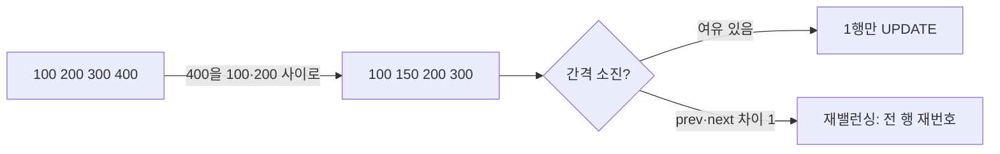

목록을 드래그해서 순서를 바꾸면, 그 순서가 새로고침 후에도 유지되어야 한다. 즉 정렬은 클라이언트의 일시적 상태가 아니라 **서버에 영속화된 순서 컬럼**이다. 운영자가 가끔 손대는 노출 순서와 달리, 일반 사용자가 **빈번히** 재정렬하는 상황에서는 "한 번 옮길 때마다 DB를 얼마나 건드리느냐"가 곧 비용이다.

## 순서를 표현하는 세 가지 전략

순서는 보통 정수 `sort_order` 컬럼으로 잡는다. 문제는 "5번과 6번 사이로 항목을 끼워 넣을 때" 어떻게 갱신하느냐다.

**(1) 전체 재번호 매기기.** 옮길 때마다 전 행의 `sort_order`를 1, 2, 3… 다시 매긴다.

```sql
UPDATE list_item SET sort_order = :newOrder WHERE id = :id;
-- 그리고 영향받은 나머지 전부 +1 / -1
UPDATE list_item SET sort_order = sort_order + 1
 WHERE board_id = :board AND sort_order >= :newOrder AND id <> :id;
```

단순하지만 한 번 이동에 **O(N)** 행을 쓴다. 100개짜리 목록을 자주 흔들면 쓰기 폭증.

**(2) 간격 기반 순서값 (LexoRank류).** 처음부터 100, 200, 300… 처럼 **띄워서** 부여한다. 100과 200 사이로 옮기면 150을 준다. 단 한 행만 UPDATE.

```sql
-- prev=100, next=200 사이로 이동 → (100+200)/2 = 150
UPDATE list_item SET sort_order = 150 WHERE id = :id;
```

이동당 **O(1)**. 거의 모든 실무 재정렬은 이 방식으로 수렴한다. 정수가 부담스러우면 실수(`DOUBLE`)나 문자열 랭크(`"aaa" < "aab"`)를 쓴다.

**(3) 인접 스왑.** 한 칸 위/아래로만 움직이는 UI라면 두 행의 값만 맞바꾼다. 임의 위치 드롭은 표현 못 한다.



## 간격 고갈과 재밸런싱

(2)의 약점은 **간격 고갈**이다. 100과 101 사이로 자꾸 끼워 넣으면 더는 나눌 정수가 없다. 정수면 `(prev+next)/2`가 prev와 같아지는 순간이고, 실수면 부동소수점 정밀도가 무너지는 지점이다.

그래서 "이웃과 차이가 1 이하"가 감지되면 그 구간 또는 보드 전체를 100 단위로 **재밸런싱**한다. 재밸런싱은 드물게 일어나지만 O(N) 쓰기이므로, 트랜잭션으로 묶고 사용자 체감을 위해 비동기로 미뤄도 된다. 핵심은 평상시엔 O(1), 가끔만 O(N)이라는 **분할 상환** 구조다.

```java
long newOrder(Long prevOrder, Long nextOrder) {
    if (prevOrder == null) return nextOrder - GAP;       // 맨 앞
    if (nextOrder == null) return prevOrder + GAP;       // 맨 뒤
    if (nextOrder - prevOrder <= 1) {
        rebalance(boardId);                              // 간격 고갈
        return recomputeBetween(prevOrder, nextOrder);
    }
    return (prevOrder + nextOrder) / 2;
}
```

## 동시 재정렬 충돌

두 사용자가 같은 목록을 동시에 흔들면 어떻게 될까. A가 항목을 150에 놓는 동안 B도 150을 계산해 같은 값을 쓸 수 있다. `sort_order`에 보드 범위 유니크 제약을 걸어 두면 둘 중 하나가 충돌로 실패하고, 클라이언트가 최신 이웃값으로 재계산해 재시도한다.

더 흔한 문제는 **stale anchor**다. B가 보던 화면의 "100번 다음"이라는 기준이, A의 이동으로 이미 깨졌을 수 있다. 그래서 이동 요청은 절대 좌표가 아니라 `(prevId, nextId)` **이웃 식별자**로 보낸다. 서버가 그 순간의 실제 이웃 순서값을 다시 읽어 사이값을 계산한다. 그러면 좌표는 흔들려도 "이 둘 사이"라는 의도는 보존된다.

## 운영 함정

- **클라이언트가 보낸 sort_order를 그대로 믿지 말 것.** 클라이언트가 보내는 건 의도(`prevId`/`nextId`)고, 실제 값 계산은 서버가 현재 상태를 읽고 한다. 안 그러면 동시성 하에 순서가 꼬인다.
- **간격을 너무 좁게 시작하지 말 것.** GAP을 10으로 두면 금방 재밸런싱이 돈다. 65536처럼 크게 잡으면 수십 번 끼워 넣어도 재밸런싱이 거의 안 난다.
- **정렬 컬럼에 인덱스.** `ORDER BY sort_order`로 매번 조회하므로 `(board_id, sort_order)` 복합 인덱스가 없으면 매 조회가 정렬 풀스캔이 된다.

## 핵심 요약

- 빈번한 재정렬엔 **간격 기반 순서값**이 사실상 표준 — 이동당 1행 UPDATE.
- 고갈되면 **재밸런싱**으로 O(N), 평소엔 O(1)인 분할 상환 구조.
- 이동 요청은 절대값이 아니라 **이웃 식별자**로 — 동시 편집 충돌을 견딘다.

> **면접 한 줄 Q&A**
> Q. 드래그 재정렬을 매번 전체 재번호로 처리하면 뭐가 문제인가?
> A. 한 번 이동에 O(N) 쓰기가 발생한다. 100, 200, 300처럼 간격을 띄운 순서값을 쓰면 사이값 계산으로 1행만 갱신하면 되고, 간격이 고갈될 때만 재밸런싱한다.
