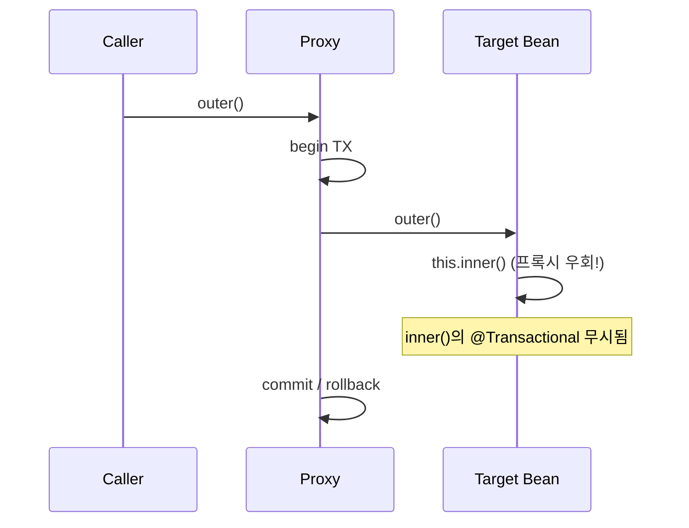

분명 `@Transactional`을 붙였는데 롤백이 안 되는 버그를 잡던 주였다. 코드를 아무리 봐도 어노테이션은 제대로 붙어 있었다. 원인은 어노테이션이 아니라 **그 메서드를 누가 호출했는가**에 있었다. 같은 클래스의 다른 메서드가 내부에서 호출하면 트랜잭션이 걸리지 않는다. 스프링 AOP가 프록시 기반이기 때문이다.

## 왜 안 걸리나 — 프록시가 끼어들 자리

`@Transactional`은 마법이 아니라 AOP 어드바이스다. 스프링은 해당 빈을 직접 노출하지 않고, 그 빈을 감싼 **프록시 객체**를 컨테이너에 등록한다. 외부에서 메서드를 호출하면 호출은 프록시를 거치고, 프록시가 트랜잭션을 열고(begin) 실제 객체의 메서드를 호출한 뒤 커밋/롤백한다.

문제는 **내부 호출(self-invocation)**이다. 객체 안에서 `this.otherMethod()`를 부르면 그 호출은 프록시를 거치지 않는다. `this`는 프록시가 아니라 실제 타깃 객체 자신이기 때문이다. 프록시가 끼어들 자리가 없으니 트랜잭션 어드바이스도 동작하지 않는다.



위 그림에서 `outer()`는 프록시를 거쳐 트랜잭션이 열린다. 하지만 `outer()` 안에서 `this.inner()`를 부르면 그 호출은 타깃 객체 내부에서 일어나므로, `inner()`에 붙은 `@Transactional(propagation = REQUIRES_NEW)` 같은 설정이 통째로 무시된다.

```java
@Service
public class OrderService {

    public void outer() {
        // ... 일반 로직
        inner(); // self-invocation: inner의 트랜잭션 설정 무시됨
    }

    @Transactional(propagation = Propagation.REQUIRES_NEW)
    public void inner() {
        orderRepository.save(...); // 새 트랜잭션을 기대했지만 안 열림
    }
}
```

## 우회법 — 셋 중 하나

**1) 빈 분리(권장).** `inner()`를 다른 빈으로 빼서 주입받아 호출하면, 호출이 프록시를 거치므로 정상 동작한다. 가장 깔끔하고 의도가 드러난다.

```java
@Service
public class OrderService {
    private final OrderTxService txService;
    public void outer() { txService.inner(); } // 프록시 경유
}
```

**2) 자기 자신을 프록시로 주입.** `ApplicationContext`에서 자기 빈을 다시 꺼내거나 `@Lazy`로 자기 자신을 주입해 `self.inner()`를 호출한다. 동작은 하지만 가독성이 떨어진다.

**3) `AopContext.currentProxy()`.** `exposeProxy = true` 설정 후 `((OrderService) AopContext.currentProxy()).inner()`로 프록시를 직접 잡는다. 침습적이라 마지막 수단이다.

## 운영 함정

**함정 1 — `private`/`final` 메서드.** CGLIB 프록시는 서브클래싱으로 동작하므로 `final` 메서드는 오버라이드할 수 없고, `private` 메서드는 애초에 외부 호출 대상이 아니다. 둘 다 `@Transactional`이 무시된다. 트랜잭션 메서드는 `public`으로 둔다.

**함정 2 — 자기 호출을 못 알아채는 디버깅.** 트랜잭션이 안 먹으면 어노테이션부터 의심하지만, 진짜 원인은 호출 경로인 경우가 많다. "이 메서드를 같은 클래스 안에서 부르고 있지 않은가?"를 먼저 확인한다.

## 면접 한 줄 Q&A

"같은 클래스 메서드에 `@Transactional`을 붙였는데 안 먹는 이유는?" → 스프링 AOP가 프록시 기반이라 외부 호출만 가로챈다. 내부 `this` 호출은 프록시를 우회하므로 어드바이스가 적용되지 않는다. 빈을 분리해 프록시를 경유시켜 해결한다.
