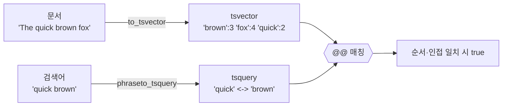

## LIKE '%검색어%'의 한계

검색 기능을 `WHERE content LIKE '%키워드%'`로 만들어 두면 처음엔 잘 돌아갑니다. 그런데 데이터가 늘면 인덱스를 못 타서 느려지고, "단어 순서"나 "어절" 같은 건 신경 쓸 수도 없습니다. PostgreSQL은 이런 상황을 위해 **전문 검색(Full Text Search)** 기능을 내장하고 있는데, 그 핵심이 `tsvector`와 `tsquery`입니다.

이번 글에선 그중에서도 **단어의 순서와 인접성**까지 따지는 `phraseto_tsquery`를 정리해보려 합니다.

## tsvector와 tsquery 기본

- `tsvector`: 문서를 검색 가능한 토큰(어휘소)들의 집합으로 변환한 것.
- `tsquery`: 검색 조건을 표현한 것. `@@` 연산자로 둘을 매칭합니다.



```sql
SELECT to_tsvector('english', 'The quick brown fox')
       @@ to_tsquery('english', 'quick & fox');   -- true
```

## 문자열을 tsquery로 만드는 4가지 함수

사용자 입력을 `tsquery`로 바꿔주는 함수가 여러 개인데, 동작이 미묘하게 다릅니다.

| 함수 | 동작 | 예: `quick brown` |
|------|------|-------------------|
| `to_tsquery` | 연산자를 직접 써야 함 | `'quick & brown'` (직접 입력) |
| `plainto_tsquery` | 단어들을 모두 AND | `quick & brown` |
| `phraseto_tsquery` | 단어 순서·인접성까지 매칭 | `quick <-> brown` |
| `websearch_to_tsquery` | 구글식 문법(`"..."`, `or`, `-`) | 따옴표로 구문 검색 |

여기서 `phraseto_tsquery`가 만들어내는 `<->`가 핵심입니다. 이건 **"바로 다음에 나오는 단어"** 를 뜻하는 거리 연산자예요.

## phraseto_tsquery가 빛나는 순간

"quick brown"이라는 **구문 그대로** 검색하고 싶다고 합시다.

```sql
-- plainto: 두 단어가 순서/인접성 상관없이 모두 있으면 매칭
SELECT to_tsvector('english', 'brown and quick fox')
       @@ plainto_tsquery('english', 'quick brown');   -- true

-- phraseto: "quick 다음에 brown"이 붙어 있어야 매칭
SELECT to_tsvector('english', 'brown and quick fox')
       @@ phraseto_tsquery('english', 'quick brown');   -- false

SELECT to_tsvector('english', 'a quick brown fox')
       @@ phraseto_tsquery('english', 'quick brown');   -- true
```

즉, 단어가 다 들어 있기만 하면 되는 게 아니라 **순서대로 인접**해 있어야 통과합니다. 제목이나 정확한 문구를 찾을 때 오탐(false positive)을 크게 줄여줍니다.

## GIN 인덱스로 빠르게

전문 검색의 진짜 장점은 인덱스입니다. `tsvector` 컬럼에 **GIN 인덱스**를 걸면 대량 문서에서도 빠르게 검색됩니다.

```sql
ALTER TABLE articles ADD COLUMN tsv tsvector
    GENERATED ALWAYS AS (to_tsvector('english', title || ' ' || body)) STORED;

CREATE INDEX idx_articles_tsv ON articles USING GIN (tsv);

SELECT id, title
FROM articles
WHERE tsv @@ phraseto_tsquery('english', 'distributed system');
```

`GENERATED ... STORED`로 만들어두면 본문이 바뀔 때 `tsvector`가 자동 갱신돼서 관리가 편합니다.

## 한국어는 한 가지 주의

기본 제공 설정(`english` 등)은 영어 형태소 기반이라, 한국어를 그대로 넣으면 형태소 분석이 제대로 안 됩니다. 한국어 전문 검색은 보통 `simple` 설정으로 단순 토큰화하거나, `pg_bigm` / 형태소 분석기 연동 같은 별도 작업이 필요합니다. 한국어 검색 품질이 중요하다면 이 부분은 따로 검토해야 합니다.

## 정리

- 단순 포함은 `plainto_tsquery`, **구문(순서+인접)** 검색은 `phraseto_tsquery`.
- `phraseto_tsquery`의 `<->`(FOLLOWED BY) 덕분에 정확한 문구 검색의 오탐이 줄어듭니다.
- 실서비스라면 `tsvector` 컬럼 + **GIN 인덱스**는 거의 필수.
- 한국어는 기본 설정으로 한계가 있으니 별도 구성을 고려하세요.
