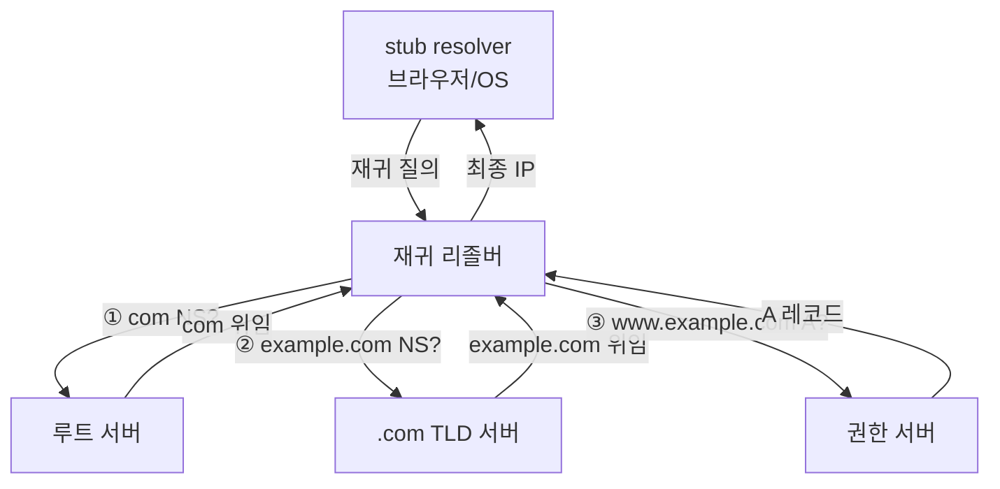

## "주소창에 도메인을 쳤다. 그 다음 0.01초 동안 무슨 일이 일어나나"

`example.com`을 입력하면 브라우저는 그 이름으로 직접 연결하지 못합니다. 패킷은 [IP 주소]()로만 흐르기 때문입니다. 그래서 그 찰나에 **이름 → IP** 변환이 일어나는데, 이게 DNS입니다. 흔히 "인터넷의 전화번호부"라 부르지만, 실제로는 **전 세계에 분산된 계층형 데이터베이스 + 거대한 캐시 시스템**입니다.

DNS를 "이름을 주소로 바꾼다" 한 줄로만 알면 장애 앞에서 무너집니다 — TTL을 잘못 잡아 장애 전환이 30분 늦어지거나, dangling CNAME으로 서브도메인이 탈취되거나, 캐시 때문에 "분명 바꿨는데 안 바뀐" 상황을 영영 못 푸니까요. 이 글은 DNS를 **루트부터 권한 서버까지의 질의 흐름 + 캐시 + 운영 함정**까지 끝까지 내려갑니다.

## 한 번의 조회를 움직임으로 보기 — 재귀 리졸버의 여정

`www.example.com`을 처음 조회할 때, **재귀 리졸버(recursive resolver)** 는 아무것도 모르는 상태에서 시작해 위에서부터 차근차근 물어 내려갑니다. 각 서버는 답을 모르면 "그건 쟤한테 물어봐"라며 **다음 단계를 가리키는 위임(referral)** 을 줍니다. <span style="color:#1971c2;font-weight:600">파랑</span>은 질의, <span style="color:#2f9e44;font-weight:600">초록</span>은 위임/응답입니다.

<div class="dns-rec" markdown="0">
<style>
.dns-rec{margin:1.4rem 0;overflow-x:auto}
.dns-rec svg{width:100%;max-width:720px;height:auto;display:block;margin:0 auto;font-family:inherit}
.dns-rec .box{fill:none;stroke:currentColor;stroke-width:1.6;opacity:.5}
.dns-rec .lbl{fill:currentColor;font-size:12px;font-weight:600}
.dns-rec .sub{fill:currentColor;font-size:9.5px;opacity:.55}
.dns-rec .ln{stroke:currentColor;opacity:.2;stroke-width:1.4}
.dns-rec .q{fill:#1971c2}
.dns-rec .a{fill:#2f9e44}
.dns-rec .q1{animation:dnsq 8s ease-in-out infinite}
.dns-rec .a1{animation:dnsa 8s ease-in-out infinite}
.dns-rec .q2{animation:dnsq 8s ease-in-out infinite 2s}
.dns-rec .a2{animation:dnsa 8s ease-in-out infinite 2s}
.dns-rec .q3{animation:dnsq 8s ease-in-out infinite 4s}
.dns-rec .a3{animation:dnsa 8s ease-in-out infinite 4s}
@keyframes dnsq{0%{transform:translate(0,0);opacity:0}2%{opacity:1}10%{transform:translate(0,-92px);opacity:1}13%{opacity:0}100%{opacity:0}}
@keyframes dnsa{0%{opacity:0}13%{opacity:0;transform:translate(0,-92px)}15%{opacity:1}23%{transform:translate(0,0);opacity:1}26%{opacity:0}100%{opacity:0}}
</style>
<svg viewBox="0 0 700 230" role="img" aria-label="재귀 리졸버가 루트·TLD·권한 서버에 순서대로 질의하고 위임을 받아 최종 IP를 알아내는 과정 애니메이션">
  <rect class="box" x="20" y="160" width="150" height="50" rx="8"/>
  <text class="lbl" x="95" y="182" text-anchor="middle">재귀 리졸버</text>
  <text class="sub" x="95" y="199" text-anchor="middle">(ISP / 8.8.8.8)</text>
  <rect class="box" x="250" y="20"  width="150" height="44" rx="8"/>
  <text class="lbl" x="325" y="40" text-anchor="middle">루트 (.)</text>
  <text class="sub" x="325" y="55" text-anchor="middle">"com은 TLD에게"</text>
  <rect class="box" x="250" y="78"  width="150" height="44" rx="8"/>
  <text class="lbl" x="325" y="98" text-anchor="middle">TLD (.com)</text>
  <text class="sub" x="325" y="113" text-anchor="middle">"example은 권한에게"</text>
  <rect class="box" x="250" y="136" width="150" height="44" rx="8"/>
  <text class="lbl" x="325" y="156" text-anchor="middle">권한 서버</text>
  <text class="sub" x="325" y="171" text-anchor="middle">"A = 93.184.x.x"</text>
  <line class="ln" x1="170" y1="185" x2="250" y2="42"/>
  <line class="ln" x1="170" y1="185" x2="250" y2="100"/>
  <line class="ln" x1="170" y1="185" x2="250" y2="158"/>
  <circle class="q q1" cx="180" cy="180" r="6"/>
  <circle class="a a1" cx="240" cy="48" r="6"/>
  <circle class="q q2" cx="180" cy="180" r="6"/>
  <circle class="a a2" cx="240" cy="106" r="6"/>
  <circle class="q q3" cx="180" cy="180" r="6"/>
  <circle class="a a3" cx="240" cy="164" r="6"/>
  <text class="sub" x="540" y="100" text-anchor="middle">클라이언트는 리졸버에</text>
  <text class="sub" x="540" y="116" text-anchor="middle">"재귀"로 한 번만 묻고,</text>
  <text class="sub" x="540" y="132" text-anchor="middle">리졸버가 "반복"으로</text>
  <text class="sub" x="540" y="148" text-anchor="middle">세 번 물어 답을 모은다</text>
</svg>
</div>

여기서 두 가지 질의 방식이 갈립니다. 클라이언트(stub resolver)는 리졸버에게 **재귀 질의(recursive)** — "최종 답을 줘"라고 한 번만 묻습니다. 리졸버는 루트·TLD·권한 서버에게 **반복 질의(iterative)** — "아는 만큼만 줘"라고 단계적으로 물어 위임을 따라갑니다. 이 분업이 DNS 확장성의 핵심입니다: 루트 서버는 "답"이 아니라 "다음 위임"만 주면 되니 부하가 분산됩니다.



## DNS 레코드 — 이름에 무엇을 매달 수 있나

도메인 하나에 여러 종류의 레코드를 붙입니다. 운영에서 자주 쓰는 것들:

| 레코드 | 의미 | 핵심 주의점 |
|--------|------|-------------|
| `A` / `AAAA` | 이름 → IPv4 / IPv6 | 가장 기본. AAAA 없으면 IPv6 전용망에서 안 됨 |
| `CNAME` | 이름 → 다른 이름(별칭) | **zone apex(`example.com` 루트)에는 못 붙임** → ALIAS/ANAME으로 우회 |
| `NS` | 이 존의 권한 서버 | 위임의 실체. 부모 존과 자식 존 양쪽에 존재 |
| `MX` | 메일 서버 + 우선순위 | 숫자 작을수록 우선 |
| `TXT` | 임의 텍스트 | SPF/DKIM/도메인 소유 증명 |
| `SOA` | 존의 메타데이터 | serial·refresh·**부정 캐싱 TTL(minimum)** |
| `PTR` | IP → 이름(역방향) | 메일 서버 신뢰도에 영향 |

> **CNAME 체인 함정.** `CNAME`은 다른 이름을 가리키므로, 리졸버는 그 이름을 다시 조회해야 합니다(추가 왕복). 그리고 가리키는 대상이 사라지면 **dangling CNAME** — 예전에 쓰던 클라우드 리소스를 해제했는데 CNAME만 남으면, 그 IP를 새로 할당받은 **공격자가 서브도메인을 탈취**(subdomain takeover)할 수 있습니다. 리소스를 지울 땐 DNS 레코드부터 지우세요.

## 캐시: DNS를 빠르게 만드는 진짜 엔진

위 그림처럼 매번 루트부터 내려가면 모든 요청이 수십 ms씩 걸립니다. 실제로는 **거의 다 캐시에서** 끝납니다. 리졸버는 응답을 **TTL(Time To Live)** 만큼 보관하고, 그 사이 같은 질의는 즉답합니다.

<div class="dns-cache" markdown="0">
<style>
.dns-cache{margin:1.4rem 0;overflow-x:auto}
.dns-cache svg{width:100%;max-width:680px;height:auto;display:block;margin:0 auto;font-family:inherit}
.dns-cache .box{fill:none;stroke:currentColor;stroke-width:1.6;opacity:.5}
.dns-cache .lbl{fill:currentColor;font-size:12px;font-weight:600}
.dns-cache .sub{fill:currentColor;font-size:9.5px;opacity:.55}
.dns-cache .ln{stroke:currentColor;opacity:.25;stroke-width:1.4;fill:none}
.dns-cache .hit{fill:#2f9e44;animation:dnshit 6s ease-in-out infinite}
.dns-cache .miss{fill:#f08c00;animation:dnsmiss 6s ease-in-out infinite 3s}
.dns-cache .cbox{stroke:#2f9e44;animation:dnsglow 6s ease-in-out infinite}
@keyframes dnshit{0%{transform:translateX(0);opacity:0}3%{opacity:1}18%{transform:translateX(150px);opacity:1}26%{transform:translateX(0);opacity:1}32%{opacity:0}50%{opacity:0}100%{opacity:0}}
@keyframes dnsmiss{0%{transform:translate(0,0);opacity:0}3%{opacity:1}15%{transform:translate(150px,0);opacity:1}25%{transform:translate(420px,0);opacity:1}40%{transform:translate(150px,0);opacity:1}48%{transform:translate(0,0);opacity:1}52%{opacity:0}100%{opacity:0}}
@keyframes dnsglow{0%,100%{opacity:.4}50%{opacity:.9}}
</style>
<svg viewBox="0 0 660 150" role="img" aria-label="캐시에 있으면 즉답(히트), 없으면 권한 서버까지 갔다 오는(미스) 차이 애니메이션">
  <circle class="box" cx="50" cy="75" r="22"/>
  <text class="sub" x="50" y="79" text-anchor="middle">클라</text>
  <rect class="box cbox" x="230" y="50" width="120" height="50" rx="8"/>
  <text class="lbl" x="290" y="72" text-anchor="middle">리졸버 캐시</text>
  <text class="sub" x="290" y="89" text-anchor="middle">TTL 동안 보관</text>
  <rect class="box" x="500" y="50" width="120" height="50" rx="8"/>
  <text class="lbl" x="560" y="72" text-anchor="middle">권한 서버</text>
  <text class="sub" x="560" y="89" text-anchor="middle">원본</text>
  <line class="ln" x1="72" y1="75" x2="230" y2="75"/>
  <line class="ln" x1="350" y1="75" x2="500" y2="75"/>
  <circle class="hit"  cx="78" cy="62" r="6"/>
  <circle class="miss" cx="78" cy="88" r="6"/>
  <text class="sub" x="155" y="120" text-anchor="middle"><tspan fill="#2f9e44">히트</tspan>: 즉답</text>
  <text class="sub" x="430" y="120" text-anchor="middle"><tspan fill="#f08c00">미스</tspan>: 원본까지 왕복</text>
</svg>
</div>

> **TTL은 양날의 검.** TTL을 길게(예: 86400초=1일) 잡으면 캐시 적중률↑·권한 서버 부하↓·응답↑ 입니다. 하지만 **장애 전환(failover)이나 IP 변경 시, 전 세계 캐시가 비워질 때까지 옛 IP로 가는 트래픽이 남습니다.** 그래서 실무에서는 *평소엔 길게* 두다가, **마이그레이션 1~2일 전에 TTL을 60초로 낮춰** 두고, 전환 후 다시 올립니다. 그리고 존재하지 않는 이름(NXDOMAIN)도 `SOA`의 minimum 값만큼 **부정 캐싱**된다는 점 — 오타로 만든 레코드 실수가 한동안 안 고쳐지는 이유입니다.

## 전송 계층의 디테일: 왜 UDP인가, 그리고 그 한계

DNS는 전통적으로 **UDP 포트 53**을 씁니다 — 질의 1개, 응답 1개로 끝나는 짧은 교환에 [TCP의 핸드셰이크]()는 과합니다([UDP의 존재 이유]()와 같은 논리). 하지만:

- 응답이 UDP 한 패킷(전통적으로 512바이트, EDNS0로 확장)을 넘으면 **TC 비트**가 켜지고 클라이언트가 **TCP로 재시도**합니다. DNSSEC·큰 레코드가 그렇습니다.
- 평문 UDP는 도청·변조·스푸핑에 취약 → **DoT(DNS over TLS, 853)**, **DoH(DNS over HTTPS, 443)** 로 암호화하는 흐름이 표준이 됐습니다.

## DNS는 사실 글로벌 트래픽 디렉터다

DNS의 진짜 위력은 "이름 → 한 IP"가 아니라 **"누가, 어디서 묻느냐에 따라 다른 답"** 을 줄 수 있다는 데 있습니다. 이게 글로벌 서비스의 1차 부하 분산 장치입니다.

| 응답 전략 | 동작 | 용도 |
|-----------|------|------|
| 라운드로빈 | 같은 이름에 IP 여러 개를 번갈아 | 단순 분산 |
| 가중치(weighted) | IP별 비율 지정 | 카나리·점진 배포 |
| 지연 기반(latency) | 가장 가까운/빠른 리전 IP | 글로벌 지연 최소화 |
| GeoDNS | 질의 출발지 지역별 다른 IP | 규제·지역 콘텐츠 |
| 헬스체크 연동 | 죽은 엔드포인트 IP는 응답에서 제외 | 자동 장애 전환 |

AWS의 **Route 53**가 정확히 이 일을 합니다 — 지연 기반 라우팅, 가중치, 헬스체크 기반 페일오버. 그래서 DNS는 [CDN]()·[로드 밸런서]() 와 함께 "사용자를 어느 서버로 보낼지" 결정하는 글로벌 레이어의 첫 단추입니다.

## 디버깅: 추측하지 말고 추적하라

```bash
# 전체 위임 체인을 루트부터 한 단계씩 추적 (캐시 무시)
dig +trace www.example.com

# 특정 권한 서버에 직접 물어 캐시·전파 문제 분리
dig @ns1.example.com www.example.com A

# 현재 응답의 TTL 확인 (남은 캐시 수명)
dig example.com +noall +answer

# 역방향 조회
dig -x 93.184.216.34
```

`dig +trace`는 "내 PC → 루트 → TLD → 권한"을 그대로 보여줘, **"리졸버 캐시 문제냐, 권한 서버 설정 문제냐, 전파 지연이냐"** 를 가릅니다. "DNS가 안 된다"의 90%는 이 한 줄로 좁혀집니다.

## 면접/리뷰 단골 질문

- **Q. 재귀 질의와 반복 질의의 차이는?** → 클라이언트는 리졸버에 재귀(최종 답 요구), 리졸버는 권한 서버들에 반복(위임 단계별 추적). 이 분업이 루트 서버 부하를 줄인다.
- **Q. 배포로 IP를 바꿨는데 일부 사용자가 옛 서버로 간다. 왜?** → TTL 동안 전 세계 리졸버에 옛 레코드가 캐시됨. 그래서 변경 전 TTL을 미리 낮춘다.
- **Q. zone apex에 CNAME을 못 쓰는 이유는?** → CNAME은 그 이름의 *모든* 다른 레코드를 대체하는데, apex에는 SOA·NS가 필수라 충돌. 그래서 ALIAS/ANAME(공급자 확장)을 쓴다.
- **Q. DNS가 UDP인데 어떻게 큰 응답을 받나?** → 512B 초과 시 TC 비트 → TCP 재시도, 또는 EDNS0로 UDP 페이로드 확장.

## 정리

- DNS = **계층형 분산 DB + 캐시**. 리졸버가 루트→TLD→권한으로 **반복 질의**해 이름을 IP로 바꾼다.
- **캐시와 TTL**이 성능의 핵심이자 운영 사고의 단골 원인 — 마이그레이션 전 TTL을 낮춰라.
- DNS는 단순 변환기가 아니라 **글로벌 트래픽 디렉터**(지연/가중/Geo/헬스체크) — Route 53가 대표.
- 장애 시 첫 손은 `dig +trace` 와 권한 서버 직접 질의로 **레이어를 분리**하는 것.

> 다음 글: 이렇게 IP를 알아내 연결한 뒤 주고받는 [HTTP의 진화(1.1→2→3)]()로 이어집니다.
