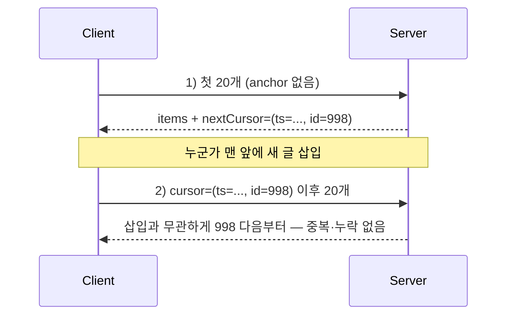

스크롤을 내리면 다음 묶음이 따라 붙는 무한 스크롤. UI는 단순해 보이지만 서버 입장에선 **연속된 요청들 사이의 정합성**을 책임져야 한다. 커서 자료구조 자체보다, 사용자가 스크롤하는 동안 **데이터가 중간에 삽입·삭제될 때 생기는 중복 표시와 항목 건너뜀**을 어떻게 막느냐가 진짜 주제다.

## offset이 무한 스크롤에 부적합한 이유

가장 쉬운 구현은 `LIMIT 20 OFFSET 40`이다. 정적 데이터라면 잘 돈다. 그러나 목록이 최신순(`ORDER BY created_at DESC`)이고 스크롤 도중 새 글이 맨 앞에 하나 추가되면, 모든 항목이 한 칸씩 밀린다. 다음 페이지를 `OFFSET 40`으로 또 부르면 **이미 본 항목 하나가 다시 보인다**(중복). 반대로 맨 앞 항목이 삭제되면 한 항목을 **건너뛴다**(누락).

원인은 offset이 "위치"를 절대 순번으로 가리키기 때문이다. 데이터가 흔들리면 순번의 의미가 바뀐다.



## anchor 기반 키셋 — 위치가 아니라 "마지막으로 본 값"

해법은 offset 대신 **마지막으로 본 항목의 정렬 키**를 커서로 넘기는 것이다. "998번 다음부터 20개"는 그 사이에 무엇이 삽입·삭제되든 의미가 변하지 않는다. anchor가 가리키는 건 순번이 아니라 **값**이기 때문이다.

정렬 키가 유일하지 않으면(생성시각이 겹칠 수 있다) 반드시 **타이브레이커**로 PK를 붙여 복합 커서를 만든다.

```sql
-- created_at DESC, id DESC 정렬에서 (lastTs, lastId) 다음 20개
SELECT id, title, created_at
FROM   post
WHERE  (created_at, id) < (:lastTs, :lastId)   -- 튜플 비교
ORDER  BY created_at DESC, id DESC
LIMIT  20;
```

`(created_at, id)` 복합 인덱스가 있으면 이 쿼리는 인덱스를 그대로 타고 들어가 **항상 일정한 비용**으로 다음 묶음을 가져온다. offset은 깊어질수록 앞 N개를 세고 버리느라 느려지지만, 키셋은 어느 지점이든 동일하다.

## 커서를 어떻게 표현하나

서버는 다음 요청에 쓸 커서를 응답에 담아 준다. 클라이언트가 내부 컬럼명·정렬 규칙을 알 필요는 없으니, 키를 인코딩한 **불투명(opaque) 토큰**으로 준다.

```java
public record PageSlice<T>(List<T> items, String nextCursor, boolean hasNext) {}

String encode(Instant ts, long id) {
    String raw = ts.toEpochMilli() + ":" + id;
    return Base64.getUrlEncoder().encodeToString(raw.getBytes(UTF_8));
}

PageSlice<PostDto> nextPage(String cursor, int size) {
    Cursor c = cursor == null ? null : decode(cursor);   // 첫 호출은 null
    List<PostDto> rows = mapper.findAfter(c, size + 1);   // 한 개 더 읽어
    boolean hasNext = rows.size() > size;                 // 다음 존재 여부 판정
    if (hasNext) rows = rows.subList(0, size);
    String next = hasNext ? encode(last(rows)) : null;
    return new PageSlice<>(rows, next, hasNext);
}
```

`size + 1`개를 읽어 보면 별도 count 쿼리 없이 "다음이 있는가"를 알 수 있다. 무한 스크롤은 전체 페이지 수를 보여줄 필요가 없으니 **count 쿼리를 아예 안 도는** 게 정석이다.

## 스크롤 위치 복원

뒤로 갔다 돌아왔을 때 보던 위치를 살리려면, 클라이언트가 **지금까지 받은 마지막 커서**와 누적 항목 수를 들고 있다가 복귀 시 그 지점부터 이어 받으면 된다. 서버는 무상태로 커서만 신뢰하면 되므로, 어떤 서버 인스턴스로 요청이 가도 동일하게 동작한다.

## 운영 함정

- **정렬 키가 안 유일하면 무조건 깨진다.** `created_at`만으로 커서를 만들면 같은 시각 항목들이 경계에서 잘리거나 중복된다. PK 타이브레이커는 선택이 아니다.
- **정렬 기준과 커서 컬럼이 일치해야 한다.** `ORDER BY` 컬럼과 `WHERE` 튜플 비교 컬럼이 다르면 인덱스를 못 타고 결과도 틀린다.
- **삭제는 막지 못한다.** anchor는 "내가 본 마지막 값 이후"라서, 아직 안 본 항목이 삭제되면 그냥 안 보일 뿐(정상). 하지만 anchor로 쓴 항목 자체가 삭제돼도 값 비교라 문제없다 — 이게 offset 대비 강점이다.

## 핵심 요약

- 무한 스크롤은 offset이 아니라 **(정렬키, PK) 복합 커서** 기반 키셋이 정답.
- count 쿼리는 돌지 않고, `size+1`로 `hasNext`를 판정한다.
- 커서는 **불투명 토큰**으로 캡슐화해 클라이언트가 내부 스키마에 의존하지 않게 한다.

> **면접 한 줄 Q&A**
> Q. 무한 스크롤에서 OFFSET 페이징이 항목을 중복·누락시키는 이유는?
> A. OFFSET은 절대 순번을 가리키는데 스크롤 중 앞쪽에 삽입/삭제가 일어나면 순번의 의미가 밀려서다. 마지막으로 본 정렬 키 값을 커서로 쓰면 삽입·삭제와 무관하게 "그 값 다음부터"가 보장된다.
