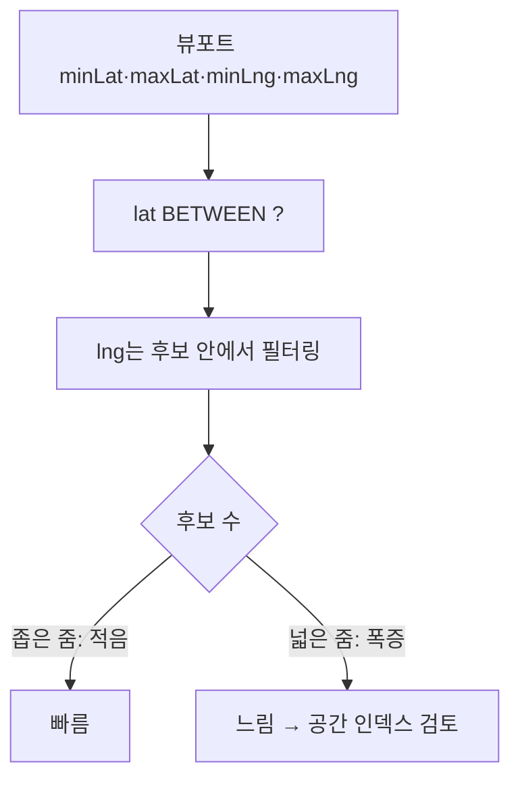

지도에 점을 뿌릴 때, 전 세계 데이터를 다 내려보내면 안 된다. **지금 화면에 보이는 영역(viewport)** 안의 좌표만 가져와야 한다. 주소를 좌표로 바꾸는 지오코딩과 달리, 이건 이미 저장된 좌표를 **현재 보이는 사각형 범위로 질의**하는 문제다. 사각형은 단순하지만, 그 단순함이 인덱스와 만나는 지점에서 함정이 생긴다.

## bounding box 조회의 기본형

뷰포트는 네 값으로 표현된다: 남서쪽(minLat, minLng)과 북동쪽(maxLat, maxLng). 그 안의 좌표는 양쪽 축의 BETWEEN이다.

```sql
SELECT id, lat, lng
FROM   place
WHERE  lat BETWEEN :minLat AND :maxLat
  AND  lng BETWEEN :minLng AND :maxLng;
```

직관적이고 잘 동작한다. 문제는 인덱스다. `(lat, lng)` 복합 B-tree 인덱스를 걸어도, B-tree는 **첫 컬럼의 범위 조건 이후엔 두 번째 컬럼의 인덱스 정렬성을 잃는다.** `lat BETWEEN`으로 후보를 좁힌 뒤 `lng`는 그 후보들 안에서 필터링(인덱스 스캔이 아닌 필터)으로 처리된다. 위도 범위가 넓으면(전국 줌) 후보가 폭증한다.



## 왜 B-tree로는 2차원이 깔끔히 안 풀리나

B-tree는 본질적으로 **1차원 정렬** 자료구조다. `(lat, lng)`로 묶으면 lat이 정렬되고 같은 lat 안에서 lng가 정렬될 뿐, 2차원 평면의 "근처"라는 개념을 모른다. 그래서 한 축은 범위로 좁혀도 다른 축은 못 좁힌다.

이걸 우회하려면 둘 중 하나다.

1. **선택도 높은 축을 앞에.** 데이터가 경도로 더 흩어져 있으면 `(lng, lat)`이 후보를 더 잘 줄인다.
2. **공간 인덱스(R-tree/GiST류).** 2차원을 직접 다루도록 설계된 인덱스다. 좌표를 묶어 사각형(MBR)으로 색인하므로 bounding box 질의를 자연스럽게 받는다. PostGIS의 GiST, MySQL의 SPATIAL 인덱스가 이 부류다.

```sql
-- 공간 타입 + 공간 인덱스 (예: PostGIS)
ALTER TABLE place ADD COLUMN geom geometry(Point, 4326);
CREATE INDEX idx_place_geom ON place USING GiST (geom);

SELECT id FROM place
WHERE  geom && ST_MakeEnvelope(:minLng, :minLat, :maxLng, :maxLat, 4326);
```

`&&`는 "bounding box가 겹치는가" 연산자로, GiST 인덱스를 그대로 탄다.

## 줌 레벨에 따른 표본 추출

전국을 한눈에 보는 줌에서 수만 개 점을 그대로 내려보내면 네트워크·렌더링이 모두 죽는다. 화면 픽셀 하나에 점 수백 개가 겹쳐 봐야 의미도 없다. 그래서 **줌 레벨이 낮으면(넓게 보면) 집계하거나 표본을 추출**한다.

- **서버측 클러스터링**: 격자(grid)로 좌표를 묶어 셀당 대표점 1개와 개수만 반환. `FLOOR(lat / cellSize)` 같은 격자 키로 GROUP BY.
- **상한 + 표본**: 결과가 N개를 넘으면 잘라 보내고 "더 확대하세요"를 알린다.

```sql
-- 줌 낮을 때: 격자 셀로 집계
SELECT FLOOR(lat / :cell) AS gy, FLOOR(lng / :cell) AS gx,
       COUNT(*) AS cnt, AVG(lat) AS clat, AVG(lng) AS clng
FROM   place
WHERE  lat BETWEEN :minLat AND :maxLat
  AND  lng BETWEEN :minLng AND :maxLng
GROUP  BY gy, gx;
```

## 운영 함정

- **좌표 NULL.** 모든 레코드에 좌표가 있는 게 아니다. 지오코딩 실패분은 lat/lng가 NULL이고, BETWEEN은 NULL을 자동으로 제외하므로 "왜 안 보이지" 문의의 단골 원인이다. 좌표 없는 데이터의 처리(별도 표기 등)를 명시적으로 정한다.
- **경도 ±180 경계(날짜변경선).** 태평양을 가로지르는 뷰포트는 `minLng > maxLng`가 되어 단순 BETWEEN이 빈 결과를 낸다. 글로벌 서비스라면 두 구간으로 쪼개야 한다. (국지 서비스면 무시 가능.)
- **공간 인덱스 과도입.** 좁은 지역만 다루고 데이터가 적으면 `(lng, lat)` B-tree로 충분하다. 후보 폭증이 실측될 때 공간 인덱스로 넘어간다.

## 핵심 요약

- 뷰포트 조회는 **양축 BETWEEN**이 기본형, 인덱스는 선택도 높은 축을 앞세운 복합 B-tree.
- B-tree는 1차원이라 두 번째 축을 못 좁힌다 — 넓은 줌에서 후보가 터지면 **공간 인덱스(GiST/SPATIAL)**.
- 넓은 줌은 그대로 뿌리지 말고 **격자 클러스터링/표본 추출**.

> **면접 한 줄 Q&A**
> Q. lat/lng에 복합 B-tree 인덱스를 걸었는데 범위 조회가 느린 이유는?
> A. B-tree는 1차원 정렬이라 첫 축을 범위로 좁히면 둘째 축은 인덱스 정렬성을 잃고 필터링으로 처리된다. 2차원 근접 질의는 R-tree/GiST 같은 공간 인덱스가 적합하다.
