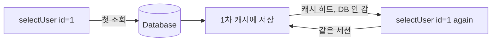

같은 조회가 한 요청 안에서 여러 번 반복되는 코드를 최적화하던 주였다. MyBatis는 캐시 계층을 두 개 가지고 있는데, 둘의 **범위(scope)**가 완전히 달라서 오해하면 오래된 데이터(stale)를 읽거나 캐시 효과를 못 본다. 1차·2차 캐시를 정확히 구분하는 게 핵심이다.

## 1차 캐시 — SqlSession 범위

1차 캐시(local cache)는 **SqlSession 단위**다. 같은 세션에서 동일한 statement를 동일한 파라미터로 다시 조회하면, DB에 가지 않고 세션 내부 맵에서 결과를 반환한다. 기본으로 항상 켜져 있다.



스프링 환경에서 SqlSession은 보통 **트랜잭션과 생명주기를 같이한다.** 즉 1차 캐시는 사실상 트랜잭션 범위다. 트랜잭션이 끝나면 세션도 닫히고 캐시도 사라진다. 한 트랜잭션 안에서 같은 조회를 반복하는 패턴에 효과적이다.

주의할 점은 **insert/update/delete가 일어나면 그 세션의 1차 캐시가 비워진다(flush).** MyBatis는 쓰기 작업 후 캐시가 오래됐다고 보고 통째로 지운다. 그래서 같은 트랜잭션 안에서 "조회 → 수정 → 재조회"를 하면 재조회는 DB를 다시 친다. 이건 stale을 막는 안전장치다.

## 2차 캐시 — 매퍼(네임스페이스) 범위

2차 캐시는 **매퍼 네임스페이스 단위**이고, **여러 SqlSession이 공유**한다. 세션이 닫혀도 살아남아 다음 요청·다음 트랜잭션이 재사용한다. 기본은 꺼져 있고 매퍼에 `<cache/>`를 선언하거나 `@CacheNamespace`를 붙여야 켜진다.

```xml
<mapper namespace="...ProductMapper">
  <cache eviction="LRU" flushInterval="60000" size="512" readOnly="true"/>
  <select id="findById" resultType="Product" useCache="true">
    SELECT * FROM product WHERE id = #{id}
  </select>
</mapper>
```

여기서 stale의 위험이 생긴다. 2차 캐시는 **해당 네임스페이스의 쓰기 작업만** 캐시를 비운다. 다른 매퍼나 외부 경로(배치, 다른 서비스, DB 직접 수정)로 같은 테이블이 바뀌면 2차 캐시는 그 변경을 모른다. 그 결과 오래된 데이터를 계속 내려준다. `flushInterval`로 주기적 만료를 걸 수 있지만, 그 사이의 stale은 감수해야 한다.

## flushCache로 제어하기

statement 단위로 캐시 동작을 강제할 수 있다.

```xml
<!-- 항상 캐시를 무시하고 비운다: 최신값이 절대적으로 필요한 조회 -->
<select id="findLatestPrice" flushCache="true" useCache="false" .../>

<!-- 이 update는 캐시를 안 비운다(드물게, 캐시 일관성을 직접 관리할 때) -->
<update id="touchLog" flushCache="false" .../>
```

조회의 `flushCache="true"`는 호출 시 캐시를 비우고, `useCache="false"`는 결과를 캐시에 담지 않는다. 갱신이 잦고 최신성이 중요한 데이터는 2차 캐시 대상에서 빼는 게 안전하다.

## 운영 함정

**함정 1 — 2차 캐시 + 외부 변경 = stale.** 배치나 다른 애플리케이션이 같은 테이블을 수정하는 환경에서 2차 캐시를 켜면, 캐시는 변경을 못 받아 오래된 값을 계속 응답한다. 멀티 인스턴스라면 인스턴스마다 별도 캐시라 더 어긋난다. 변동이 잦은 데이터엔 2차 캐시를 켜지 않거나 외부 캐시(Redis 등)로 무효화 신호를 공유한다.

**함정 2 — 1차 캐시로 인한 "수정했는데 안 바뀐" 착각.** 같은 트랜잭션 안에서 다른 경로로 DB가 바뀌어도, 1차 캐시는 이미 담아둔 결과를 반환한다. 최신값이 필요하면 세션을 분리하거나 `flushCache`로 비운다.

## 면접 한 줄 Q&A

"MyBatis 1차 캐시와 2차 캐시의 차이는?" → 1차는 SqlSession(사실상 트랜잭션) 범위로 기본 켜져 있고 세션 종료 시 사라진다. 2차는 매퍼 네임스페이스 범위로 세션 간 공유되며 기본 꺼져 있다. 2차는 외부 변경을 감지 못해 stale 위험이 크다.
