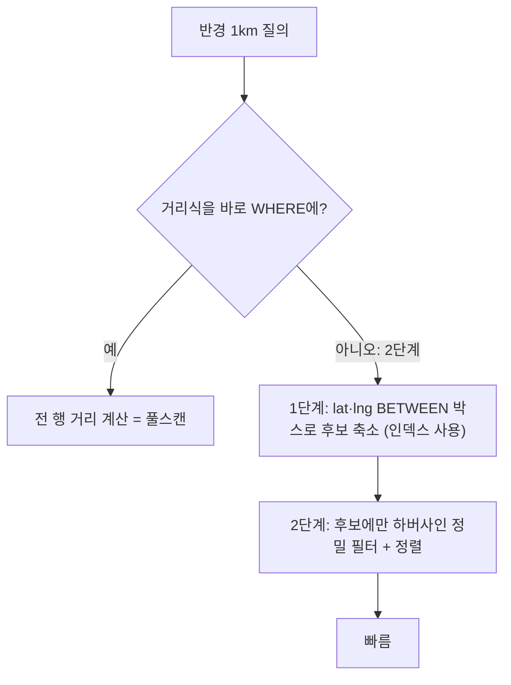

"내 위치에서 반경 1km 안"을 조회한다. 사각형 뷰포트와 달리 이건 **원(반경) 조건**이라, 정확히 하려면 두 좌표 사이 거리를 삼각함수로 계산해야 한다. 그런데 그 거리식을 WHERE 절에 그대로 쓰는 순간 인덱스가 무력화된다. 이건 `LIKE '%kim%'`이 인덱스를 못 타는 것과 같은 부류의 함정 — 공간 버전이다.

## 거리식이 인덱스를 죽이는 이유

지구는 구면이라 두 위경도 사이 거리는 하버사인(haversine) 공식으로 구한다.

```sql
-- 안티패턴: 모든 행에 대해 거리 계산 후 비교
SELECT id FROM place
WHERE 6371 * ACOS(
        COS(RADIANS(:lat)) * COS(RADIANS(lat)) *
        COS(RADIANS(lng) - RADIANS(:lng)) +
        SIN(RADIANS(:lat)) * SIN(RADIANS(lat))
      ) <= 1.0;   -- km
```

문제는 분명하다. WHERE의 좌변이 `lat`, `lng`를 **함수로 감싼 식**이다. B-tree 인덱스는 컬럼 **원본 값**으로 정렬돼 있는데, `ACOS(COS(...lat...))` 같은 가공값으로는 인덱스 정렬을 쓸 수 없다. 결국 옵티마이저는 **전 행을 읽어 한 건씩 거리를 계산**(풀스캔)한다. 인덱스가 있어도 안 탄다. `WHERE YEAR(created_at) = 2024`가 인덱스를 못 타는 것과 똑같은 원리다.



## 2단계 접근 — 박스로 좁히고 원으로 다듬기

핵심 아이디어: **인덱스가 탈 수 있는 조건으로 먼저 후보를 줄이고, 비싼 거리 계산은 그 후보에만** 적용한다.

반경 r(km)을 위경도 델타로 환산하면 사각 bounding box가 나온다. 위도 1도 ≈ 111km, 경도 1도 ≈ 111 × cos(위도) km다.

```sql
-- 1단계: 박스로 후보 축소 (lat,lng 인덱스 활용)
-- 2단계: 후보에만 하버사인으로 원 안인지 확인 + 거리순 정렬
SELECT id, lat, lng,
       6371 * ACOS( LEAST(1.0,
         COS(RADIANS(:lat))*COS(RADIANS(lat))*COS(RADIANS(lng)-RADIANS(:lng))
         + SIN(RADIANS(:lat))*SIN(RADIANS(lat)) )) AS dist_km
FROM   place
WHERE  lat BETWEEN :lat - :dLat AND :lat + :dLat     -- 인덱스 가능
  AND  lng BETWEEN :lng - :dLng AND :lng + :dLng     -- 인덱스 가능
HAVING dist_km <= :radiusKm                           -- 후보에만 정밀 필터
ORDER  BY dist_km
LIMIT  20;
```

박스가 후보를 수천 분의 일로 줄여 주므로, 비싼 하버사인은 소수의 후보에만 돈다. 박스는 원을 외접하므로 모서리에 가짜 후보(원 밖, 박스 안)가 끼지만, HAVING이 걸러낸다. **빠른 근사 필터(인덱스) + 정확한 정밀 필터(거리식)** 조합이 정석이다.

`LEAST(1.0, ...)`는 부동소수점 오차로 ACOS 인자가 1을 살짝 넘겨 NaN이 나는 걸 막는 방어다.

## 거리 정렬과 페이징의 비용

"가까운 순"으로 정렬하면 `dist_km`가 인덱스로 미리 정렬돼 있지 않으니, 박스 후보 전체를 계산·정렬한 뒤 LIMIT한다. 후보가 작으면 문제없지만, 박스 안에 후보가 여전히 많으면(도심) 정렬 비용이 든다. 무한 스크롤로 더 보기를 한다면 거리 자체가 안정적 커서 키가 될 수 있지만, 동일 거리 동점 처리를 위해 PK 타이브레이커가 필요하다.

규모가 커지면 공간 인덱스(GiST/SPATIAL)의 `ST_DWithin` 같은 함수가 박스 축소와 거리 필터를 한 번에 처리해 준다. 2단계 수작업을 엔진이 대신하는 셈이다.

## 운영 함정

- **반경을 키우면 박스도 커진다.** 반경 50km 같은 큰 검색은 박스 후보가 폭증해 2단계 이점이 줄어든다. 이때가 공간 인덱스 도입 분기점이다.
- **위도에 따라 경도 1도의 거리가 다르다.** 고위도일수록 경도 간격이 좁아진다. `dLng = r / (111 * cos(lat))`로 위도를 반영하지 않으면 동서 방향 박스가 틀어진다.
- **거리 단위 혼동.** 지구 반지름 6371을 km로 쓰면 결과도 km다. m와 km, 미터와 마일을 섞으면 반경 필터가 통째로 어긋난다.

## 핵심 요약

- 거리식을 WHERE에 직접 쓰면 컬럼이 함수로 감싸져 **인덱스를 못 탄다** → 풀스캔.
- **박스 BETWEEN으로 인덱스 후보 축소 → 후보에만 하버사인 정밀 필터**의 2단계.
- 반경이 크거나 데이터가 많아지면 **공간 인덱스 + ST_DWithin**으로 승급.

> **면접 한 줄 Q&A**
> Q. 하버사인 거리 조건이 인덱스를 못 타는 이유와 해결책은?
> A. WHERE 좌변이 lat/lng를 함수로 감싼 가공값이라 B-tree 원본 정렬을 쓸 수 없어 풀스캔이 된다. lat/lng BETWEEN 박스로 인덱스를 태워 후보를 줄인 뒤, 그 후보에만 하버사인으로 정밀 필터링한다.
