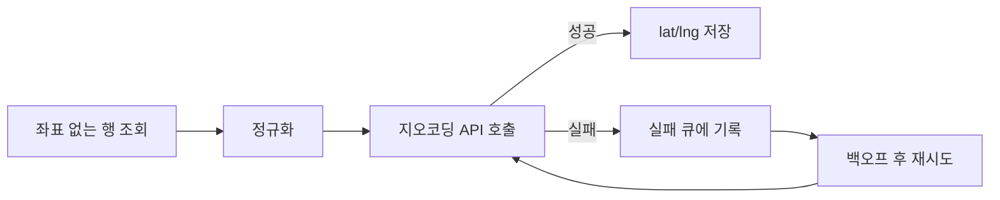

그 주엔 주소만 들고 있는 데이터에 위도·경도를 채워 넣는 일을 했다. 화면에 지도를 띄우거나 거리 계산을 하려면 좌표가 필요한데, 입력은 사람이 친 주소 문자열뿐이다. 좌표는 외부 지오코딩 API가 안다. 그래서 이 작업의 본질은 **외부 호출로 빠진 필드를 채우는 데이터 보강(enrichment) 배치**이고, 핵심 난이도는 변환 알고리즘이 아니라 **수만 건을 부르는 동안 한도·실패·재시도를 어떻게 다루느냐**다.

## 보강 파이프라인의 형태

한 건씩 동기로 부르면 단순하지만, 대량이면 외부 API가 먼저 무너진다. 보강은 다음 단계로 흐른다.



핵심은 **성공과 실패를 같은 트랜잭션에 묶지 않는 것**이다. 1만 건 중 9,990건이 성공했는데 10건 실패로 전체를 롤백하면, 다음 실행에서 9,990건을 또 부른다. 한도와 비용을 그대로 낭비한다. 성공은 즉시 커밋하고, 실패는 따로 기록해 이어서 처리한다.

## 한도와 재시도

외부 API는 거의 예외 없이 **rate limit**을 건다. 초당 N건, 일당 M건. 이를 무시하면 `429 Too Many Requests`가 쏟아진다. 송신 측에서 속도를 스스로 조절하는 게 정석이다.

```java
RateLimiter limiter = RateLimiter.create(10.0); // 초당 10건

for (Address a : pending) {
    limiter.acquire();                  // 한도에 맞춰 대기
    try {
        GeoPoint p = geocoder.lookup(a.normalized());
        a.setLat(p.lat());
        a.setLng(p.lng());
        repo.saveCoords(a);             // 성공 → 즉시 커밋
    } catch (RateLimitException e) {
        failQueue.push(a, backoff(e));  // 백오프 후 재시도 대상
    } catch (NotFoundException e) {
        repo.markUnresolvable(a);       // 영구 실패 → 재시도 안 함
    }
}
```

재시도는 **재시도 가능한 실패와 영구 실패를 구분**해야 한다. `429`·타임아웃·`5xx`는 잠시 뒤 다시 부르면 풀릴 가능성이 있으니 지수 백오프로 재시도한다. "주소를 못 찾음"은 몇 번을 불러도 같은 결과다 — 영구 실패로 표시하고 사람이 보정하게 둔다. 둘을 안 가르면 영영 안 풀릴 주소를 무한히 두드린다.

## 운영 함정

**정규화를 안 하면 적중률이 떨어진다.** "서울시 강남구"와 "서울 강남구", 공백·괄호·층호 표기 차이만으로 지오코더가 못 찾는다. 호출 전에 주소를 정규화해 두면 성공률이 오르고 그만큼 한도 낭비가 준다.

**좌표 정밀도와 캐싱.** 같은 주소가 데이터에 수백 번 나올 수 있다. 정규화한 주소를 키로 변환 결과를 캐시하면 동일 주소를 다시 부르지 않는다. 또 지오코더가 도로명 중심점/건물 중심점 중 무엇을 주는지에 따라 정밀도가 다르니, 응답의 정밀도 등급을 함께 저장해 신뢰도를 판단한다.

## 핵심 요약

- 데이터 보강 배치는 **성공 즉시 커밋, 실패 별도 기록**. 전체 롤백은 한도 낭비다.
- **rate limit은 송신 측이 스스로** 지킨다(클라이언트 측 스로틀 + 지수 백오프).
- **재시도 가능 실패(429·타임아웃)와 영구 실패(미해결 주소)를 구분**한다.
- 호출 전 주소 정규화 + 결과 캐싱으로 적중률과 비용을 동시에 잡는다.
