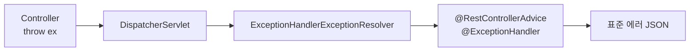

여러 컨트롤러의 예외 처리를 한 번에 통일한 주가 있었다. API마다 응답 포맷이 제각각이면 프런트는 매번 분기 코드를 새로 짜야 한다. 핵심은 "예외 처리 정책을 한 곳에 모으는 것"이다.

## 왜 전역 핸들러인가

`try-catch`를 컨트롤러마다 흩뿌리면 두 가지가 깨진다. 첫째, 같은 예외인데 응답 바디가 메서드마다 다르다. 둘째, 비즈니스 로직과 예외 변환 코드가 뒤섞여 가독성이 떨어진다.

Spring MVC는 `DispatcherServlet`이 핸들러 실행 중 던져진 예외를 잡아 `HandlerExceptionResolver` 체인에 넘긴다. 이 체인 안에 `ExceptionHandlerExceptionResolver`가 있고, 이것이 `@ControllerAdvice`(또는 `@RestControllerAdvice`)에 선언된 `@ExceptionHandler` 메서드를 찾아 호출한다. 즉 컨트롤러에서 예외를 던지기만 하면, 변환은 전역 핸들러가 책임지는 구조다.



## 표준 에러 바디 설계

먼저 모든 응답이 공유할 에러 포맷을 정한다. 코드, 메시지, 그리고 디버깅용 타임스탬프 정도면 충분하다.

```java
public record ErrorResponse(
    String code,        // 도메인 에러 코드 (예: ORDER_NOT_FOUND)
    String message,     // 사용자에게 보일 메시지
    Instant timestamp
) {}

@RestControllerAdvice
public class GlobalExceptionHandler {

    @ExceptionHandler(EntityNotFoundException.class)
    public ResponseEntity<ErrorResponse> handleNotFound(EntityNotFoundException e) {
        return ResponseEntity.status(HttpStatus.NOT_FOUND)
            .body(new ErrorResponse("NOT_FOUND", e.getMessage(), Instant.now()));
    }

    @ExceptionHandler(MethodArgumentNotValidException.class)
    public ResponseEntity<ErrorResponse> handleValidation(MethodArgumentNotValidException e) {
        String msg = e.getBindingResult().getFieldErrors().stream()
            .map(f -> f.getField() + ": " + f.getDefaultMessage())
            .collect(Collectors.joining(", "));
        return ResponseEntity.badRequest()
            .body(new ErrorResponse("VALIDATION_ERROR", msg, Instant.now()));
    }

    @ExceptionHandler(Exception.class)
    public ResponseEntity<ErrorResponse> handleUnexpected(Exception e) {
        log.error("Unhandled exception", e);   // 5xx는 반드시 로깅
        return ResponseEntity.status(HttpStatus.INTERNAL_SERVER_ERROR)
            .body(new ErrorResponse("INTERNAL_ERROR", "잠시 후 다시 시도해 주세요.", Instant.now()));
    }
}
```

여기서 매핑 원칙이 드러난다. **클라이언트 잘못은 4xx, 서버 잘못은 5xx**. 입력 검증 실패는 400, 권한 없음은 403, 리소스 없음은 404로 명시적으로 매핑한다. 그리고 마지막의 `Exception.class` 핸들러가 예상치 못한 예외를 모두 받아 500으로 떨어뜨리는 안전망이 된다.

## 운영 함정

**핸들러 매칭은 가장 구체적인 타입 우선이다.** `Exception.class`와 `IllegalArgumentException.class` 핸들러가 둘 다 있으면 후자가 우선 매칭된다. 따라서 광범위한 `Exception` 핸들러를 둬도 구체 핸들러를 가린다는 걱정은 없다. 다만 커스텀 예외 계층을 만들 때 상속 관계를 의도와 다르게 짜면 엉뚱한 핸들러로 흘러간다.

**내부 메시지 노출 사고.** `e.getMessage()`를 그대로 5xx 바디에 넣으면 스택 정보나 SQL 단편이 외부로 샐 수 있다. 4xx는 사용자에게 의미 있는 메시지를 주되, 5xx는 일반 메시지로 마스킹하고 상세는 로그에만 남긴다.

## 면접 한 줄 Q&A

- **Q. `@ControllerAdvice`와 `@ExceptionHandler`의 차이는?**
  A. `@ExceptionHandler`는 단일 컨트롤러 내부에서만 동작하고, `@ControllerAdvice`는 이를 모든 컨트롤러에 전역 적용한다.
- **Q. 예외별 상태코드 매핑 기준은?**
  A. 클라이언트 입력/권한 문제는 4xx, 서버 내부 오류는 5xx. 5xx는 반드시 로깅하고 응답 메시지는 마스킹한다.
