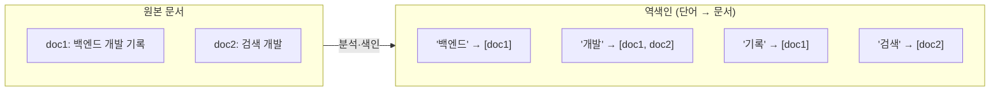

## DB의 LIKE 검색이 한계에 부딪혔을 때

검색 기능을 RDB의 `LIKE '%키워드%'`로 만들면, 데이터가 많아질수록 느려지고 "관련도 순 정렬"이나 "오타 허용" 같은 건 꿈도 못 꿉니다. 본격적인 검색이 필요해지면서 **Elasticsearch**를 도입했는데, 그 빠름의 비밀이 **역색인(Inverted Index)** 이었습니다.

## 정방향 vs 역방향

일반 DB는 "문서 → 내용"으로 저장합니다. 특정 단어를 찾으려면 모든 문서를 훑어야 하죠. 역색인은 이걸 **뒤집습니다**: "단어 → 그 단어가 들어 있는 문서 목록".



책 맨 뒤의 "찾아보기(색인)"와 똑같은 원리입니다. "개발"을 찾으면 전체를 뒤지지 않고 `[doc1, doc2]`를 즉시 얻습니다. 이게 대량 문서에서도 검색이 빠른 이유입니다.

## 문서 모델: Index, Document, Field

Elasticsearch의 데이터 단위를 RDB에 비유하면 이렇습니다.

| Elasticsearch | RDB 비유 |
|---------------|----------|
| Index | Table |
| Document (JSON) | Row |
| Field | Column |
| Mapping | Schema |

문서는 JSON이고, 인덱스에 저장됩니다.

```json
PUT /posts/_doc/1
{
  "title": "백엔드 개발 기록",
  "tags": ["spring", "postgresql"],
  "views": 120
}
```

## text vs keyword — 가장 중요한 구분

매핑에서 문자열 타입을 어떻게 잡느냐가 검색 동작을 좌우합니다.

- **text**: 분석기(analyzer)를 거쳐 **토큰으로 쪼개 색인** → 전문 검색(full-text)용. "백엔드 개발"에서 "개발"로 검색 가능.
- **keyword**: 쪼개지 않고 **값 전체를 하나로** 색인 → 정확히 일치, 집계, 정렬, 필터링용.

```json
PUT /posts
{
  "mappings": {
    "properties": {
      "title":  { "type": "text" },                     // 전문 검색
      "status": { "type": "keyword" },                  // 필터/집계
      "title_raw": { "type": "keyword" }                // 정렬용
    }
  }
}
```

> "검색은 되는데 정렬/집계가 안 돼요" 또는 "정확히 일치 검색이 안 돼요"의 대부분은 이 **text/keyword 선택** 문제입니다. 둘 다 필요하면 `text` + `keyword` 멀티필드로 잡습니다.
{: .prompt-tip }

## 샤드와 분산

인덱스는 내부적으로 **샤드(shard)** 로 쪼개져 여러 노드에 분산됩니다. 덕분에 데이터가 커져도 수평 확장이 가능하고, 복제본(replica)으로 가용성도 확보합니다. (이 글에선 개념만, 자세한 운영은 별도로)

## 정리

- Elasticsearch의 빠름은 **역색인**(단어 → 문서) 덕분.
- 데이터 단위: Index(=Table) / Document(=Row, JSON) / Field(=Column) / Mapping(=Schema).
- 문자열은 **text(전문 검색)** vs **keyword(정확 일치·집계·정렬)** 를 의도에 맞게.
- 다음 글에서 text가 어떻게 토큰으로 쪼개지는지(분석기)와 match/term 차이를 다룹니다.
