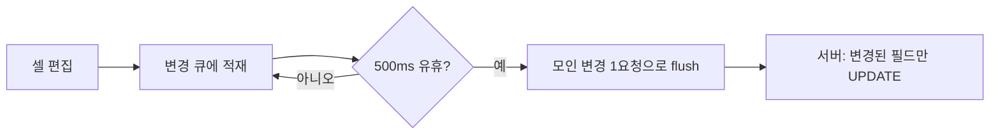

표 화면에서 셀을 더블클릭해 값을 고치면 바로 저장된다. 편하지만 서버 입장에선 "편집 단위가 셀 하나로 잘게 쪼개졌다"는 뜻이다. 부분 갱신을 어떻게 표현하느냐(PATCH vs PUT)보다, **얼마나 잘게 저장 요청을 보낼 것인가 — 갱신 입도(granularity)** 가 이 문제의 본질이다.

## 입도 — 셀마다 보낼까, 묶을까

셀 하나 고칠 때마다 요청을 보내면 **셀 단위 PATCH**다. 한 행을 다 고치고 한 번에 보내면 **행 단위**다. 트레이드오프가 분명하다.

- **셀 단위**: 충돌 범위가 좁다(같은 행 다른 셀은 안 부딪힘). 대신 빠르게 여러 셀을 고치면 요청이 폭주한다.
- **행/배치 단위**: 요청 수가 적다. 대신 한 셀만 틀려도 행 전체가 실패하거나, 안 건드린 셀까지 덮어쓸 위험.

실무 절충은 **셀 단위 의미 + 디바운스 묶음**이다. 사용자가 셀을 고치면 변경을 큐에 쌓고, 짧은 유휴(예: 500ms) 후 모인 변경을 한 요청으로 묶어 보낸다. 입도는 셀이되 네트워크는 배치다.



## 변경된 필드만 — 동적 UPDATE

부분 갱신의 핵심은 **보낸 필드만** 갱신하는 것이다. 전체 객체를 PUT으로 받아 통째로 덮으면, 클라이언트가 안 보낸(=오래된) 값으로 다른 사람의 최신 편집을 날린다. 그래서 변경된 컬럼만 SET하는 동적 UPDATE를 쓴다.

```java
// 요청: PATCH /items/42  { "price": 12000, "status": "ACTIVE" }
public record CellPatch(Long id, Map<String, Object> changes, long version) {}
```

```sql
<update id="patchItem">
  UPDATE item
  <set>
    <if test="changes.price   != null"> price  = #{changes.price},  </if>
    <if test="changes.status  != null"> status = #{changes.status}, </if>
    <if test="changes.memo    != null"> memo   = #{changes.memo},   </if>
  </set>
  WHERE id = #{id} AND version = #{version}   <!-- 낙관적 락 -->
</update>
```

`<set>` 동적 SQL은 들어온 필드만 갱신하고 후행 콤마를 정리한다. **필드 키는 화이트리스트로 매핑**한다 — 클라이언트가 보낸 키를 컬럼명에 그대로 쓰면 인젝션·의도치 않은 컬럼 갱신이 된다. 위처럼 `<if>`로 허용 필드를 고정하는 게 안전하다.

## 동시 편집과 낙관적 UI

같은 행의 같은 셀을 두 명이 동시에 고치면 마지막 쓰기가 이긴다(lost update). 이를 막으려면 행에 `version` 컬럼을 두고 **낙관적 락**을 건다. UPDATE의 WHERE에 `version = :version`을 넣고, 갱신된 행 수가 0이면 "그 사이 누군가 바꿨다"는 뜻이므로 충돌로 처리한다.

```java
int affected = mapper.patchItem(patch);
if (affected == 0) {
    throw new OptimisticLockException("다른 사용자가 먼저 수정했습니다");
}
```

UI는 보통 **낙관적**으로 동작한다 — 서버 응답을 기다리지 않고 화면을 먼저 바꾸고, 실패하면 되돌린다. 그래서 서버는 충돌·검증 실패 시 **무엇이 왜 거부됐는지**를 셀 단위로 돌려줘야 한다. 행 전체 실패가 아니라 "price 셀이 충돌"처럼.

## 편집 중 목록 새로고침과 동기화

표가 주기적으로(또는 다른 사용자 변경으로) 새로고침되는데 사용자가 한 셀을 편집 중이면, 새로 받은 데이터가 편집 중인 셀을 덮어쓰면 안 된다. **편집 중(dirty)인 셀은 갱신에서 제외**하고, 편집이 끝나면 그때 최신값과 머지한다. 서버는 무상태로 버전만 책임지고, 이 머지 정책은 클라이언트가 들고 가는 게 일반적이다.

## 운영 함정

- **빈 PATCH / no-op 갱신.** 디바운스로 묶다 보면 실제 변경이 없는데 요청이 가는 경우가 있다. 변경 집합이 비면 보내지 않고, 서버도 동일값 갱신은 건너뛴다(불필요한 row touch·트리거 방지).
- **부분 검증의 일관성.** 셀 단위로 검증하면 "price는 통과, status는 실패"처럼 행이 불완전 상태가 된다. 필드 간 제약(예: status가 X면 price 필수)은 셀 단위로 못 잡으니, 그런 규칙은 행/배치 커밋 시점에 함께 검증한다.
- **PUT으로 부분 갱신 흉내.** 전체 객체 PUT을 부분 갱신처럼 쓰면 안 보낸 필드가 NULL로 날아가거나 stale 값으로 덮인다. 부분 갱신은 PATCH + 변경 필드만 SET이 원칙.

## 핵심 요약

- 인라인 편집의 본질은 **갱신 입도** — 셀 단위 의미 + 디바운스 배치가 실무 절충.
- **변경된 필드만** 동적 UPDATE, 필드 키는 화이트리스트, 값은 바인딩.
- 동시 편집은 **version 낙관적 락**, 편집 중 셀은 새로고침에서 제외 후 머지.

> **면접 한 줄 Q&A**
> Q. 셀 단위 인라인 편집을 PUT으로 전체 객체를 보내 처리하면 뭐가 문제인가?
> A. 클라이언트가 안 보낸/오래된 필드가 NULL이나 stale 값으로 다른 사람의 최신 편집을 덮어쓴다. PATCH로 변경 필드만 동적 SET하고 version으로 낙관적 락을 걸어야 한다.
