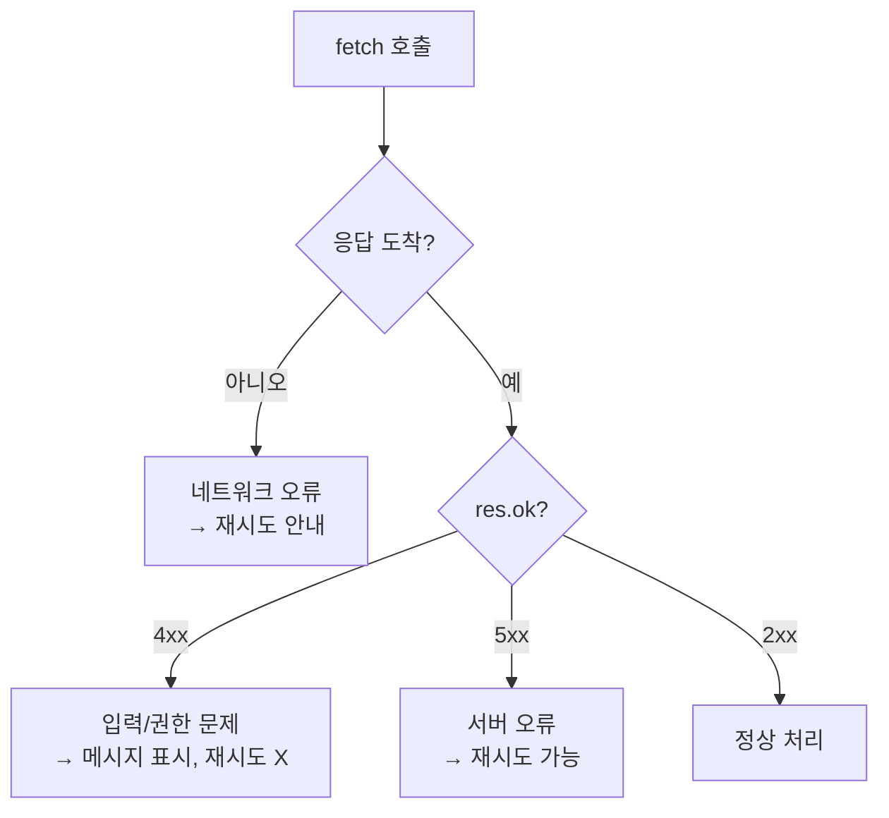

비동기 호출을 본격적으로 다룬 주가 있었다. 화면이 멈추지 않고 데이터를 받아오는 건 편하지만, 그만큼 "실패가 조용히 묻히는" 위험이 커진다. 핵심은 성공만 가정하지 않고 실패의 종류를 구분해 다루는 것이다.

## 실패는 한 종류가 아니다

ajax 호출의 결과는 크게 세 갈래다. 이 셋은 원인도, 사용자에게 줄 메시지도 완전히 다르다.

1. **서버가 4xx로 응답** — 요청 자체가 잘못됐다(검증 실패, 권한 없음, 리소스 없음). 사용자가 입력을 고쳐야 풀린다. 재시도해도 똑같이 실패한다.
2. **서버가 5xx로 응답** — 서버 내부 오류. 사용자 잘못이 아니다. 잠시 후 재시도가 의미 있을 수 있다.
3. **응답 자체가 없음** — 네트워크 단절, 타임아웃, DNS 실패. HTTP 상태코드조차 없다.

`fetch`의 함정이 여기서 드러난다. `fetch`는 **HTTP 에러 상태(4xx/5xx)를 reject하지 않는다.** 네트워크 자체가 끊겼을 때만 reject한다. 따라서 `res.ok`를 직접 확인하지 않으면 404 응답을 "성공"으로 오해한다.



## 분기 처리 구현

```javascript
async function requestWithHandling(url, options) {
  let res;
  try {
    res = await fetch(url, options);
  } catch (networkError) {
    // 응답조차 못 받음
    notify("네트워크 연결을 확인해 주세요.");
    throw networkError;
  }

  if (res.ok) {
    return res.json();
  }

  if (res.status >= 400 && res.status < 500) {
    // 클라이언트 오류: 서버가 준 메시지를 그대로 보여줄 수 있음
    const body = await res.json().catch(() => ({}));
    notify(body.message ?? "요청을 처리할 수 없습니다.");
    throw new Error(`client error ${res.status}`);
  }

  // 5xx
  notify("일시적인 오류입니다. 잠시 후 다시 시도해 주세요.");
  throw new Error(`server error ${res.status}`);
}
```

재시도는 **5xx와 네트워크 오류에만** 적용한다. 4xx에 재시도를 걸면 같은 실패를 반복하며 서버 부하만 키운다. 재시도는 지수 백오프로 간격을 늘려 동시 폭주를 막는다.

```javascript
async function withRetry(fn, max = 3) {
  for (let i = 0; i < max; i++) {
    try { return await fn(); }
    catch (e) {
      if (i === max - 1) throw e;
      await new Promise(r => setTimeout(r, 2 ** i * 300)); // 300, 600, 1200ms
    }
  }
}
```

## 운영 함정

**더블 클릭으로 인한 중복 요청.** 응답이 오기 전 사용자가 버튼을 다시 누르면 같은 요청이 두 번 나간다. 결제·주문처럼 부수효과가 있는 호출은 요청 동안 버튼을 비활성화하고, 서버 측에서도 멱등 키로 중복을 막아야 한다.

**침묵하는 실패.** `.then`만 쓰고 `.catch`를 빠뜨리면 실패가 콘솔에도 안 남고 사용자도 모른 채 화면이 빈 상태로 멈춘다. 모든 비동기 경로에는 반드시 실패 처리를 붙인다.

## 핵심 요약

- HTTP 에러는 reject되지 않을 수 있다 — `res.ok`로 명시 확인.
- 4xx(사용자 책임), 5xx(서버 책임), 네트워크 오류(응답 없음)를 분리해 다른 메시지/동작을 준다.
- 재시도는 5xx·네트워크 오류에만, 지수 백오프로. 4xx 재시도는 금물.
