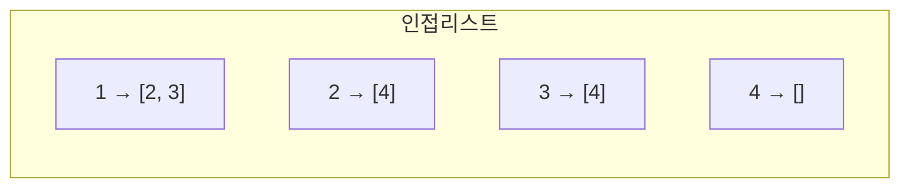
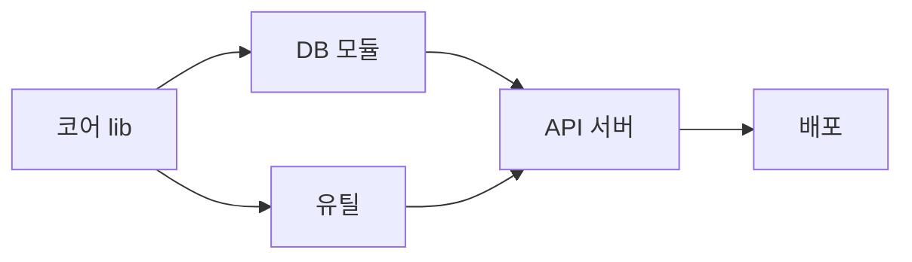

## 세상은 거의 다 그래프다

친구 관계, 도로망, 패키지 의존성, 웹 링크, 마이크로서비스 호출, 빌드 태스크 — 전부 **정점(vertex)** 과 **간선(edge)** 으로 이뤄진 **그래프**입니다. [트리]()가 사이클 없는 특수한 그래프였다면, 일반 그래프는 사이클·다중 경로·방향까지 허용합니다. 그래프 문제의 90%는 결국 "**어떻게 빠짐없이, 효율적으로 훑을 것인가**" — 즉 **순회(traversal)** 로 환원됩니다.

## 먼저 그래프를 메모리에 담는 두 방법

| 표현 | 공간 | "u→v 간선 있나?" | "u의 이웃 전부" | 적합 |
|------|------|------------------|------------------|------|
| 인접 행렬 | $O(V^2)$ | $O(1)$ | $O(V)$ | 밀집(dense) 그래프 |
| 인접 리스트 | $O(V+E)$ | $O(\deg u)$ | $O(\deg u)$ | 희소(sparse) 그래프 — 대부분 |

현실의 그래프는 대개 **희소**합니다(정점 100만 개라도 간선은 평균 몇 개). 그래서 실무 기본은 **인접 리스트**입니다. 인접 행렬은 $V=10^6$이면 $10^{12}$ 칸 — 메모리가 폭발합니다.



## BFS — 시작점에서 동심원처럼 퍼지는 물결

**너비 우선 탐색(BFS)** 은 시작 정점에서 **거리가 가까운 순서대로** 방문합니다. 큐(FIFO)에 이웃을 넣고 꺼내며, 한 겹(level)을 다 본 뒤 다음 겹으로 넘어갑니다. 그래서 **가중치 없는 그래프의 최단 경로**를 자연히 구합니다 — 처음 도달한 순간이 곧 최단 거리니까요.

아래는 시작 정점에서 물결이 **레벨별로** 번지는 모습입니다. 같은 색=같은 거리.

<div class="graph10-bfs" markdown="0">
<style>
.graph10-bfs{margin:1.4rem 0;overflow-x:auto}
.graph10-bfs svg{width:100%;max-width:560px;height:auto;display:block;margin:0 auto;font-family:inherit}
.graph10-bfs .e{stroke:currentColor;opacity:.28;stroke-width:1.6;fill:none}
.graph10-bfs .nd{fill:none;stroke:currentColor;stroke-width:1.8}
.graph10-bfs .nl{fill:#1971c2;opacity:0}
.graph10-bfs .t{fill:currentColor;font-size:12px;font-weight:600}
.graph10-bfs .sub{fill:currentColor;font-size:10px;opacity:.6}
.graph10-bfs .w0{animation:graph10wave 5s ease-in-out infinite;animation-delay:0s}
.graph10-bfs .w1{animation:graph10wave 5s ease-in-out infinite;animation-delay:.7s}
.graph10-bfs .w2{animation:graph10wave 5s ease-in-out infinite;animation-delay:1.4s}
.graph10-bfs .w3{animation:graph10wave 5s ease-in-out infinite;animation-delay:2.1s}
@keyframes graph10wave{0%{opacity:0}6%{opacity:.85}82%{opacity:.85}90%{opacity:0}100%{opacity:0}}
</style>
<svg viewBox="0 0 520 220" role="img" aria-label="BFS가 시작 정점에서 레벨별로 동심원처럼 퍼지며 가까운 정점부터 방문하는 애니메이션">
  <line class="e" x1="70" y1="110" x2="190" y2="60"/>
  <line class="e" x1="70" y1="110" x2="190" y2="160"/>
  <line class="e" x1="190" y1="60" x2="320" y2="40"/>
  <line class="e" x1="190" y1="60" x2="320" y2="110"/>
  <line class="e" x1="190" y1="160" x2="320" y2="110"/>
  <line class="e" x1="190" y1="160" x2="320" y2="180"/>
  <line class="e" x1="320" y1="110" x2="440" y2="110"/>
  <line class="e" x1="320" y1="180" x2="440" y2="110"/>
  <circle class="nl w0" cx="70"  cy="110" r="20"/>
  <circle class="nl w1" cx="190" cy="60"  r="20"/>
  <circle class="nl w1" cx="190" cy="160" r="20"/>
  <circle class="nl w2" cx="320" cy="40"  r="20"/>
  <circle class="nl w2" cx="320" cy="110" r="20"/>
  <circle class="nl w2" cx="320" cy="180" r="20"/>
  <circle class="nl w3" cx="440" cy="110" r="20"/>
  <circle class="nd" cx="70"  cy="110" r="20"/>
  <circle class="nd" cx="190" cy="60"  r="20"/>
  <circle class="nd" cx="190" cy="160" r="20"/>
  <circle class="nd" cx="320" cy="40"  r="20"/>
  <circle class="nd" cx="320" cy="110" r="20"/>
  <circle class="nd" cx="320" cy="180" r="20"/>
  <circle class="nd" cx="440" cy="110" r="20"/>
  <text class="t" x="70"  y="115" text-anchor="middle">S</text>
  <text class="sub" x="70"  y="150" text-anchor="middle">레벨0</text>
  <text class="sub" x="190" y="200" text-anchor="middle">레벨1</text>
  <text class="sub" x="320" y="210" text-anchor="middle">레벨2</text>
  <text class="sub" x="440" y="150" text-anchor="middle">레벨3</text>
</svg>
</div>

```python
from collections import deque
def bfs(adj, s):
    dist = {s: 0}
    q = deque([s])
    while q:
        u = q.popleft()          # FIFO — 가까운 것부터
        for v in adj[u]:
            if v not in dist:    # 처음 도달 = 최단
                dist[v] = dist[u] + 1
                q.append(v)
    return dist
```

시간 $O(V+E)$, 공간 $O(V)$. **방문 표시는 큐에 넣는 순간** 해야 합니다 — 꺼낼 때 표시하면 같은 정점이 큐에 여러 번 들어가 터집니다.

## DFS — 갈 수 있는 데까지 갔다가 되돌아온다

**깊이 우선 탐색(DFS)** 은 한 길로 **끝까지 파고들었다가**, 막히면 **백트래킹**해 다른 길을 봅니다. 재귀(호출 스택) 또는 명시적 스택으로 구현합니다. 아래에서 토큰이 깊이 내려갔다가 되돌아오는 흐름을 보세요.

<div class="graph10-dfs" markdown="0">
<style>
.graph10-dfs{margin:1.4rem 0;overflow-x:auto}
.graph10-dfs svg{width:100%;max-width:520px;height:auto;display:block;margin:0 auto;font-family:inherit}
.graph10-dfs .e{stroke:currentColor;opacity:.28;stroke-width:1.6;fill:none}
.graph10-dfs .nd{fill:none;stroke:currentColor;stroke-width:1.8}
.graph10-dfs .t{fill:currentColor;font-size:12px;font-weight:600}
.graph10-dfs .tok{fill:#f08c00;animation:graph10dfs 6.5s ease-in-out infinite}
@keyframes graph10dfs{
0%{transform:translate(0,0)}
9%{transform:translate(100px,-50px)}
20%{transform:translate(200px,-70px)}
31%{transform:translate(100px,-50px)}
42%{transform:translate(200px,-20px)}
53%{transform:translate(100px,-50px)}
64%{transform:translate(0,0)}
75%{transform:translate(100px,50px)}
86%{transform:translate(0,0)}
100%{transform:translate(0,0)}}
</style>
<svg viewBox="0 0 420 220" role="img" aria-label="DFS가 한 경로로 깊이 내려갔다가 막히면 백트래킹해 다른 경로를 탐색하는 토큰 이동 애니메이션">
  <line class="e" x1="60" y1="110" x2="160" y2="60"/>
  <line class="e" x1="160" y1="60" x2="260" y2="40"/>
  <line class="e" x1="160" y1="60" x2="260" y2="90"/>
  <line class="e" x1="60" y1="110" x2="160" y2="160"/>
  <circle class="nd" cx="60"  cy="110" r="18"/>
  <circle class="nd" cx="160" cy="60"  r="18"/>
  <circle class="nd" cx="260" cy="40"  r="18"/>
  <circle class="nd" cx="260" cy="90"  r="18"/>
  <circle class="nd" cx="160" cy="160" r="18"/>
  <text class="t" x="60"  y="115" text-anchor="middle">A</text>
  <text class="t" x="160" y="65"  text-anchor="middle">B</text>
  <text class="t" x="260" y="45"  text-anchor="middle">D</text>
  <text class="t" x="260" y="95"  text-anchor="middle">E</text>
  <text class="t" x="160" y="165" text-anchor="middle">C</text>
  <circle class="tok" cx="60" cy="110" r="8"/>
</svg>
</div>

DFS 도중 정점을 **언제 처음 보고(진입) 언제 떠나는지(완료)** 의 순서가 강력한 도구입니다 — 사이클 탐지, 위상정렬, 강연결요소가 전부 이 진입/완료 시각에서 나옵니다.

| | BFS | DFS |
|---|---|---|
| 자료구조 | 큐(FIFO) | 스택/재귀(LIFO) |
| 방문 순서 | 거리 가까운 순(레벨) | 깊이 먼저 |
| 무가중 최단경로 | **구함** | 못 구함 |
| 메모리(최악) | 한 레벨 폭만큼 넓음 | 트리 높이만큼 |
| 대표 용도 | 최단거리, 레벨 탐색 | 사이클·위상정렬·SCC·백트래킹 |

## 위상정렬 — 의존성을 한 줄로 세우기

방향성 비순환 그래프(DAG)에서 "**모든 간선 u→v에 대해 u가 v보다 앞**"이 되도록 정점을 일렬로 세우는 것이 **위상정렬(topological sort)** 입니다. 빌드 시스템(`make`, Gradle), 패키지 매니저(`npm` 의존성 해소), 강의 선수과목 — 전부 이것입니다.

**Kahn 알고리즘**은 진입차수(in-degree)가 0인 정점을 큐에 넣고, 꺼내면서 그 정점이 가리키던 간선을 제거(이웃의 진입차수 감소)합니다. 큐가 빌 때까지 꺼낸 순서가 곧 위상 순서. **끝까지 갔는데 정점이 남으면 = 사이클이 있다**는 뜻(의존성 순환).



## 강연결요소(SCC) — 서로 오갈 수 있는 무리

방향 그래프에서 "**서로가 서로에게 도달 가능**"한 정점들의 최대 묶음이 강연결요소입니다. Tarjan/Kosaraju가 DFS의 진입 시각(`low-link`)을 이용해 $O(V+E)$에 찾습니다. 마이크로서비스 호출 그래프에서 SCC = **순환 의존(서로 호출)** 덩어리 — 배포·장애 격리의 골칫거리를 정확히 집어냅니다.

## 프로덕션에서 마주치는 함정

| 함정 | 증상 | 해법 |
|------|------|------|
| 방문 표시를 큐에서 꺼낼 때 함 | 같은 정점 중복 enqueue → 메모리·시간 폭발 | enqueue 시점에 표시 |
| 깊은 DFS 재귀 | 정점 수십만 → 스택 오버플로 | 명시적 스택으로 반복 구현 |
| 위상정렬 결과가 비어 끝남 | 사이클 존재(순환 의존) | 남은 정점 = 사이클, 의존성 끊기 |
| 인접 행렬로 희소 그래프 | $O(V^2)$ 메모리 폭발 | 인접 리스트 |
| 무방향에서 부모로 되돌아감을 사이클로 오판 | 가짜 사이클 | 직전 정점(부모) 제외 처리 |

## 면접/리뷰 단골 질문

- **Q. BFS와 DFS, 언제 무엇?** → 무가중 최단거리·레벨 단위면 BFS, 경로 존재·사이클·위상정렬·백트래킹이면 DFS. 둘 다 $O(V+E)$.
- **Q. BFS가 최단경로를 주는 이유?** → 거리 가까운 순으로 방문하므로 처음 도달이 곧 최단(가중치 동일일 때).
- **Q. 위상정렬이 불가능한 경우?** → 사이클(DAG가 아님). Kahn에서 정점이 남으면 사이클.
- **Q. DFS 재귀의 위험?** → 깊은 그래프에서 스택 오버플로. 반복+명시 스택으로 회피.
- **Q. 인접 행렬 vs 리스트?** → 밀집·간선조회 잦으면 행렬, 희소(대부분)면 리스트($O(V+E)$ 공간).

## 정리

- 현실 문제 대부분은 그래프 순회로 환원된다. 그래프는 보통 **희소** → **인접 리스트**.
- **BFS**(큐, 물결, 무가중 최단거리) vs **DFS**(스택/재귀, 깊이, 백트래킹). 둘 다 $O(V+E)$.
- **위상정렬**은 DAG의 의존성 선형화 — 끝나지 않으면 사이클. **SCC**는 순환 의존 묶음을 찾는다.
- 모든 함정의 절반은 "방문 표시 시점" — enqueue/진입 즉시 표시하라.

> 「알고리즘 A-Z」 그래프 3부작의 시작입니다. 다음은 간선에 **가중치**가 붙었을 때의 [최단 경로]()와 [최소 신장 트리·Union-Find]()로 이어집니다. 비용 분석의 기초는 [복잡도·Big-O]()를 참고하세요.
</content>
