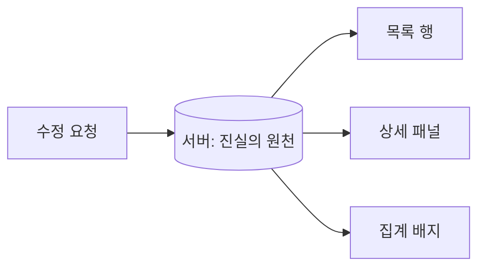

그 주의 작업을 한 문장으로 줄이면 이렇다. **"한 곳에서 데이터를 수정하면, 같은 데이터를 보여주던 다른 영역도 즉시 맞아떨어져야 한다."** 한 페이지에 목록과 상세 패널, 그리고 상단의 집계 배지(예: "미처리 12건")가 동시에 떠 있을 때, 목록에서 한 건의 상태를 바꾸면 상세도, 배지의 숫자도 함께 바뀌어야 한다. 이건 흔히 말하는 read-your-writes 일관성과는 결이 다르다. 그쪽이 캐시·복제 지연이라는 *시간축*의 문제라면, 이건 한 시점에 화면에 공존하는 여러 뷰를 *어떻게 한꺼번에 맞추느냐*는 동기화 설계의 문제다.

## 핵심: 진실의 원천을 하나로

문제의 뿌리는 "같은 데이터가 화면에 여러 번 복제되어 있다"는 것이다. 목록의 한 행, 상세 폼의 필드들, 배지의 카운트는 모두 같은 도메인 사실을 각자 따로 들고 있는 사본이다. 갱신이 일어나면 이 사본들이 서로 어긋난다(stale). 동기화 전략은 결국 **이 사본들을 다시 진실의 원천(source of truth)에 맞추는 세 가지 방법** 중 무엇을 고르느냐로 귀결된다.



**(1) 변경 후 전체 재조회.** 가장 단순하고 가장 안전하다. PUT/PATCH가 성공하면 화면을 구성하는 데이터를 다시 GET 한다. 진실의 원천이 항상 서버이므로 어긋날 일이 없다. 대신 라운드트립이 한 번 더 늘고, 큰 목록을 통째로 다시 받으면 낭비가 크다.

**(2) 갱신 응답에 갱신본을 동봉.** PATCH의 응답 바디에 변경된 엔티티의 *최신 표현*을 담아 돌려준다. 클라이언트는 그걸로 해당 행·상세를 갈아끼운다. 추가 라운드트립이 없고, 서버가 계산한 파생 필드(상태 라벨, updatedAt 등)까지 정확히 반영된다. REST에서 `200 OK` 바디에 리소스를 돌려주는 관례가 바로 이걸 위한 것이다.

**(3) 클라이언트 낙관적 반영.** 응답을 기다리지 않고 화면을 먼저 바꾼다. 체감 속도가 가장 빠르지만, 실패 시 롤백 로직과 서버 진실과의 재조정(reconcile)이 필요하다.

## 부분 무효화 범위 — 무엇까지 다시 그릴까

핵심 판단은 **"한 건이 바뀌면 어디까지 영향을 받는가"**다. 상태 컬럼을 바꾸면 그 행과 상세는 당연히 바뀐다. 하지만 상단 배지처럼 **집계에 참여하는 값**이라면, 그 한 건의 변경이 카운트 전체를 흔든다. 이 의존 관계를 무시하고 행만 갈아끼우면 배지는 영원히 stale 상태로 남는다.

서버 응답을 설계할 때 이 의존성을 명시적으로 표현하는 게 깔끔하다. 갱신 응답에 *바뀐 엔티티*와 *영향받은 집계 델타*를 함께 담는 식이다.

```java
public record UpdateResult(Order updated, Map<String, Long> badgeCounts) {}

@PatchMapping("/orders/{id}/status")
public UpdateResult changeStatus(@PathVariable Long id,
                                 @RequestBody StatusReq req) {
    Order saved = orderService.changeStatus(id, req.status());
    // 변경된 엔티티 + 화면 배지가 의존하는 집계를 함께 반환
    Map<String, Long> counts = orderService.countByStatus();
    return new UpdateResult(saved, counts);
}
```

```sql
-- 배지가 의존하는 집계. 변경 한 건마다 전부 재계산하면 비싸므로
-- 상태 컬럼에 인덱스를 두고, 카운트만 가볍게 다시 구한다.
SELECT status, COUNT(*) AS cnt
FROM orders
WHERE shop_id = #{shopId}
GROUP BY status;
```

서버가 카운트까지 정직하게 돌려주면, 클라이언트는 "행 교체 + 배지 숫자 교체"라는 결정적(deterministic) 갱신만 하면 된다. 클라이언트가 직접 "+1/-1"을 추측하지 않게 하는 게 포인트다. 추측한 숫자는 동시 편집·필터 조건 앞에서 반드시 어긋난다.

## 운영 함정

**함정 1 — 낙관적 반영 후 재조정 누락.** 클라가 먼저 화면을 바꾸고 응답을 무시하면, 서버가 정규화한 값(예: 입력한 이름의 trim·대문자화, 서버 채번한 코드)과 화면이 달라진다. 낙관적 반영을 쓰더라도 **응답이 오면 그 값으로 한 번 더 덮는다**는 규칙을 둬야 한다. "낙관적 → 확정"의 2단계가 정석이다.

**함정 2 — 캐시 무효화 범위 오판.** 서버가 목록을 캐싱하고 있을 때, 한 건의 갱신으로 *그 항목이 속한 캐시 키 전체*를 무효화해야 한다. 필터·정렬·페이지마다 캐시 키가 다르면, 어느 키들이 그 항목을 포함하는지 추적하기 어렵다. 이럴 땐 항목 단위 캐시 대신 **목록 캐시를 통째로 짧은 TTL로** 두거나, 변경 시 관련 prefix를 일괄 evict 하는 편이 안전하다.

## 핵심 요약

- 화면에 같은 데이터가 여러 번 복제돼 있으면, 갱신 시 **모든 사본을 진실의 원천에 다시 맞춰야** 한다.
- 추가 라운드트립이 싫다면 **갱신 응답에 갱신본과 영향받은 집계를 동봉**하는 게 가장 결정적이다.
- 낙관적 반영은 빠르지만 **"낙관 → 서버값으로 확정"** 2단계 재조정이 필수다.

> **면접 한 줄 Q&A**
> Q. 수정 후 화면 동기화에서 클라가 카운트를 직접 +1 하면 안 되는 이유는?
> A. 필터·동시편집·서버 정규화 때문에 클라의 추측값은 서버 진실과 어긋난다. 서버가 계산한 집계를 응답에 담아 결정적으로 덮어야 한다.
