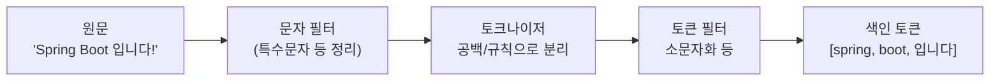

## "분명 있는데 검색이 안 돼요"

Elasticsearch를 처음 쓸 때 가장 헷갈렸던 건, **`term` 쿼리로 검색했는데 결과가 안 나오는** 현상이었습니다. 분명 그 단어가 문서에 있는데도요. 원인은 **분석기(analyzer)** 와 **match/term의 차이**를 몰라서였습니다.

## 분석기: text를 토큰으로 쪼개는 과정

`text` 필드는 색인될 때 **분석기**를 거칩니다. 분석기는 보통 세 단계입니다.



기본 분석기(standard)는 소문자화까지 합니다. 그래서 원문이 `"Spring"`이어도 색인엔 `"spring"`(소문자)으로 들어갑니다. **이게 핵심입니다.**

## match vs term

- **match**: 검색어도 **분석기를 거친 뒤** 매칭. 전문 검색용.
- **term**: 검색어를 **분석하지 않고 그대로** 색인된 토큰과 비교. 정확 일치용.

이제 아까의 미스터리가 풀립니다.

```json
// 색인엔 'spring'(소문자)로 저장됨

// match: 'Spring' → 분석 → 'spring' → 매칭 O
GET /posts/_search
{ "query": { "match": { "title": "Spring" } } }

// term: 'Spring'(대문자 그대로)을 색인의 'spring'과 비교 → 매칭 X !!
GET /posts/_search
{ "query": { "term": { "title": "Spring" } } }
```

`term`이 안 먹은 이유는, 검색어 `"Spring"`은 분석되지 않은 채로 색인된 `"spring"`과 글자 그대로 비교됐기 때문입니다.

## 그래서 규칙

- **text 필드 전문 검색 → `match`** (검색어도 분석되어야 일치)
- **keyword 필드 정확 일치/필터 → `term`** (분석 안 된 값끼리 비교)

```json
// 권장 조합
{ "query": { "match": { "title": "spring boot" } } }   // text 검색
{ "query": { "term":  { "status": "PUBLISHED" } } }     // keyword 필터
```

`term`을 `text` 필드에 쓰면 십중팔구 의도와 다르게 동작합니다.

## 분석 결과를 직접 확인하기

"이 텍스트가 어떤 토큰으로 쪼개지나"는 `_analyze` API로 바로 볼 수 있습니다. 디버깅의 핵심 도구입니다.

```json
GET /posts/_analyze
{
  "field": "title",
  "text": "Spring Boot 입니다!"
}
// → 토큰: spring, boot, 입니다
```

> 한국어는 standard 분석기로는 형태소 분리가 약합니다. 실서비스 한글 검색엔 **Nori** 같은 한국어 형태소 분석기 플러그인을 쓰는 게 좋습니다.
{: .prompt-tip }

## 정리

- `text`는 색인 시 **분석기**로 토큰화(소문자화 등)된다.
- **match**: 검색어도 분석 후 비교(전문 검색). **term**: 분석 없이 그대로 비교(정확 일치).
- `term`이 안 먹으면 십중팔구 분석기/대소문자 때문 → `_analyze`로 확인.
- 한글은 **Nori** 분석기 고려.
