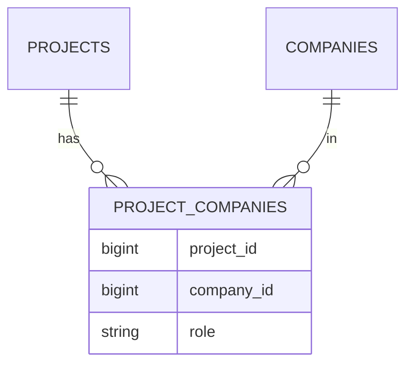

그 주의 작업은 "하나의 대상에 역할이 서로 다른 여러 연관을 붙이는" 모델링이었다. 추상화하면 이렇다. 한 프로젝트에 **설계 담당, 시공 담당, 감리 담당**처럼 *역할이 정해진 슬롯*마다 회사(파트너)가 연결된다. 여기서 갈림길이 나온다. 컬럼을 역할 수만큼 평면으로 박을 것인가(`design_company_id`, `build_company_id`, …), 아니면 역할(role) 컬럼을 가진 **연결 테이블** 하나로 정규화할 것인가. 이건 와이드 테이블 수직 분할이나 읽기 모델 역정규화와는 다른 축의 결정이다. 핵심은 **"역할이 고정인가, 늘어나는가"**다.

## 두 모델의 구조

### 평면 컬럼 방식

```sql
CREATE TABLE projects (
    id              bigint PRIMARY KEY,
    name            varchar(200),
    design_company_id bigint REFERENCES companies(id),
    build_company_id  bigint REFERENCES companies(id),
    supervise_company_id bigint REFERENCES companies(id)
);
```

역할이 컬럼으로 박혀 있어 **단일 행 조회로 모든 역할이 한 번에** 나온다. 조인 없이 `SELECT *` 한 방이면 끝이다. 단점은 명확하다. 역할이 하나 늘면 `ALTER TABLE`로 컬럼을 추가해야 하고, 한 역할에 회사가 둘 이상 붙어야 하는 순간 모델이 깨진다(역할당 1개라는 가정에 갇힘).

### 연결 테이블 방식

```sql
CREATE TABLE project_companies (
    project_id  bigint NOT NULL REFERENCES projects(id),
    company_id  bigint NOT NULL REFERENCES companies(id),
    role        varchar(20) NOT NULL,  -- 'DESIGN' | 'BUILD' | 'SUPERVISE'
    PRIMARY KEY (project_id, role, company_id)
);
CREATE INDEX idx_pc_company ON project_companies (company_id);
```



역할은 **데이터(row)**가 된다. 새 역할은 `INSERT` 한 줄, 한 역할에 회사 여럿도 자연스럽다. 대신 한 프로젝트의 전체 역할을 보려면 조인 + 행 묶기(grouping)가 필요하다.

## 무엇을 기준으로 고르나

판단 축은 세 가지다.

**1) 역할 집합의 안정성.** 역할이 도메인상 영구히 고정(예: 설계/시공/감리 딱 3개, 향후에도 안 늘 것)이면 평면 컬럼이 단순하고 빠르다. 역할이 추가·삭제되거나 사용자가 정의할 수 있으면 연결 테이블이 옳다. 컬럼 추가는 마이그레이션이지만 행 추가는 그냥 데이터다.

**2) 카디널리티(역할당 개수).** "역할당 회사 정확히 1개"가 도메인 불변식이면 평면 컬럼이 그 제약을 타입으로 강제해준다(컬럼이 하나니까). "역할당 여러 개 가능"이면 연결 테이블 외엔 답이 없다.

**3) 조회 패턴.** "프로젝트 화면에서 항상 모든 역할을 함께 보여준다"면 평면 컬럼의 단일 행 조회가 유리하다. 반대로 **"이 회사가 어떤 프로젝트에 어떤 역할로 참여했나"**를 자주 묻는다면, 평면 컬럼은 `WHERE design_company_id=? OR build_company_id=? OR ...` 같은 OR 지옥이 된다. 연결 테이블이면 `company_id`에 인덱스 하나로 깔끔하다.

```sql
-- 연결 테이블: "이 회사의 참여 내역" — 역방향 조회가 자명하다
SELECT p.id, p.name, pc.role
FROM project_companies pc
JOIN projects p ON p.id = pc.project_id
WHERE pc.company_id = #{companyId};

-- 평면 컬럼으로 같은 질문을 하면 OR 나열 + 인덱스 활용 난항
SELECT * FROM projects
WHERE design_company_id = #{cid}
   OR build_company_id = #{cid}
   OR supervise_company_id = #{cid};
```

## 운영 함정

**함정 1 — 평면 컬럼의 "조용한 한계 초과".** 처음엔 역할당 1개였는데 비즈니스가 "공동 시공"을 허용하는 순간, 평면 컬럼 모델은 `build_company_id_2`를 낳기 시작한다. 이 시점이 오면 이미 코드 전반이 단일 컬럼을 가정해 짜여 있어 리팩터링 비용이 폭발한다. "역할당 여럿"이 조금이라도 미래에 있을 것 같으면 처음부터 연결 테이블로 가는 게 싸다.

**함정 2 — 연결 테이블의 역할 무결성.** role이 자유 문자열이면 `'BUILD'`, `'build'`, `'시공'`이 섞여 들어와 집계가 깨진다. role은 enum/체크 제약이나 별도 코드 테이블로 도메인을 닫아야 한다. 또한 `(project_id, role)`에 유일 제약을 줄지(역할당 1개) 안 줄지(여럿 허용)로 카디널리티 불변식을 **DB가 강제**하게 만드는 게 핵심이다.

## 핵심 요약

- 역할이 **고정·역할당 1개·항상 함께 조회**면 평면 컬럼이 단순하고 빠르다.
- 역할이 **늘어나거나·역할당 여럿·역방향 조회가 잦으면** 연결 테이블이 정답.
- 연결 테이블을 택하면 role 도메인을 닫고, 유일 제약으로 카디널리티 불변식을 DB에 박아라.

> **면접 한 줄 Q&A**
> Q. 다대다를 컬럼으로 펼치면 안 되는 신호는?
> A. "역할/슬롯이 늘어날 수 있다" 또는 "한 슬롯에 여럿이 붙을 수 있다"가 보이는 순간. 그땐 role 컬럼을 가진 연결 테이블로 정규화한다.
