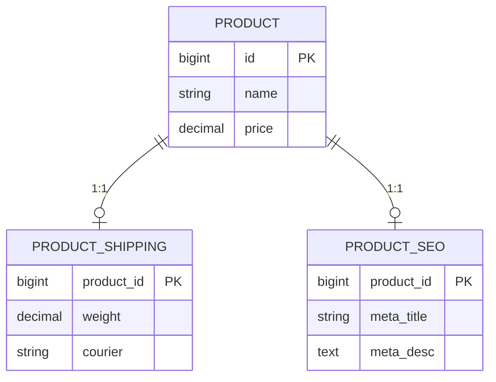

그 주엔 컬럼이 수십 개로 불어난 테이블 하나를 다뤘다. 한 엔티티에 성격이 다른 여러 역할의 속성이 다 붙어 있었다. 어떤 행은 A 역할 컬럼만 차고 B·C·D 역할 컬럼은 전부 `NULL`, 다른 행은 그 반대였다. 폭이 넓어 읽기 힘들고, 한 역할만 고쳐도 거대한 행 전체를 건드려야 했다. 이 작업의 본질은 **역할이 다른 컬럼군을 별도 테이블로 떼어내는 수직 분할(vertical partitioning)**이다.

## 수직 분할이란

수직 분할은 한 테이블의 **컬럼들을 그룹으로 나눠 여러 테이블로 쪼개고**, 같은 기본키(또는 외래키)로 1:1 연결하는 모델링이다. 행을 나누는 수평 분할(샤딩)과 반대 축이다.



핵심 판단 기준은 **함께 채워지고 함께 쓰이는 컬럼끼리 묶는 것**이다. 배송 관련 컬럼은 배송을 다룰 때 같이 읽고 같이 쓴다. SEO 컬럼은 또 다른 화면에서만 쓴다. 이렇게 응집도가 높은 컬럼군을 떼면, 각 테이블은 명확한 책임을 갖고 폭이 좁아진다.

## 무엇이 좋아지나 — 그리고 무엇을 내주나

```sql
-- 분리 후: 핵심 정보만 읽을 땐 좁은 테이블만 스캔
SELECT id, name, price FROM product WHERE id = 100;

-- 배송 정보가 필요할 때만 1:1 조인
SELECT p.id, p.name, s.weight, s.courier
FROM product p
JOIN product_shipping s ON s.product_id = p.id
WHERE p.id = 100;
```

**얻는 것.** (1) `NULL` 컬럼이 준다. 역할별로 채워지므로 쓰지 않는 컬럼이 빈 채로 행을 차지하지 않는다. (2) 자주 읽는 핵심 테이블의 행 폭이 좁아져, 한 페이지에 더 많은 행이 들어가고 캐시 효율이 오른다. 큰 텍스트/BLOB을 떼면 효과가 크다. (3) 각 테이블을 독립적으로 잠그고 갱신해 경합이 준다.

**내주는 것.** 한 화면에서 여러 역할을 다 보여줘야 하면 **조인 비용**을 매번 낸다. 1:1 조인은 기본키 조인이라 싸지만 공짜는 아니다. 그래서 "이 컬럼들이 정말 따로 읽히는가"를 봐야 한다. 늘 함께 읽는 컬럼을 떼면 조인만 늘고 이득이 없다.

## 운영 함정

**1:1 관계의 무결성.** 분리한 테이블에 행이 없을 수 있다(`LEFT JOIN` 대상). 자식 행 존재를 항상 보장하려면 부모 생성 시 함께 만들거나 FK·제약으로 강제한다. 보장 없이 `INNER JOIN`으로 조회하면 자식이 없는 부모가 결과에서 통째로 사라진다.

**과한 분할.** 컬럼 3~4개씩 잘게 쪼개면 조회마다 조인이 5~6개로 불어난다. 정규화는 목적이 아니라 수단이다. NULL 감소·행 폭 축소라는 실익이 분명한 경계에서만 가른다.

## 핵심 요약

- 수직 분할 = **컬럼을 응집도로 묶어 1:1 테이블로 분리**. 함께 채워지고 함께 쓰이는 것끼리.
- 이득: NULL 감소, 핵심 테이블 행 폭 축소(캐시·I/O 개선), 경합 분리.
- 비용: 여러 역할을 함께 볼 때 매번 조인. 1:1 자식 부재 시 `INNER JOIN`이 부모를 지운다 — `LEFT JOIN`/무결성 보장으로 다룬다.

> **면접 한 줄 Q&A**
> Q. 수직 분할의 판단 기준은?
> A. 컬럼이 함께 채워지고 함께 조회되는지(응집도). 늘 같이 읽는 컬럼을 떼면 조인만 늘고 손해, 역할별로 따로 쓰이고 NULL이 많은 컬럼군은 분리 이득이 크다.
