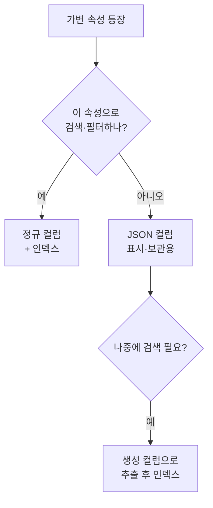

스키마를 고정하기 어려운 가변 속성을 다룬 주가 있었다. 상품마다 옵션이 다르고 새 속성이 수시로 생긴다. 매번 컬럼을 추가하기 부담스러우면 JSON 컬럼이 후보로 떠오른다. 하지만 유연함에는 대가가 있다.

## JSON 컬럼은 왜 매력적인가, 그리고 왜 위험한가

관계형 모델은 컬럼이 고정이다. 새 속성이 생길 때마다 `ALTER TABLE`을 하면 운영 부담이 크고, 속성이 수십 개의 선택적 값이면 컬럼 대부분이 null로 비게 된다. JSON 컬럼은 이걸 한 컬럼으로 흡수한다.

```sql
CREATE TABLE product (
  id        BIGINT PRIMARY KEY,
  name      VARCHAR(200) NOT NULL,
  attributes JSON          -- {"color":"red","size":"L","weight":1.2}
);
```

문제는 DB 엔진이 JSON 내부를 "불투명한 텍스트 덩어리"로 본다는 점이다. `WHERE name = ?`은 인덱스를 타지만, JSON 안의 `color`로 거르려면 매 행마다 JSON을 파싱해 값을 추출해야 한다. 추출 함수로 쿼리할 수 있긴 하다.

```sql
-- MySQL: 추출 함수 또는 ->> 연산자
SELECT id, name
FROM product
WHERE attributes->>'$.color' = 'red';
```

하지만 이 쿼리는 인덱스가 없으면 **풀 테이블 스캔**이다. 데이터가 적을 땐 멀쩡하다가, 행이 수백만으로 늘면 조용히 느려진다.

## 인덱싱 한계 — 함수 기반/생성 컬럼

JSON 경로 자체에는 일반 인덱스를 못 건다. 우회로는 **추출 결과를 별도 컬럼으로 끄집어내는 것**이다. MySQL은 생성 컬럼(generated column)에 인덱스를 건다.

```sql
ALTER TABLE product
  ADD COLUMN color VARCHAR(30)
    GENERATED ALWAYS AS (attributes->>'$.color') STORED,
  ADD INDEX idx_color (color);
```

여기서 핵심 모순이 드러난다. **자주 검색하는 속성은 결국 컬럼으로 끄집어내야 한다.** 그렇다면 그건 처음부터 정규 컬럼이었어야 한다. JSON 컬럼은 "검색하지 않는, 표시·보관 위주의 가변 속성"에 맞다.



## 운영 함정

**무결성 검증의 부재.** JSON 컬럼은 키 오타, 타입 불일치(숫자여야 할 값이 문자열), 누락된 필수 키를 막아 주지 않는다. DB는 그냥 텍스트로 저장한다. 애플리케이션이 직렬화/역직렬화 시점에 검증하지 않으면 깨진 데이터가 쌓이고, 읽는 쪽에서 매번 방어 코드를 짜야 한다.

**부분 수정의 비용.** JSON의 키 하나만 바꿔도 보통은 컬럼 전체를 다시 써야 한다. 행이 크고 갱신이 잦으면 쓰기 증폭이 생긴다. 자주 갱신되는 값이라면 더더욱 정규 컬럼이 맞다.

## 핵심 요약

- JSON 컬럼은 가변·선택적 속성을 한 컬럼으로 흡수해 잦은 `ALTER`를 피한다.
- DB는 JSON 내부를 불투명하게 보므로, 경로 검색은 인덱스 없이는 풀스캔이다.
- 검색·필터·정렬에 쓰는 속성은 정규 컬럼(또는 생성 컬럼)으로 빼라. JSON은 보관·표시용이 정석이다.
