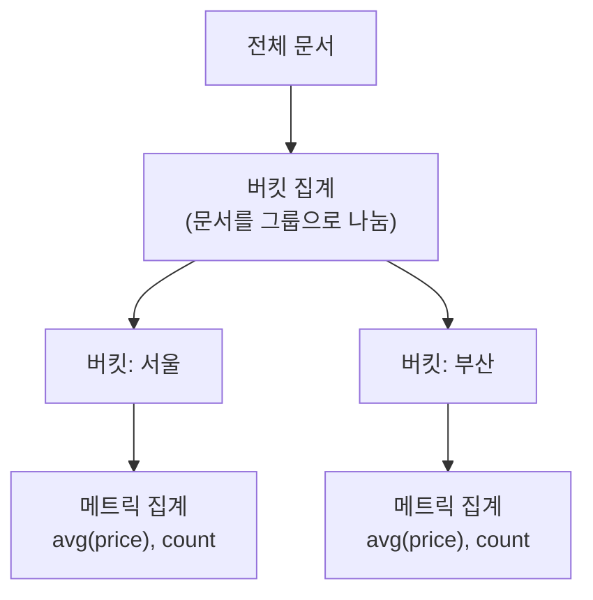

## 검색 엔진인데 통계도 잘한다

Elasticsearch를 검색용으로만 쓰다가, "카테고리별 게시글 수", "지역별 평균 가격" 같은 **통계/분석**이 필요해졌습니다. SQL의 `GROUP BY` + 집계함수에 해당하는 게 Elasticsearch의 **Aggregation**입니다. 크게 **버킷 집계**와 **메트릭 집계** 두 종류를 이해하면 됩니다.

## 두 집계의 관계



- **버킷(bucket) 집계**: 문서를 기준에 따라 **그룹(버킷)으로 나눔** = SQL의 `GROUP BY`.
- **메트릭(metric) 집계**: 숫자 값을 **계산**(합/평균/최대/유니크 수 등) = SQL의 `SUM`, `AVG`, `COUNT`.
- 보통 **버킷으로 나눈 뒤, 각 버킷 안에서 메트릭을 계산**하는 식으로 중첩합니다.

## 메트릭 집계 예시

```json
GET /orders/_search
{
  "size": 0,
  "aggs": {
    "avg_price": { "avg": { "field": "price" } },
    "max_price": { "max": { "field": "price" } }
  }
}
```

`"size": 0`은 검색 결과 문서는 필요 없고 집계만 받겠다는 뜻입니다.

### Cardinality — 유니크한 값의 수

"순 방문자 수", "중복 제거한 상품 종류 수"처럼 **유니크 개수**가 필요하면 `cardinality`를 씁니다(SQL `COUNT(DISTINCT)`).

```json
{
  "size": 0,
  "aggs": {
    "unique_users": { "cardinality": { "field": "user_id" } }
  }
}
```

> `cardinality`는 정확한 값이 아니라 **근사치**(HyperLogLog 기반)입니다. 대규모에서 메모리를 아끼려는 설계라, 약간의 오차를 허용한다는 점을 알고 써야 합니다.
{: .prompt-warning }

## 버킷 집계 예시 (+ 메트릭 중첩)

지역별로 나누고(버킷), 각 지역의 평균 가격(메트릭)을 구합니다.

```json
GET /orders/_search
{
  "size": 0,
  "aggs": {
    "by_region": {
      "terms": { "field": "region" },          // 버킷: region별 그룹
      "aggs": {
        "avg_price": { "avg": { "field": "price" } }  // 각 버킷 내 메트릭
      }
    }
  }
}
```

`terms`(범주별), `date_histogram`(기간별), `range`(구간별) 등이 대표적인 버킷 집계입니다.

## 집계 대상 필드 주의

집계는 `text`가 아니라 **keyword(또는 숫자/날짜)** 필드에 해야 합니다. `text`는 분석되어 토큰으로 쪼개져 있어 그룹 기준으로 부적합합니다(그리고 기본적으로 막혀 있습니다). 그래서 집계용 필드는 `keyword`로 매핑하세요. ([역색인 글의 text/keyword 참고](/posts/elasticsearch-inverted-index/))

## 정리

- **버킷 집계** = GROUP BY(그룹 나누기), **메트릭 집계** = 합/평균/유니크 등 계산.
- 보통 **버킷 → 메트릭 중첩**으로 "그룹별 통계"를 만든다.
- 유니크 수는 `cardinality`(근사치)임을 기억.
- 집계는 **keyword/숫자/날짜** 필드에. `text`는 부적합.
