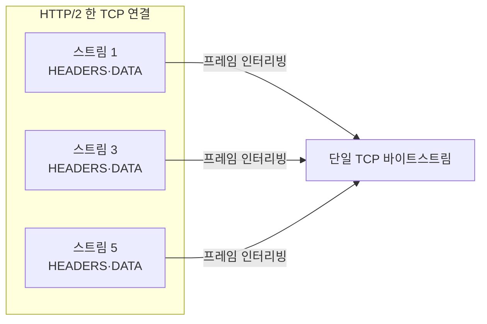

## "같은 서버, 같은 콘텐츠인데 왜 어떤 사이트는 빠를까"

HTTP는 웹의 언어입니다. 그런데 같은 "GET /index.html"이라도 HTTP/1.1로 받느냐, HTTP/2로 받느냐, HTTP/3로 받느냐에 따라 체감 속도가 크게 달라집니다. 차이는 **요청을 어떻게 실어 나르느냐** — 한 줄로 줄 세우느냐, 한 연결에 여러 요청을 겹쳐 보내느냐, 아예 [전송 계층]()을 바꾸느냐에 있습니다.

이 글은 HTTP를 메서드·상태코드 암기로 끝내지 않고, **각 버전이 어떤 병목을 풀려고 등장했는지** — 그리고 그때 새로 생긴 병목은 무엇인지를 따라갑니다. 핵심 키워드 하나만 기억하면 됩니다: **HOL(Head-of-Line) blocking, 줄의 맨 앞이 막히면 뒤가 다 막힌다.**

## HTTP/1.1의 한계: 한 연결은 한 번에 하나

HTTP/1.1은 **텍스트 기반**이고, 한 TCP 연결에서 요청-응답이 **순서대로 하나씩** 처리됩니다. `keep-alive`로 연결을 재사용해 매번 [TCP 핸드셰이크]()를 피할 수는 있지만, 응답 하나가 끝나야 다음 요청을 보냅니다. 파이프라이닝(여러 요청을 미리 보내기)은 명세에 있었지만, **응답은 보낸 순서대로 와야 한다**는 제약 때문에 앞 응답이 느리면 뒤가 다 막혀(HOL) 실패했고, 사실상 폐기됐습니다.

브라우저는 이를 **연결을 6개쯤 동시에 여는** 꼼수로 버텼습니다. 하지만 연결마다 핸드셰이크·혼잡 윈도우([슬로스타트]())를 따로 데우고, 헤더(쿠키 포함)가 매 요청 반복돼 낭비가 큽니다.

## 직렬 vs 멀티플렉싱 — 움직임으로 보기

위는 HTTP/1.1: 한 연결에서 요청이 **끝나야** 다음이 갑니다(앞이 느리면 뒤가 대기). 아래는 HTTP/2: **한 연결**에 여러 요청을 잘게 쪼갠 프레임으로 **겹쳐(interleave)** 보냅니다 — 요청별 색(<span style="color:#1971c2;font-weight:600">파랑</span>·<span style="color:#f08c00;font-weight:600">주황</span>·<span style="color:#2f9e44;font-weight:600">초록</span>)이 한 선 위에 섞여 흐릅니다.

<div class="http-mux" markdown="0">
<style>
.http-mux{margin:1.4rem 0;overflow-x:auto}
.http-mux svg{width:100%;max-width:720px;height:auto;display:block;margin:0 auto;font-family:inherit}
.http-mux .lbl{fill:currentColor;font-size:12px;font-weight:600}
.http-mux .sub{fill:currentColor;font-size:9.5px;opacity:.55}
.http-mux .wire{stroke:currentColor;opacity:.18;stroke-width:6;stroke-linecap:round}
.http-mux .ra{fill:#1971c2}.http-mux .rb{fill:#f08c00}.http-mux .rc{fill:#2f9e44}
.http-mux .s1{animation:httpser 6s linear infinite}
.http-mux .s2{animation:httpser 6s linear infinite}
.http-mux .s3{animation:httpser 6s linear infinite}
.http-mux .m{animation:httpmux 6s linear infinite}
@keyframes httpser{0%{transform:translateX(0);opacity:0}2%{opacity:1}31%{transform:translateX(560px);opacity:1}34%{opacity:0}100%{opacity:0}}
@keyframes httpmux{0%{transform:translateX(0);opacity:0}3%{opacity:1}90%{transform:translateX(560px);opacity:1}100%{opacity:0}}
</style>
<svg viewBox="0 0 700 230" role="img" aria-label="HTTP/1.1은 요청을 순차로 보내고 HTTP/2는 한 연결에 여러 요청 프레임을 겹쳐 보내는 멀티플렉싱 비교 애니메이션">
  <text class="lbl" x="8" y="30">HTTP/1.1 · 한 연결, 한 번에 하나 (직렬)</text>
  <line class="wire" x1="60" y1="60" x2="630" y2="60"/>
  <text class="sub" x="40" y="64" text-anchor="end">요청</text>
  <rect class="ra s1" x="54" y="52" width="40" height="16" rx="3" style="animation-delay:0s"/>
  <rect class="rb s2" x="54" y="52" width="40" height="16" rx="3" style="animation-delay:1.9s"/>
  <rect class="rc s3" x="54" y="52" width="40" height="16" rx="3" style="animation-delay:3.8s"/>

  <text class="lbl" x="8" y="140">HTTP/2 · 한 연결, 프레임으로 쪼개 겹쳐 보냄 (멀티플렉싱)</text>
  <line class="wire" x1="60" y1="170" x2="630" y2="170"/>
  <text class="sub" x="40" y="174" text-anchor="end">요청</text>
  <rect class="ra m" x="54" y="162" width="22" height="16" rx="3" style="animation-delay:0s"/>
  <rect class="rb m" x="54" y="162" width="22" height="16" rx="3" style="animation-delay:.5s"/>
  <rect class="rc m" x="54" y="162" width="22" height="16" rx="3" style="animation-delay:1s"/>
  <rect class="ra m" x="54" y="162" width="22" height="16" rx="3" style="animation-delay:1.5s"/>
  <rect class="rb m" x="54" y="162" width="22" height="16" rx="3" style="animation-delay:2s"/>
  <rect class="rc m" x="54" y="162" width="22" height="16" rx="3" style="animation-delay:2.5s"/>
</svg>
</div>

## HTTP/2: 한 연결을 똑똑하게 쪼개다

HTTP/2는 의미(메서드·헤더·바디)는 그대로 두고 **전송 방식**만 바꿨습니다.

- **바이너리 프레이밍**: 메시지를 `HEADERS`/`DATA` 등 프레임으로 쪼갭니다. 파싱이 빠르고 명확합니다.
- **스트림 멀티플렉싱**: 한 TCP 연결 안에 독립적인 **스트림**이 여럿. 각 프레임에 스트림 ID가 있어, 여러 요청을 겹쳐 보내고 응답도 도착하는 대로 받습니다 → **애플리케이션 레벨 HOL이 사라집니다.** 연결 6개 꼼수가 불필요해집니다.
- **HPACK 헤더 압축**: 반복되는 헤더(쿠키·User-Agent)를 인덱스 테이블 + 허프만으로 압축. 1.1의 헤더 낭비를 제거.
- **우선순위/의존성**: CSS를 이미지보다 먼저 받게 가중치 부여(브라우저 구현은 편차 있음).



## 그런데 HTTP/2도 막힌다: TCP HOL blocking

HTTP/2가 애플리케이션 레벨 HOL을 없앴지만, **그 아래 TCP는 여전히 "순서 보장된 단일 바이트스트림"** 입니다. 스트림 3개를 한 TCP 연결에 겹쳐 보내다 **중간 패킷 하나가 유실**되면, TCP는 그 패킷이 재전송될 때까지 *뒤따라온 모든 데이터*를 애플리케이션에 올려주지 않습니다. 잃어버린 건 스트림 1의 패킷인데, **멀쩡히 도착한 스트림 3·5까지 발이 묶입니다.** 이게 **TCP 레벨 HOL blocking** — HTTP/2의 마지막 한계입니다.

아래에서 위는 HTTP/2(TCP): 스트림 1(<span style="color:#1971c2;font-weight:600">파랑</span>)의 패킷이 <span style="color:#e03131;font-weight:600">유실</span>되면 뒤따르던 스트림 2·3까지 그 자리에 묶입니다. 아래는 HTTP/3(QUIC): 같은 유실이 나도 스트림 2·3은 그대로 통과합니다.

<div class="http-hol" markdown="0">
<style>
.http-hol{margin:1.4rem 0;overflow-x:auto}
.http-hol svg{width:100%;max-width:700px;height:auto;display:block;margin:0 auto;font-family:inherit}
.http-hol .lbl{fill:currentColor;font-size:12px;font-weight:600}
.http-hol .sub{fill:currentColor;font-size:9.5px;opacity:.55}
.http-hol .wire{stroke:currentColor;opacity:.18;stroke-width:6;stroke-linecap:round}
.http-hol .bar{stroke:#e03131;stroke-width:1.6;stroke-dasharray:4 3;opacity:.7}
.http-hol .xx{fill:#e03131;font-size:14px;font-weight:700}
.http-hol .s1{fill:#1971c2}.http-hol .s2{fill:#f08c00}.http-hol .s3{fill:#2f9e44}
.http-hol .blk{animation:httpblk 5s ease-in-out infinite}
.http-hol .pass{animation:httppass 5s ease-in-out infinite}
@keyframes httpblk{0%{transform:translateX(0);opacity:0}5%{opacity:1}45%{transform:translateX(270px);opacity:1}92%{transform:translateX(270px);opacity:1}100%{opacity:0}}
@keyframes httppass{0%{transform:translateX(0);opacity:0}5%{opacity:1}90%{transform:translateX(560px);opacity:1}100%{opacity:0}}
</style>
<svg viewBox="0 0 700 210" role="img" aria-label="HTTP/2는 한 스트림의 패킷 유실이 다른 스트림까지 막지만 HTTP/3는 다른 스트림이 그대로 통과하는 TCP HOL blocking 비교 애니메이션">
  <text class="lbl" x="8" y="26">HTTP/2 (TCP) · 한 스트림 유실 → 전체 정지</text>
  <line class="wire" x1="60" y1="58" x2="630" y2="58"/>
  <line class="bar" x1="350" y1="38" x2="350" y2="78"/>
  <text class="xx" x="350" y="34" text-anchor="middle">✕ 유실</text>
  <rect class="s1 blk" x="54" y="50" width="20" height="16" rx="3" style="animation-delay:0s"/>
  <rect class="s2 blk" x="54" y="50" width="20" height="16" rx="3" style="animation-delay:.45s"/>
  <rect class="s3 blk" x="54" y="50" width="20" height="16" rx="3" style="animation-delay:.9s"/>

  <text class="lbl" x="8" y="138">HTTP/3 (QUIC) · 스트림 독립 → 나머지는 통과</text>
  <line class="wire" x1="60" y1="170" x2="630" y2="170"/>
  <line class="bar" x1="350" y1="150" x2="350" y2="190"/>
  <text class="xx" x="350" y="146" text-anchor="middle">✕</text>
  <rect class="s1 blk"  x="54" y="162" width="20" height="16" rx="3" style="animation-delay:0s"/>
  <rect class="s2 pass" x="54" y="162" width="20" height="16" rx="3" style="animation-delay:.45s"/>
  <rect class="s3 pass" x="54" y="162" width="20" height="16" rx="3" style="animation-delay:.9s"/>
</svg>
</div>

| | HTTP/1.1 | HTTP/2 | HTTP/3 |
|---|---|---|---|
| 전송 | TCP | TCP | **QUIC (UDP 위)** |
| 포맷 | 텍스트 | 바이너리 프레임 | 바이너리 프레임 |
| 동시성 | 연결 6개 + 직렬 | 1연결 멀티플렉싱 | 1연결 멀티플렉싱 |
| 헤더 압축 | 없음 | HPACK | QPACK |
| 앱 레벨 HOL | 있음 | 없음 | 없음 |
| **전송(TCP) HOL** | 있음 | **있음** | **없음** |
| 핸드셰이크 | TCP+TLS 다단계 | TCP+TLS 다단계 | QUIC 1-RTT/0-RTT |

## HTTP/3: 전송 계층을 갈아끼우다

HTTP/3는 TCP를 버리고 **[QUIC]()**(UDP 위에서 동작) 위에서 돕니다. QUIC은 **스트림을 전송 계층에서부터 독립적으로** 다룹니다. 그래서 한 스트림의 패킷이 유실돼도 **다른 스트림은 영향 없이** 계속 진행 — TCP HOL이 원천 제거됩니다. 덤으로 QUIC은 TLS 1.3을 내장해 연결 수립이 **1-RTT(재방문 시 0-RTT)** 로 짧고, connection ID 덕에 **IP가 바뀌어도(와이파이↔LTE) 연결이 유지**됩니다.

> **왜 굳이 UDP 위에 새로 만들었나?** TCP는 OS 커널·중간 장비(미들박스)에 깊이 박혀 있어 진화가 거의 불가능합니다("ossification"). UDP 위에 유저 공간으로 구현하면 **앱·라이브러리 업데이트만으로 전송 프로토콜을 개선**할 수 있습니다. HTTP/3가 빠르게 퍼진 비결입니다.

## 운영 관점의 디테일

- **HTTP/2는 사실상 TLS 위에서만**(브라우저가 `h2`를 ALPN으로 [TLS]() 협상). 즉 HTTPS가 전제입니다.
- **CDN/로드밸런서가 프로토콜 변환을 흡수**합니다 — 클라이언트↔엣지는 HTTP/3, 엣지↔오리진은 HTTP/1.1인 경우가 흔합니다([CDN]()·[로드밸런싱]()).
- **서버 푸시는 사실상 폐기**됐습니다(캐시·과전송 문제). 대신 `103 Early Hints`로 대체되는 추세.

## 디버깅

```bash
# 협상된 프로토콜과 헤더 흐름 보기
curl -v --http2 https://example.com -o /dev/null
curl -v --http3 https://example.com -o /dev/null   # curl이 HTTP/3 지원 빌드일 때

# h2 전용 클라이언트로 스트림/프레임 관찰
nghttp -v https://example.com

# 어떤 ALPN으로 h2가 잡혔는지
openssl s_client -alpn h2 -connect example.com:443 </dev/null | grep ALPN
```

## 면접/리뷰 단골 질문

- **Q. HTTP/2가 연결 6개를 1개로 줄였는데, 왜 더 빠른가?** → 멀티플렉싱으로 한 연결에 요청을 겹쳐 보내 앱 레벨 HOL 제거 + HPACK 헤더 압축 + 혼잡 윈도우를 한 연결에 집중해 효율↑.
- **Q. 그런데도 HTTP/2가 느려지는 경우는?** → 패킷 손실이 잦은 망. TCP가 단일 바이트스트림이라 한 패킷 손실이 모든 스트림을 막는 TCP HOL. 그래서 HTTP/3(QUIC)가 등장.
- **Q. HTTP/3는 왜 TCP가 아니라 UDP 위인가?** → 전송 계층에서 스트림을 독립 처리해 HOL을 없애고, 커널·미들박스에 막힌 TCP의 ossification을 우회해 유저 공간에서 진화하기 위해.
- **Q. HTTP/2를 쓰려면 꼭 HTTPS여야 하나?** → 명세상 평문(h2c)도 있으나, 브라우저는 TLS+ALPN(`h2`)만 지원 → 사실상 HTTPS 필수.

## 정리

- HTTP는 의미는 유지하고 **전송 방식**을 진화시켜 왔다 — 모든 단계의 적은 **HOL blocking**.
- 1.1: 직렬(연결 6개로 버팀). 2: **한 연결 멀티플렉싱 + HPACK**로 앱 레벨 HOL 제거.
- 2의 한계는 그 아래 **TCP의 단일 바이트스트림**(패킷 손실 시 TCP HOL).
- 3: 전송을 **QUIC(UDP 위)** 로 바꿔 스트림을 독립 처리 → TCP HOL 제거 + 1-RTT/0-RTT + 연결 이동성.

> 다음 글: HTTP/2·3의 전제이자 모든 보안 통신의 토대인 [TLS/HTTPS 핸드셰이크]()로 이어집니다.
