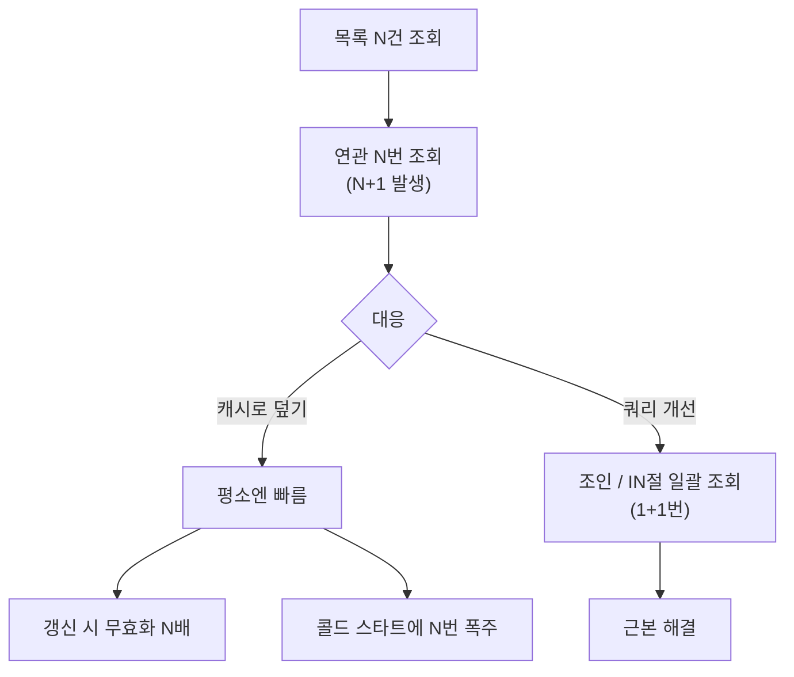

조회 성능을 개선하면서 캐시를 함께 얹은 주가 있었다. 목록이 느릴 때 가장 먼저 떠오르는 게 캐시다. 그런데 느림의 원인이 N+1이라면, 캐시는 문제를 해결하는 게 아니라 더 깊은 곳으로 숨길 뿐이다.

## N+1은 왜 생기나

목록 N건을 조회한 뒤, 각 건의 연관 데이터를 건별로 또 조회하면 쿼리가 1 + N번 나간다. 주문 100건을 가져오고 각 주문의 회원 정보를 따로 조회하면 101번이다.

```java
List<Order> orders = orderMapper.findRecent(100);   // 1번
for (Order o : orders) {
    o.setMember(memberMapper.findById(o.getMemberId())); // N번
}
```

여기서 흔한 미봉책이 등장한다. "회원 조회를 캐시하자."

```java
Member member = cache.get(memberId, () -> memberMapper.findById(memberId));
```

캐시가 차면 두 번째 조회부터 DB를 안 친다. 응답이 빨라진 것처럼 보인다. **하지만 N+1 구조는 그대로다.**

## 캐시가 만드는 더 큰 문제

캐시는 두 가지 비용을 새로 만든다.

첫째, **무효화 폭발**이다. 회원 정보가 바뀌면 그 회원을 참조하는 모든 캐시 항목을 무효화해야 한다. N+1을 건별 캐시로 덮으면 캐시 키가 잘게 쪼개져, 무효화 대상이 N배로 늘고 누락 위험도 커진다. 어떤 키를 지워야 하는지 추적하는 로직 자체가 또 다른 버그의 원천이 된다.

둘째, **콜드 스타트와 정합성**이다. 캐시가 비어 있는 첫 요청(또는 만료 직후)에는 N+1이 그대로 터진다. 트래픽이 몰린 순간 캐시가 비면 N번의 쿼리가 한꺼번에 쏟아진다(캐시 스탬피드). 캐시는 평균을 가렸을 뿐 최악을 없애지 못했다.



## 먼저 쿼리를 고쳐라

N+1의 정석 해법은 **연관 데이터를 한 번에 가져오는 것**이다. 조인하거나, ID를 모아 `IN` 절로 일괄 조회한다.

```java
List<Order> orders = orderMapper.findRecent(100);            // 1번
List<Long> memberIds = orders.stream().map(Order::getMemberId).distinct().toList();
Map<Long, Member> members = memberMapper.findByIds(memberIds) // 1번 (IN절)
    .stream().collect(toMap(Member::getId, m -> m));
orders.forEach(o -> o.setMember(members.get(o.getMemberId())));
```

```sql
SELECT * FROM member WHERE id IN (101, 102, 103, ...);
```

쿼리가 1+1번으로 줄면 캐시 없이도 충분히 빠른 경우가 많다. **그 위에** 캐시를 얹으면, 이번엔 캐시 단위가 "조회 결과 묶음"이라 무효화도 단순해진다. 순서가 중요하다 — 구조를 먼저 고치고, 캐시는 그다음이다.

## 운영 함정

**캐시가 가린 회귀.** 캐시 도입 후 N+1이 "해결된 것"으로 기록되면, 누군가 캐시를 끄거나 TTL을 줄이는 순간 잠재해 있던 폭주가 운영에서 터진다. 캐시는 최적화지 설계 수정이 아니다.

**정합성 부채.** 건별 캐시는 갱신 누락 시 사용자가 옛 데이터를 보게 만든다. 빠르지만 틀린 화면은 느린 화면보다 나쁠 때가 많다.

## 면접 한 줄 Q&A

- **Q. N+1을 캐시로 푸는 게 왜 안티패턴인가?**
  A. 구조적 문제를 그대로 둔 채 평균 지연만 가린다. 무효화가 N배로 폭발하고, 콜드 스타트 때 폭주가 그대로 터진다. 조인·일괄 조회로 쿼리를 먼저 줄인 뒤에 캐시를 얹어야 한다.
