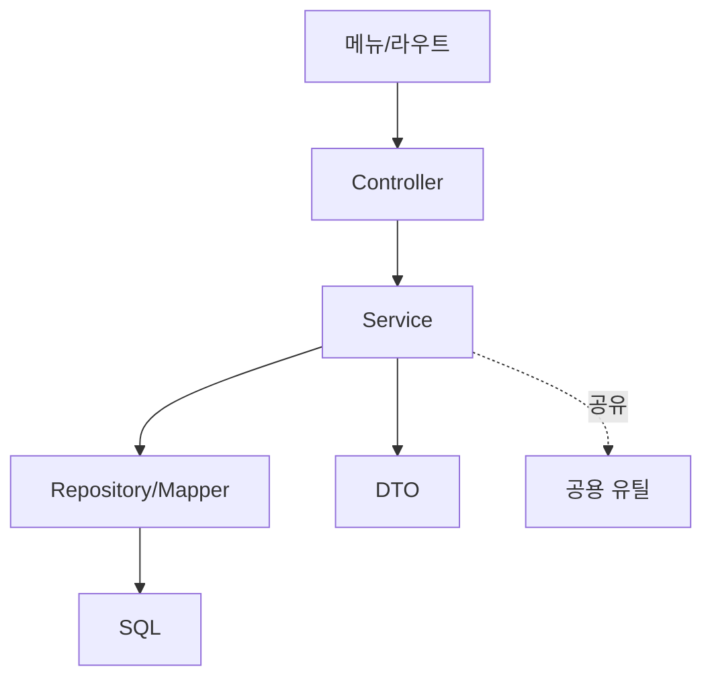

그 주엔 더 안 쓰는 운영 메뉴 몇 개를 코드째 걷어냈다. 메뉴를 내리는 일은 겉보기엔 화면 링크 하나 지우는 작업처럼 보이지만, 그 뒤에는 컨트롤러·서비스·쿼리·DTO·엔티티가 사슬처럼 매달려 있다. 화면만 숨기면 그 사슬은 **죽은 코드(dead code)**로 남아 빌드 시간, 정적 분석 노이즈, 다음 사람의 혼란을 늘린다. 이 작업의 본질은 **기능 폐기(decommission)를 의존 그래프를 따라 안전하게 수행하는 절차**다.

## 의존을 역추적한다

진입점(라우트/메뉴)에서 시작해 호출 사슬을 거꾸로 따라간다.



규칙은 하나다. **이 진입점에서만 도달하는 노드는 지운다. 다른 진입점도 쓰는 노드는 남긴다.** 컨트롤러는 보통 이 메뉴 전용이라 지운다. 서비스 메서드도 대개 전용이다. 그런데 그 서비스가 부르는 유틸이나 매퍼는 다른 화면도 공유할 수 있다. 여기서 판단이 갈린다. 도구의 도움을 받자.

```bash
# 심볼의 참조 수를 센다 — 0이면 죽은 코드 후보
grep -rn "OldReportService" src/ --include=*.java | wc -l
```

IDE의 "Find Usages", 컴파일러 경고, 정적 분석기(미사용 메서드 탐지)를 함께 쓴다. 참조가 이 사슬 안에서만 나오면 제거 후보, 바깥에서도 나오면 보존이다. 리플렉션·XML 매퍼 ID·문자열로 참조되는 빈은 grep에 안 잡히니 별도로 확인한다.

## 데이터는 코드와 다르게 판단한다

코드는 지워도 복구가 쉽다(VCS). **데이터는 지우면 끝**이다. 그래서 테이블·컬럼 삭제는 코드 제거와 분리해 보수적으로 본다. 보통:

1. 먼저 코드에서 그 테이블을 읽고 쓰는 경로를 전부 제거한다.
2. 일정 기간 운영하며 정말 아무도 안 쓰는지 관측한다.
3. 그 뒤에야 테이블을 드롭하거나, 아예 아카이브로 옮긴다.

코드와 스키마를 한 번에 날리면, 되돌릴 일이 생겼을 때 복구가 어렵다.

## 단계적·되돌릴 수 있게

한 커밋에 다 몰아넣지 않는다. 되돌리기 쉬운 단위로 쪼갠다.

1. **진입점 비활성화** — 메뉴/라우트를 막아 사용자 접근을 끊는다(코드는 아직 둔다). 문제가 생기면 이것만 되돌린다.
2. **죽은 코드 제거** — 도달 불가가 확인된 컨트롤러·서비스·DTO·전용 쿼리를 지운다.
3. **공유 자원 정리** — 참조 0이 된 유틸·매퍼를 마지막에 정리한다.
4. **데이터 정리** — 충분히 관측한 뒤 별도로.

## 운영 함정

**숨은 참조.** 스케줄러·배치·이벤트 리스너·외부 웹훅이 그 서비스를 부르고 있을 수 있다. 화면에서만 안 쓴다고 죽은 게 아니다. 진입점은 UI만이 아니다.

**문자열·설정 기반 참조.** MyBatis 매퍼는 XML의 `id`로 호출돼 컴파일러가 미사용을 못 잡는다. 빈을 이름 문자열로 찾는 코드, 설정 파일에 박힌 클래스명도 마찬가지. grep으로 문자열까지 훑어야 안전하다.

## 핵심 요약

- 기능 폐기는 **의존 그래프 역추적**이다. 이 진입점에서만 도달하면 제거, 공유되면 보존.
- **코드는 지워도 복구되지만 데이터는 안 된다.** 스키마 삭제는 분리해 보수적으로.
- **단계적으로**(비활성화 → 코드 제거 → 공유 정리 → 데이터) 되돌릴 수 있게 쪼갠다.
- UI 밖의 진입점(배치·스케줄러·웹훅)과 문자열 참조(XML 매퍼 ID·빈 이름)를 놓치지 않는다.
