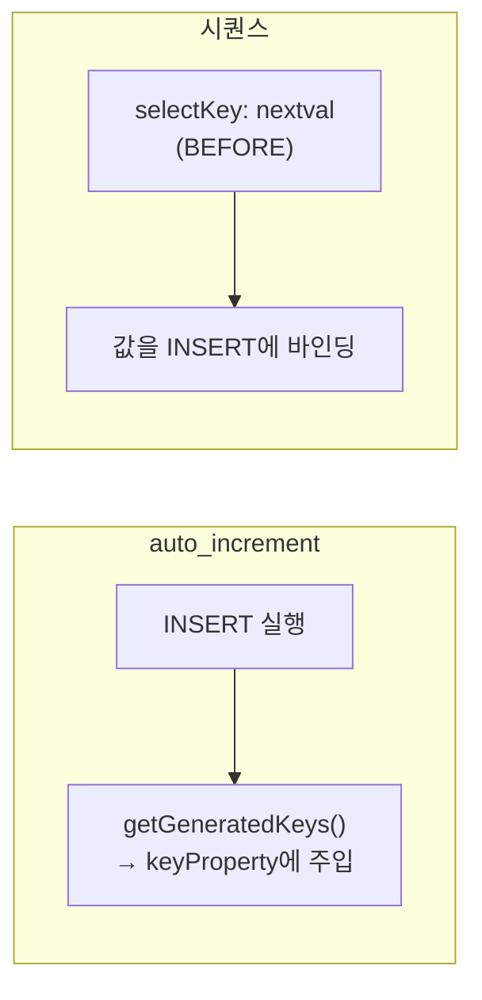

저장 직후 그 행의 식별자가 곧바로 필요했던 주가 있었다. 주문을 insert하고 그 주문 ID로 결제 행을 만들거나, 응답으로 새 리소스 ID를 내려줘야 할 때다. PK가 DB에서 생성된다면, 애플리케이션은 그 값을 어떻게 돌려받을까.

## 두 가지 PK 생성 모델

DB가 PK를 만드는 방식은 크게 둘이다. 이 차이가 회수 방법을 가른다.

- **auto_increment / IDENTITY (MySQL 등)** — insert가 실행된 *후에* 값이 정해진다. JDBC의 `getGeneratedKeys()`로 사후 회수한다.
- **시퀀스 (Oracle, PostgreSQL 등)** — `nextval`로 값을 *먼저* 뽑고, 그 값을 insert에 넣는다. 즉 값이 insert *전에* 정해진다.

MyBatis는 이 둘을 각각 `useGeneratedKeys`와 `<selectKey>`로 지원한다.



## auto_increment: useGeneratedKeys

```xml
<insert id="insertOrder" parameterType="Order"
        useGeneratedKeys="true" keyProperty="id">
  INSERT INTO orders (member_id, amount)
  VALUES (#{memberId}, #{amount})
</insert>
```

`useGeneratedKeys="true"`와 `keyProperty="id"`를 주면, MyBatis가 insert 실행 후 JDBC `getGeneratedKeys()`로 생성 키를 읽어 파라미터 객체의 `id` 필드에 채워 넣는다. 호출 쪽에서는 이렇게 회수한다.

```java
Order order = new Order(memberId, amount);
orderMapper.insertOrder(order);
Long newId = order.getId();   // insert 후 채워진다
paymentMapper.insertPayment(new Payment(newId, ...));
```

반환값은 여전히 "영향받은 행 수"다. 생성 ID는 **반환값이 아니라 파라미터 객체에 주입**된다는 점이 핵심이다.

## 시퀀스: selectKey의 before / after

```xml
<insert id="insertOrder" parameterType="Order">
  <selectKey keyProperty="id" resultType="long" order="BEFORE">
    SELECT order_seq.NEXTVAL FROM dual
  </selectKey>
  INSERT INTO orders (id, member_id, amount)
  VALUES (#{id}, #{memberId}, #{amount})
</insert>
```

`order="BEFORE"`는 insert *전에* `selectKey`를 실행해 ID를 뽑고, 그 값을 insert에 바인딩한다. 시퀀스 기반 DB의 정석이다. 반대로 `order="AFTER"`는 insert 후 키를 조회하는 방식으로, auto_increment를 selectKey로 회수할 때 쓴다(`SELECT LAST_INSERT_ID()`).

요약하면: **시퀀스는 BEFORE, auto_increment는 AFTER 또는 useGeneratedKeys.** DB 엔진이 값을 정하는 시점이 다르기 때문에 순서도 달라진다.

## 운영 함정

**회수 실패가 NPE로 번진다.** `keyProperty`를 빠뜨리거나 필드명을 틀리면 생성 ID가 객체에 주입되지 않아 `getId()`가 null이다. 그 null을 들고 후속 insert를 하면 외래키 제약 위반이나 NPE로 터진다. 더 위험한 건, 저장 자체는 성공해 데이터가 들어가 있다는 점이다 — "절반만 성공"한 상태가 된다.

**배치 insert와의 충돌.** JDBC 배치 모드(`ExecutorType.BATCH`)에서는 드라이버가 모든 행의 생성 키를 돌려주지 않는 경우가 있다. 건별 ID가 필요하면 배치 대신 일반 실행을 쓰거나, 시퀀스 BEFORE 방식으로 ID를 미리 확보한 뒤 배치해야 한다.

## 면접 한 줄 Q&A

- **Q. `useGeneratedKeys`와 `selectKey`는 언제 각각 쓰나?**
  A. auto_increment처럼 insert 후 값이 정해지면 `useGeneratedKeys`(또는 selectKey AFTER), 시퀀스처럼 insert 전 값을 뽑아야 하면 selectKey BEFORE.
- **Q. 생성 ID는 어디로 반환되나?**
  A. 메서드 반환값(영향 행 수)이 아니라 `keyProperty`로 지정한 파라미터 객체의 필드에 주입된다.
