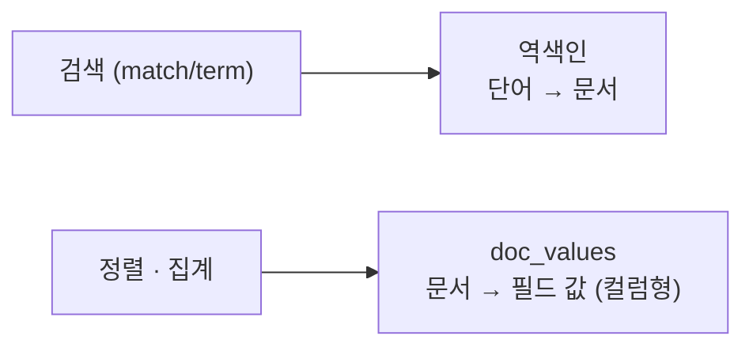

## 정렬·집계가 갑자기 느려지거나 터질 때

검색은 빠른데 **정렬이나 집계**를 걸면 느려지거나 메모리 에러가 나는 경험, Elasticsearch를 좀 쓰다 보면 만납니다. 그리고 `*keyword*` 같은 와일드카드 검색이 클러스터를 휘청이게 만들기도 하죠. 이 두 가지 성능 포인트를 정리합니다.

## doc_values — 정렬·집계를 위한 컬럼 저장소

[역색인](/posts/elasticsearch-inverted-index/)은 "단어 → 문서"라서 **검색**엔 최적이지만, "문서 → 필드 값"이 필요한 **정렬·집계**엔 맞지 않습니다. 그래서 Elasticsearch는 색인 시 **doc_values** 라는 별도의 컬럼 지향 자료구조를 디스크에 같이 만듭니다.



- doc_values는 **keyword·숫자·날짜** 타입에 기본 활성화됩니다.
- 디스크 기반이라 힙 메모리를 적게 쓰면서 정렬·집계를 효율적으로 처리합니다.

### 그래서 주의점

- 정렬/집계를 **할 필드는 doc_values를 끄지 말 것**(기본값 유지).
- 반대로, **정렬/집계를 절대 안 할** 큰 keyword 필드는 `"doc_values": false`로 꺼서 **디스크를 절약**할 수 있습니다.
- `text` 필드는 doc_values가 없어, 정렬/집계하려면 `keyword` 멀티필드가 필요합니다.

```json
PUT /logs
{
  "mappings": {
    "properties": {
      "trace_id": { "type": "keyword", "doc_values": false }  // 검색만, 정렬/집계 안 함 → 절약
    }
  }
}
```

## wildcard 쿼리 — 편하지만 위험하다

`wildcard`로 `*검색어*` 같은 패턴을 쓰면 RDB의 `LIKE '%...%'`처럼 동작하는데, **앞에 `*`가 붙으면 매우 느립니다.**

```json
// 앞 와일드카드(leading wildcard) → 전체 텀을 스캔, 매우 느림
{ "query": { "wildcard": { "title.keyword": "*board*" } } }
```

이유는 역색인이 "정렬된 단어 사전" 구조라, "특정 글자로 **시작**하는" 건 빨리 찾지만 "**포함**/끝남"은 사전 전체를 훑어야 하기 때문입니다.

### 더 나은 대안

부분 문자열 검색이 진짜 필요하다면 wildcard 대신:

- **분석기 + match**: 토큰 단위로 검색되도록 매핑 설계 ([분석기 글](/posts/elasticsearch-match-term-analyzer/))
- **n-gram / edge-ngram**: 색인 시점에 부분 문자열을 미리 토큰으로 만들어 둠 → 검색은 빨라지지만 색인 크기↑
- **wildcard 타입**(ES 7.9+): 와일드카드/정규식에 최적화된 전용 필드 타입

```json
// 자동완성 등 prefix 검색이면 edge-ngram이 적합
"analyzer": { "tokenizer": "edge_ngram_tokenizer" }
```

## 정리

- **doc_values**: 정렬·집계를 위한 컬럼형 저장소. keyword/숫자/날짜에 기본 ON.
- 정렬/집계 안 하는 큰 필드는 `doc_values: false`로 디스크 절약.
- **앞 와일드카드(`*...`)는 느리다.** 부분검색은 n-gram/edge-ngram이나 wildcard 타입으로 설계.
- 결국 "무슨 검색을 할지"를 먼저 정하고 **매핑을 설계**하는 게 성능의 출발점.
