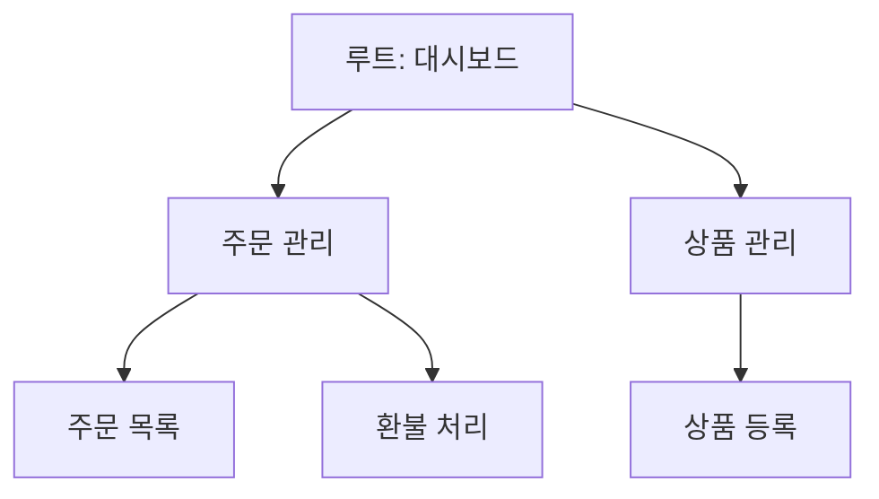

그 주엔 운영 화면의 메뉴를 관리하는 기능을 만들었다. 메뉴를 화면 템플릿(JSP 등)에 하드코딩하면, 항목을 추가하거나 숨기는 사소한 변경에도 코드를 고치고 배포해야 한다. 운영자가 직접 메뉴를 켜고 끄게 하려면 메뉴 자체가 **코드가 아니라 데이터**여야 한다. 이 작업의 본질은 **네비게이션 메뉴를 테이블로 모델링하고, 권한에 맞춰 동적으로 렌더링하는 데이터 주도(data-driven) 메뉴 설계**다.

## 메뉴는 트리다

메뉴는 본질적으로 트리다. 대분류 아래 중분류, 그 아래 항목. 이걸 한 테이블에 **인접 리스트(adjacency list)**로 담는다 — 각 행이 자기 부모를 가리킨다.

```sql
CREATE TABLE menu (
  id          BIGINT PRIMARY KEY,
  parent_id   BIGINT NULL,          -- 루트는 NULL
  label       VARCHAR(100) NOT NULL,
  url         VARCHAR(255),
  sort_order  INT NOT NULL DEFAULT 0,
  visible     BOOLEAN NOT NULL DEFAULT TRUE,
  required_role VARCHAR(50)          -- 이 메뉴를 볼 권한
);
```

`parent_id`로 부모-자식을, `sort_order`로 형제 간 순서를, `visible`로 노출 여부를 데이터로 제어한다. 운영자가 행 하나를 끄면 메뉴가 사라진다 — 배포 없이.



## 플랫 행을 트리로 조립하기

DB에서 정렬된 평면 행을 받아 메모리에서 트리로 조립한다. 재귀 쿼리가 없거나 깊이가 얕다면 이 방식이 단순하고 빠르다.

```java
public List<MenuNode> buildTree(List<MenuRow> rows) {
    Map<Long, MenuNode> byId = new LinkedHashMap<>();
    for (MenuRow r : rows) {
        byId.put(r.id(), new MenuNode(r));   // 정렬 순서 보존
    }
    List<MenuNode> roots = new ArrayList<>();
    for (MenuNode n : byId.values()) {
        Long pid = n.parentId();
        if (pid == null) roots.add(n);
        else byId.get(pid).addChild(n);      // 부모에 매단다
    }
    return roots;                            // O(n), 한 번 순회
}
```
```sql
-- 보이고 권한에 맞는 메뉴만, 정렬 순서대로
SELECT * FROM menu
WHERE visible = TRUE
  AND (required_role IS NULL OR required_role IN (/* 사용자 역할들 */))
ORDER BY parent_id, sort_order;
```

`ORDER BY parent_id, sort_order`로 부모별·순서대로 받으면, 조립 루프가 한 번만 돌아도 `LinkedHashMap`이 순서를 보존한다. 권한 필터는 **조회 단계에서** 건다. 안 보일 메뉴를 트리에 넣고 화면에서 숨기는 건, 보면 안 될 URL을 응답에 흘리는 일이다.

## 권한과 노출은 다른 축이다

`visible`(운영자가 끈 메뉴)과 `required_role`(권한 없어 못 보는 메뉴)은 다른 개념이다. 둘 다 만족해야 렌더링한다. 빈 부모 처리도 정해야 한다 — 자식이 전부 권한에 걸려 사라지면 부모(클릭 시 갈 곳 없는 그룹 헤더)도 같이 접는다. 안 그러면 눌러도 아무 일 없는 빈 메뉴가 남는다.

## 운영 함정

**N+1 트리 조회.** 부모를 읽고 자식을 부모마다 또 쿼리하면 메뉴 한 번 그리는데 쿼리가 수십 번 나간다. 메뉴는 모든 페이지에 뜨는 공통 요소라 타격이 크다. **한 번에 전부 SELECT하고 메모리에서 조립**한다. 메뉴는 자주 바뀌지 않으니 캐싱도 잘 맞는다.

**깊이 무제한·순환 참조.** `parent_id`를 잘못 넣어 A→B→A 같은 순환이 생기면 트리 조립이 무한 루프에 빠진다. 깊이 상한과 순환 탐지를 둔다.

## 핵심 요약

- 메뉴를 **데이터(테이블)**로 두면 추가·숨김을 배포 없이 운영자가 한다.
- 인접 리스트(`parent_id`)로 트리를 담고, **한 번에 SELECT → 메모리 O(n) 조립**으로 N+1을 피한다.
- 권한 필터는 **조회 단계에서** 건다. 안 보일 URL을 응답에 흘리지 않는다.
- `visible`(운영자 토글)과 `required_role`(권한)은 별개 축이며, 자식이 다 빠진 부모는 함께 접는다.
