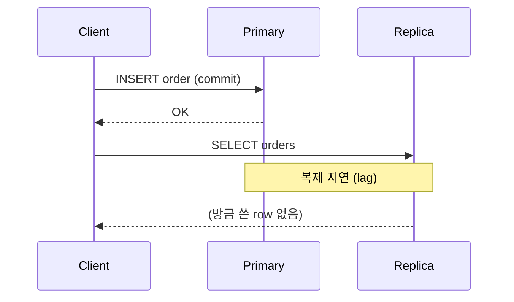

저장 버튼을 누른 뒤 곧바로 목록을 다시 불러왔는데, 방금 넣은 데이터가 보이지 않는다. 버그 리포트로 가장 자주 올라오는 유형 중 하나다. 코드를 백 번 봐도 INSERT는 정상이고 트랜잭션도 커밋됐다. 문제는 애플리케이션 코드가 아니라, **쓰기와 읽기가 같은 데이터를 보고 있다는 가정**이 깨진 데 있다.

## 핵심 개념: read-your-writes 정합성

read-your-writes(자신의 쓰기 읽기)는 *"내가 방금 쓴 값은 내가 즉시 다시 읽을 수 있어야 한다"*는 보장이다. 너무 당연해 보이지만, 시스템에 캐시나 읽기 복제본이 끼는 순간 이 보장은 공짜가 아니게 된다.

깨지는 경로는 둘이다.

**1) 캐시 지연.** 조회 결과를 캐시에 올려두고 일정 시간(TTL) 동안 재사용한다. 쓰기는 DB만 갱신하고 캐시는 그대로 두면, 재조회는 무효화되지 않은 옛 캐시를 돌려준다. 방금 쓴 게 안 보인다.

**2) 복제 지연.** 쓰기는 마스터(primary)로, 읽기는 부하 분산을 위해 복제본(replica)으로 보내는 구성이 흔하다. 복제는 비동기다. 쓰기가 복제본에 도달하기까지 수 ms~수 초의 지연(replication lag)이 있고, 그 사이에 같은 사용자의 읽기가 복제본을 때리면 옛 상태를 본다.



## 어떻게 막는가

문제의 본질은 "쓴 주체가 다음 읽기에서 최신을 보장받지 못한다"는 것이므로, 해법도 그 경로를 끊는 데 집중한다.

**캐시는 쓰기 시점에 무효화한다.** TTL 만료를 기다리지 말고, 쓰기 트랜잭션이 커밋된 직후 해당 키를 즉시 삭제(또는 갱신)한다.

```java
@Transactional
public void updateProduct(Product p) {
    productMapper.update(p);
    // 커밋 이후에 캐시를 비워야 한다 — 아래 "운영 함정" 참고
    cache.evict("product:" + p.getId());
}
```

**복제 지연은 "쓴 사람은 잠깐 마스터를 읽게" 해서 막는다.** 흔한 패턴이 *session pinning(세션 고정)* 이다. 어떤 사용자가 쓰기를 했으면, 일정 시간 동안 그 사용자의 읽기는 복제본 대신 마스터로 라우팅한다.

```java
public List<Order> findMyOrders(long userId) {
    boolean recentlyWrote = writeTracker.wroteWithin(userId, Duration.ofSeconds(3));
    // 방금 쓴 사용자만 마스터로, 나머지는 복제본으로
    DataSourceContext.set(recentlyWrote ? PRIMARY : REPLICA);
    try {
        return orderMapper.findByUser(userId);
    } finally {
        DataSourceContext.clear();
    }
}
```

## 운영 함정

**1) 캐시 무효화를 커밋 전에 한다.** `@Transactional` 메서드 안에서 캐시를 비우면, DB는 아직 커밋되지 않았는데 캐시는 비워진 찰나가 생긴다. 그 틈에 다른 요청이 들어와 *옛 DB 값*을 다시 캐시에 채운다. 결과적으로 쓴 값이 또 안 보인다. 무효화는 반드시 **커밋 이후**에 일어나야 한다 — 트랜잭션 동기화 콜백(`afterCommit`)에 거는 것이 정석이다.

**2) 세션 고정을 전역 시간으로 잡는다.** "쓰기 후 3초간 마스터"를 *모든 읽기*에 걸면 복제본을 둔 의미가 사라진다. 반드시 **쓴 사용자 단위**로만 고정한다.

## 핵심 요약

- "방금 쓴 게 안 보인다"는 거의 항상 **캐시 미무효화** 또는 **복제 지연** 둘 중 하나다.
- 캐시는 TTL이 아니라 **쓰기 시점·커밋 이후**에 무효화한다.
- 복제 지연은 **쓴 사용자만 잠깐 마스터로 라우팅**(session pinning)해서 read-your-writes를 보장한다.

> **면접 Q.** 읽기 복제본을 붙였더니 "저장 직후 조회가 안 됨" 버그가 생겼다. 원인과 해법은?
> **A.** 복제 비동기 지연 때문이다. 강한 전역 정합성 대신, 쓴 사용자의 읽기만 일정 시간 마스터로 보내는 세션 고정으로 read-your-writes만 국소 보장한다.
