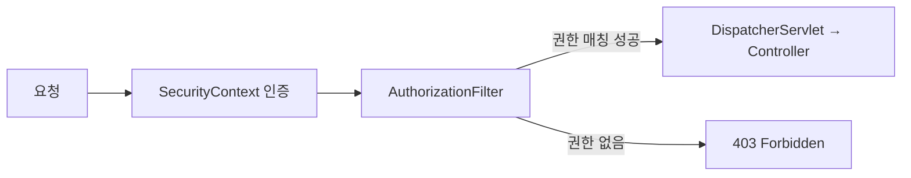

운영자마다 접근할 수 있는 메뉴가 다른 어드민을 만들었다. 화면에서 버튼을 숨기는 것만으로는 부족하다. URL을 직접 치면 그대로 들어가지기 때문이다. 인가(authorization)는 화면이 아니라 **요청 단계**에서 걸어야 한다. 그 자리가 바로 Spring Security 필터 체인이다.

## 인가는 요청의 길목에서 끝나야 한다

인증(authentication)은 "너 누구냐"를 묻고, 인가는 "그래서 이걸 해도 되냐"를 묻는다. 컨트롤러에 들어와서 권한을 체크하면 늦다. 이미 트랜잭션이 열리고 서비스 로직이 돌기 직전이다. 게다가 컨트롤러마다 체크 코드를 흩뿌리면 빠뜨리는 곳이 반드시 생긴다.

Spring Security는 모든 요청을 `FilterChainProxy`가 가로채고, 그 안에서 여러 보안 필터가 순서대로 실행된다. 마지막 인가 지점은 `AuthorizationFilter`(구버전 `FilterSecurityInterceptor`)다. 이 자리에서 "이 요청 URL을, 이 사용자의 권한으로 통과시킬 것인가"를 결정한다. 메뉴 권한을 여기에 태우면 컨트롤러는 권한을 모른 채 순수 로직만 책임진다.



## 동적 권한을 어떻게 매칭할까

문제는 메뉴 권한이 **DB에 있는 동적 데이터**라는 점이다. 정적으로 `antMatchers("/admin/users").hasRole("USER_ADMIN")`을 나열할 수 없다. 메뉴가 추가될 때마다 코드를 고치고 재배포할 수는 없으니까.

그래서 `AuthorizationManager`를 직접 구현해 요청 URL을 권한 매핑과 대조한다. 핵심은 "URL 패턴 → 필요 권한" 테이블을 메모리에 올려두고, 요청이 올 때마다 매칭하는 것이다.

```java
public class MenuAuthorizationManager
        implements AuthorizationManager<RequestAuthorizationContext> {

    private final MenuPermissionRepository repo;

    @Override
    public AuthorizationDecision check(
            Supplier<Authentication> auth,
            RequestAuthorizationContext context) {

        String uri = context.getRequest().getRequestURI();
        // URL에 필요한 권한 코드 조회 (캐시 권장)
        Set<String> required = repo.requiredAuthorities(uri);
        if (required.isEmpty()) {
            return new AuthorizationDecision(true); // 보호 대상 아님
        }
        Set<String> granted = auth.get().getAuthorities().stream()
                .map(GrantedAuthority::getAuthority)
                .collect(Collectors.toSet());
        boolean allowed = !Collections.disjoint(required, granted);
        return new AuthorizationDecision(allowed);
    }
}
```

설정에서 이 매니저를 인가 규칙으로 등록한다.

```java
http.authorizeHttpRequests(reg -> reg
        .requestMatchers("/admin/**").access(menuAuthorizationManager)
        .anyRequest().authenticated());
```

이러면 메뉴 권한이 바뀌어도 DB와 캐시만 갱신하면 된다. 코드는 그대로다.

## 운영 함정

**필터 순서를 잘못 보면 인증 전에 인가가 돈다.** 인가 필터는 반드시 인증 필터 *뒤*에 있어야 한다. `Authentication`이 아직 채워지지 않은 상태에서 권한을 읽으면 익명 사용자로 취급돼 멀쩡한 요청이 403으로 튕긴다. 커스텀 필터를 `addFilterBefore`/`addFilterAfter`로 끼울 때 기준 필터를 잘못 잡는 실수가 잦다.

**매 요청 DB 조회는 곧 병목이다.** URL→권한 매핑을 요청마다 SELECT하면 어드민 트래픽이 적어도 부담이다. 시작 시점에 한 번 로딩하고 메뉴 변경 시 무효화하는 캐시를 둔다. 단, 권한을 회수했는데 캐시가 살아 있으면 보안 구멍이 되므로 무효화 시점을 명확히 한다.

## 핵심 요약

- 인가는 컨트롤러가 아니라 필터 체인에서 끝내야 누락이 없다.
- 동적 메뉴 권한은 `AuthorizationManager`로 URL과 권한을 대조해 처리한다.
- 인증 필터 뒤에 인가를 두고, 권한 매핑은 캐시하되 회수 시 즉시 무효화한다.

**면접 Q.** 권한 체크를 인터셉터 대신 시큐리티 필터에 두는 이유는? **A.** 필터는 DispatcherServlet보다 앞단이라 컨트롤러 진입 전에 차단되고, Security의 인증 컨텍스트를 그대로 활용해 인증·인가를 한 흐름으로 묶을 수 있기 때문이다.
